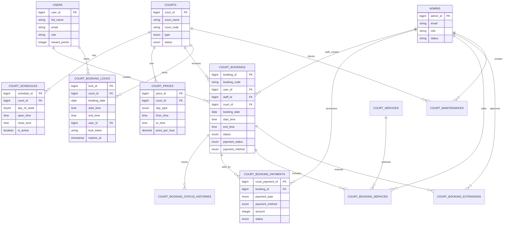

# ROADMAP BOOKING SYSTEM

Ngày audit: 2026-05-29  
Phạm vi: Laravel Backend, VueJS Frontend, Pinia, MySQL migrations/schema, API routes, Realtime, UI booking.  
Nguyên tắc thực hiện: chỉ đọc và phân tích source; không refactor, không sửa code, không commit.

---

## 1. Tổng quan hệ thống

Dự án hiện tại là hệ thống thương mại điện tử thể thao kết hợp module quản lý đặt sân cầu lông. Backend dùng Laravel 12 API, JWT auth qua guard `api` và `admin`, MySQL, Laravel Reverb có cấu hình sẵn. Frontend dùng Vue 3, Pinia, Vue Router, Axios, Bootstrap, Laravel Echo và Pusher client.

Hệ thống e-commerce đã có nhiều module hoàn chỉnh hơn booking: sản phẩm, danh mục, giỏ hàng, đơn hàng, thanh toán VNPay/MoMo, POS, coupon, flash sale, affiliate, live chat, dashboard/statistics. Module booking sân đã được thêm vào tương đối đầy đủ ở tầng database/model/API cơ bản, nhưng frontend chưa đồng bộ contract API, chưa có realtime booking thật, chưa có payment flow riêng cho booking, chưa có lịch ngày/tuần/tháng đúng nghĩa và còn thiếu nhiều nghiệp vụ vận hành sân.

Kết luận nhanh:

| Mảng | Trạng thái | Nhận định |
| --- | --- | --- |
| E-commerce | Khá đầy đủ | Có database, API, UI, payment gateway, dashboard, POS |
| Booking database | Đã có nền | Có 12 bảng booking chuyên biệt, nhưng thiếu constraint chống overlap ở DB |
| Booking API | Có core cơ bản | Có CRUD sân, lịch, giá, dịch vụ, maintenance, booking, lock; một số endpoint chưa implement/thiếu filter |
| Booking UI | Có khung màn hình | Nhiều màn hình đang lệch field/contract nên chưa thể hoạt động ổn định |
| Booking realtime | Chưa đạt | Có Reverb/Echo chung, nhưng không có event/channel booking |
| Booking payment | Chưa đạt | Có bảng `court_booking_payments`, nhưng chưa tích hợp VNPay/MoMo/Banking cho booking |
| Operations | Một phần | Có check-in/check-out/gia hạn/thêm dịch vụ ở backend, UI còn lỗi mapping |

---

## 2. Kiến trúc hiện tại

### Backend

Kiến trúc backend đang theo kiểu Laravel API truyền thống, có tách một phần service/repository nhưng chưa nhất quán toàn hệ thống.

| Thành phần | Hiện trạng |
| --- | --- |
| Controllers | Có controller trực tiếp cho auth, product, cart, order, payment, admin, POS, chat, affiliate, booking |
| Services | Có `CourtBookingService`, `OrderService`, `PaymentGatewayService`, `PaymentProcessingService`, `VNPayService`, `MoMoService`, `CartService`, `ProductService`, `StatisticsService`, `AffiliateService` |
| Repositories | Có repository cho e-commerce/statistics/payment/user/affiliate; booking chưa có repository riêng |
| Models | Có đầy đủ model e-commerce và model booking: `Court`, `CourtBooking`, `CourtSchedule`, `CourtPrice`, `CourtBookingLock`, `CourtBookingPayment`, v.v. |
| Middleware | Chỉ có custom `RoleMiddleware`; chưa có middleware audit log/booking policy |
| Events | Có `MessageSent`, `OrderCreatedAdmin`, `PosBarcodeScanned`, `UserNotificationEvent`; chưa có booking event |
| Listeners | Không có thư mục/listener riêng |
| Jobs | Có `OrderProcessingJob`, `SendBulkCouponEmail`; chưa có job cleanup lock booking/reminder booking |
| Scheduling | Có birthday, abandoned cart, order email; chưa có cleanup expired booking locks |

Booking backend hiện có:

| Nhóm | File chính | Đánh giá |
| --- | --- | --- |
| Public court API | `Api/CourtController.php` | Có list/detail/availability nhưng availability chỉ trả boolean, không trả danh sách slot |
| User booking API | `Api/CourtBookingController.php` | Có lock, create, list, detail, cancel |
| Admin court API | `Api/Admin/CourtAdminController.php` | Có CRUD sân |
| Admin schedule/price/service/maintenance | `Api/Admin/*AdminController.php` | Có CRUD cơ bản |
| Admin booking ops | `CourtBookingAdminController.php` | Có list/detail/update/delete/check-in/check-out/add service/extend; admin create trả 501 |
| Booking service | `CourtBookingService.php` | Có transaction và `lockForUpdate`, nhưng còn thiếu xác thực lock token theo user/court/time |

Điểm kiến trúc đáng chú ý:

| Vấn đề | Mức độ | Ghi chú |
| --- | --- | --- |
| `routes/court_booking.php` không được đăng ký trong `bootstrap/app.php` | Trung bình | Booking routes thực tế nằm trong `routes/api.php`; file riêng đang dư/thừa |
| Booking không có repository riêng | Thấp | Chấp nhận được ở giai đoạn đầu, nhưng lệch pattern so với e-commerce |
| Thiếu service tách riêng cho availability/slot generation/payment | Cao | Hiện logic phân tán và chưa đủ để UI đặt sân theo khung giờ |
| Thiếu event-driven architecture cho booking | Cao | Không phát realtime khi lock/booking/cancel/check-in |
| Admin update booking dùng `$request->all()` | Cao | Rủi ro mass assignment logic nghiệp vụ và trạng thái không qua state machine |

### Frontend

Frontend tổ chức theo `src/Pages`, `components`, `layouts`, `stores`, `services`, `router`.

| Thành phần | Hiện trạng |
| --- | --- |
| Views khách hàng | Home, Product, Cart, Checkout, PaymentResult, Profile, CourtsList, CourtDetail, UserBookings |
| Views admin | Dashboard, Product, Category, Order, POS, Staff, Users, Stats, Chat, Attendance, CourtManagement, BookingManagement |
| Components | Header/Footer, AdminAside, ProductCard, SearchModal, ChatbotWidget, BarcodeScanner, AddressSelector |
| Layouts | `ClientLayout`, `AdminLayout`, `AuthLayout`, `SellerLayout` |
| Pinia Stores | `auth`, `cart`, `catalog`, `favorites`, `toast`, `ui`, `cartUpsell`, `useCourtBookingStore` |
| API Services | `authService`, `cartService`, `catalogService`, `orderService`, `addressService`, `affiliateService`, `courtBookingService` |
| Realtime Modules | `src/echo.js`, usage ở chat, POS, order notification; chưa có booking realtime |

Frontend booking hiện có:

| Màn hình | File | Nhận định |
| --- | --- | --- |
| Danh sách sân | `Pages/Client/Courts/CourtsList.vue` | Có UI, gọi API, nhưng mapping field sai ở một số chỗ |
| Chi tiết sân/đặt sân | `Pages/Client/Courts/CourtDetail.vue` | Có UI chọn slot, dịch vụ, đặt sân; contract với API đang sai nghiêm trọng |
| Lịch sử đặt sân | `Pages/Client/Courts/UserBookings.vue` | Có UI, nhưng dùng `booking.id`/`court.name` thay vì `booking_id`/`court_name` |
| Admin quản lý sân | `Pages/admin/AdminCourtManagement.vue` | CRUD sân có thể dùng một phần; tab giá/dịch vụ chưa hoàn thiện state |
| Admin quản lý booking | `Pages/admin/AdminBookingManagement.vue` | Có bảng và thao tác, nhưng field/action payload sai với backend |

---

## 3. Phân tích database

### Các bảng hiện có

#### E-commerce

| Bảng yêu cầu | Hiện trạng | Ghi chú |
| --- | --- | --- |
| `users` | Có | PK `user_id`, có role/reward/affiliate fields |
| `products` | Có | Có brand/category/seller, soft delete |
| `categories` | Có | Có parent tree |
| `orders` | Có | Có order_code, payment_status, fulfillment_status |
| `order_items` | Có | Snapshot sản phẩm |
| `carts` | Có | 1 cart/user |
| `payments` | Có | Gắn cứng `order_id`, không dùng chung booking |
| `addresses` | Có | Dành cho giao hàng |

Các bảng e-commerce bổ sung: `brands`, `product_variants`, `product_images`, `favorites`, `promotions`, `promotion_*`, `coupons`, `user_coupons`, `coupon_categories`, `flash_sales`, `flash_sale_items`, `inventory_transactions`, `shipping_zones`, `posts`, `post_categories`, `contacts`, `notifications`, `chat_sessions`, `chat_messages`, `affiliate_*`, `attendances`.

#### Booking

| Bảng yêu cầu | Hiện trạng | Ghi chú |
| --- | --- | --- |
| `courts` | Có | Danh sách sân |
| `court_slots` | Không có | Đang thay bằng `court_schedules` + logic thời gian động; chưa có slot materialized |
| `bookings` | Không có đúng tên | Có `court_bookings` |
| `booking_details` | Không có đúng tên | Có `court_booking_services`; chưa có booking detail nhiều slot |
| `schedules` | Không có đúng tên | Có `court_schedules` |
| `transactions` | Không có đúng tên | Có `court_booking_payments` |

Các bảng booking thực tế:

| Bảng | Vai trò | FK chính |
| --- | --- | --- |
| `courts` | Danh sách sân | Không |
| `court_schedules` | Giờ mở/đóng theo ngày trong tuần | `court_id -> courts` |
| `court_prices` | Giá theo sân/loại ngày/khung giờ | `court_id -> courts` |
| `court_bookings` | Booking trung tâm | `user_id -> users`, `staff_id -> admins`, `court_id -> courts` |
| `court_booking_status_histories` | Lịch sử trạng thái | `booking_id -> court_bookings` |
| `court_booking_locks` | Giữ chỗ tạm 10 phút | `court_id -> courts`, `user_id -> users` |
| `court_services` | Dịch vụ bán thêm | Không |
| `court_booking_services` | Dịch vụ gắn với booking | `booking_id`, `service_id`, `added_by` |
| `court_maintenances` | Bảo trì/block sân | `court_id`, `created_by` |
| `court_booking_payments` | Thanh toán booking | `booking_id`, `processed_by` |
| `court_booking_extensions` | Gia hạn giờ chơi | `booking_id`, `approved_by` |
| `court_activity_logs` | Audit log thao tác | Không FK cứng |

### Đánh giá database

| Nhóm | Vấn đề | Mức độ |
| --- | --- | --- |
| Thiếu bảng | Không có `court_slots` materialized để quản lý từng slot hiển thị/lifecycle | Trung bình |
| Thiếu bảng | Không có `booking_holds` tách lifecycle hold/release rõ hơn ngoài `court_booking_locks` | Thấp |
| Thiếu bảng | Không có `booking_refunds`/refund policy riêng | Cao |
| Thiếu bảng | Không có voucher/coupon riêng cho booking | Trung bình |
| Thiếu bảng | Không có recurring booking/waitlist | Thấp/P2 |
| Thiếu dữ liệu vận hành | Không thấy seeder 7 sân mặc định | Cao cho go-live |
| Khóa ngoại | `court_activity_logs.actor_id/subject_id` không có FK | Chấp nhận được nếu thiết kế audit polymorphic, nhưng cần convention |
| Constraint | Không có DB-level unique/exclusion constraint chống overlap booking | Cao |
| Lock | `court_booking_locks` không có unique/constraint chống overlap ở DB; chỉ dựa service transaction | Cao |
| Payment | `payments` e-commerce không dùng lại được vì `order_id` bắt buộc | Đúng hướng khi tạo `court_booking_payments` riêng |
| Tiền tệ | Booking dùng `integer`, e-commerce dùng decimal ở một số nơi | Trung bình; nên thống nhất VND integer hoặc decimal |
| Naming | Frontend dùng `id/name/price`, backend dùng `*_id`, `court_name`, `unit_price` | Cao do gây lỗi runtime |

---

## 4. ERD

---

## 5. Danh sách chức năng hiện có

### Booking backend

| Chức năng | Trạng thái | Ghi chú |
| --- | --- | --- |
| Danh sách sân public | Có | `GET /api/courts` |
| Chi tiết sân | Có | `GET /api/courts/{id}` |
| Kiểm tra availability | Có một phần | Chỉ trả `is_available`, không trả slot grid |
| Giữ slot tạm | Có | `POST /api/court-bookings/lock` |
| Tạo booking | Có | Có transaction, lockForUpdate |
| Lịch sử booking user | Có | Chưa eager load court ở index |
| Hủy booking user | Có cơ bản | Không có policy thời gian/hoàn tiền |
| CRUD sân admin | Có | API đầy đủ |
| CRUD schedule admin | Có | Nhưng UI chưa có tab hoàn chỉnh |
| CRUD price admin | Có | UI chưa lưu state đúng |
| CRUD service admin | Có | UI chưa hoàn chỉnh và field mismatch |
| CRUD maintenance admin | Có | UI chưa có màn hình riêng |
| Admin list booking | Có | Chưa áp filter request |
| Admin create booking walk-in | Chưa | Trả 501 Not implemented |
| Check-in/check-out | Có cơ bản | Chưa có QR/auto/state validation |
| Thêm dịch vụ | Có | Payload/UI đang lệch field |
| Gia hạn | Có | Backend nhận `extension_minutes`, UI gửi `hours` |

### E-commerce

| Chức năng | Trạng thái |
| --- | --- |
| Catalog/category/product | Có |
| Cart/checkout/order | Có |
| VNPay/MoMo/bank transfer cho đơn hàng | Có |
| POS | Có |
| Admin orders | Có |
| Flash sale | Có |
| Coupon/voucher | Có cho e-commerce |
| Affiliate | Có |
| Chatbot/live chat | Có |
| Admin statistics | Có |

---

## 6. Danh sách chức năng thiếu

| Nhóm | Thiếu | Mức độ ưu tiên |
| --- | --- | --- |
| Quản lý 7 sân | Seeder/config tạo 7 sân mặc định | P0 |
| Slot booking | API trả slot grid theo ngày/sân, gồm giá/trạng thái/lock | P0 |
| Booking UI | Đồng bộ field `court_id`, `court_name`, `booking_id`, `service_id`, `unit_price` | P0 |
| Lock flow | UI gọi lock trước booking và truyền `lock_token` | P0 |
| Race condition | DB constraint hoặc strategy lock chuẩn hơn cho overlap | P0 |
| Realtime | Event `CourtSlotLocked`, `CourtBookingCreated`, `CourtBookingCancelled`, `CourtStatusChanged` | P0 |
| Payment booking | Tích hợp VNPay/MoMo/banking vào `court_booking_payments` | P1 |
| Cancel policy | Rule hủy theo thời gian, phí hủy, refund | P1 |
| Check-in | QR check-in, validation khung giờ, no-show | P1 |
| Lịch vận hành | View ngày/tuần/tháng cho admin | P1 |
| Customer profile | Tổng tiền booking, điểm thưởng booking, voucher booking | P2 |
| Reporting | Doanh thu theo sân/khung giờ/ngày/tháng, utilization | P2 |
| Cleanup jobs | Xóa lock hết hạn, reminder trước giờ chơi, auto no-show | P0/P1 |
| Audit log | Ghi `court_activity_logs` thực tế | P1 |

---

## 7. Danh sách API

### Booking API chi tiết

| API | Method | Middleware | Frontend sử dụng |
| --- | --- | --- | --- |
| `/api/courts` | GET | `api` | `CourtsList.vue`, `CourtDetail.vue`, `AdminBookingManagement.vue` |
| `/api/courts/{id}` | GET | `api` | `CourtDetail.vue` |
| `/api/courts/{id}/availability` | GET | `api` | `CourtDetail.vue` |
| `/api/court-bookings/lock` | POST | `api`, `auth:api,admin` | Có trong service/store, nhưng UI chưa gọi |
| `/api/court-bookings` | POST | `api`, `auth:api,admin` | `CourtDetail.vue`, nhưng payload sai |
| `/api/court-bookings` | GET | `api`, `auth:api,admin` | `UserBookings.vue` |
| `/api/court-bookings/{id}` | GET | `api`, `auth:api,admin` | Có service/store, UI detail booking chưa rõ |
| `/api/court-bookings/{id}/cancel` | POST | `api`, `auth:api,admin` | `UserBookings.vue`, nhưng dùng `booking.id` sai |
| `/api/admin/courts` | GET/POST | `api`, `auth`, `role:admin,staff,seller` | `AdminCourtManagement.vue` |
| `/api/admin/courts/{court}` | GET/PUT/PATCH/DELETE | `api`, `auth`, `role:admin,staff,seller` | `AdminCourtManagement.vue` |
| `/api/admin/court-schedules` | GET/POST | `api`, `auth`, `role:admin,staff,seller` | Có service/store, UI chưa hoàn chỉnh |
| `/api/admin/court-schedules/{id}` | GET/PUT/PATCH/DELETE | `api`, `auth`, `role:admin,staff,seller` | Có service/store |
| `/api/admin/court-prices` | GET/POST | `api`, `auth`, `role:admin,staff,seller` | `AdminCourtManagement.vue`, nhưng state/payload sai (`start_time/end_time` thay vì `from_time/to_time`) |
| `/api/admin/court-prices/{id}` | GET/PUT/PATCH/DELETE | `api`, `auth`, `role:admin,staff,seller` | Có service/store |
| `/api/admin/court-services` | GET/POST | `api`, `auth`, `role:admin,staff,seller` | `CourtDetail.vue`, `AdminCourtManagement.vue`, `AdminBookingManagement.vue`; field mismatch |
| `/api/admin/court-services/{id}` | GET/PUT/PATCH/DELETE | `api`, `auth`, `role:admin,staff,seller` | Có service/store |
| `/api/admin/court-maintenances` | GET/POST | `api`, `auth`, `role:admin,staff,seller` | Có service/store, thiếu UI riêng |
| `/api/admin/court-maintenances/{id}` | GET/PUT/PATCH/DELETE | `api`, `auth`, `role:admin,staff,seller` | Có service/store |
| `/api/admin/court-bookings` | GET | `api`, `auth`, `role:admin,staff,seller` | `AdminBookingManagement.vue` |
| `/api/admin/court-bookings` | POST | `api`, `auth`, `role:admin,staff,seller` | Không dùng; backend trả 501 |
| `/api/admin/court-bookings/{id}` | GET/PUT/PATCH/DELETE | `api`, `auth`, `role:admin,staff,seller` | Có service/store |
| `/api/admin/court-bookings/{id}/check-in` | POST | `api`, `auth`, `role:admin,staff,seller` | `AdminBookingManagement.vue`, nhưng id sai |
| `/api/admin/court-bookings/{id}/check-out` | POST | `api`, `auth`, `role:admin,staff,seller` | `AdminBookingManagement.vue`, nhưng id sai |
| `/api/admin/court-bookings/{id}/services` | POST | `api`, `auth`, `role:admin,staff,seller` | `AdminBookingManagement.vue`, nhưng service field sai |
| `/api/admin/court-bookings/{id}/extend` | POST | `api`, `auth`, `role:admin,staff,seller` | UI gửi `hours`, backend cần `extension_minutes` |

### API e-commerce/payment/realtime chính

| Nhóm API | Method chính | Middleware | Frontend sử dụng |
| --- | --- | --- | --- |
| `/api/login`, `/api/register`, `/api/logout`, `/api/me`, `/api/refresh` | POST/GET | Public/auth/throttle | Auth pages/store |
| `/api/products`, `/api/categories`, `/api/brands` | GET/POST/PUT/DELETE | Public/admin/staff | Product/catalog/admin UI |
| `/api/cart*` | GET/POST/PUT/DELETE | `auth:api,admin` | Cart/checkout |
| `/api/profile/orders*` | GET/POST/PUT | `auth:api,admin` | Profile orders/checkout |
| `/api/admin/orders*` | GET/PUT/POST | `auth`, `role:admin,seller` | Admin order |
| `/api/payment/vnpay-return`, `/api/payment/vnpay-ipn` | GET/POST | throttle | PaymentResult/e-commerce gateway |
| `/api/payment/momo-return`, `/api/payment/momo-ipn` | GET/POST | throttle | PaymentResult/e-commerce gateway |
| `/api/admin/statistics/*` | GET | `auth`, `role:admin,seller,staff` | AdminStats |
| `/api/live-chat/*`, `/api/admin/live-chats/*` | GET/POST | throttle/auth | ChatbotWidget/AdminChat |
| `/api/broadcasting/auth` | GET/POST/HEAD | `api`, `auth:api,admin` | Echo private channels |

Ghi chú API:

| Vấn đề | Chi tiết |
| --- | --- |
| Duplicate route | `/api/payment/momo-ipn` được khai báo 2 lần trong `api.php` |
| Debug routes | `/api/debug/*` còn tồn tại, cần loại bỏ khỏi production |
| Route file dư | `routes/court_booking.php` có route booking khác prefix nhưng không được load |
| Route conflict tiềm ẩn | `GET products/{id}` đặt trước `products/slug/{slug}` có thể shadow một số trường hợp |

---

## 8. Kiểm tra Realtime

### Hiện trạng

| Thành phần | Có/Không | Ghi chú |
| --- | --- | --- |
| Laravel Reverb package | Có | `composer.json` có `laravel/reverb` |
| Config Reverb | Có | `config/reverb.php`, `config/broadcasting.php` |
| Env Reverb | Có | `.env` có `BROADCAST_CONNECTION=reverb` và VITE_REVERB variables |
| Laravel Echo frontend | Có | `src/echo.js` |
| Pusher client | Có | `pusher-js`, Echo dùng broadcaster `reverb` |
| Broadcast auth route | Có | `Broadcast::routes(['middleware' => ['api', 'auth:api,admin']])` trong `api.php` |
| Booking event | Không | Không có event nào cho court/slot/booking |
| Booking channel | Không | `channels.php` không khai báo channel booking |
| Booking listener frontend | Không | Không có `Echo.listen` trong các màn hình booking |

### Event realtime hiện có

| Event | Kênh | Mục đích |
| --- | --- | --- |
| `MessageSent` | `chat.{sessionToken}` / admin chat | Live chat |
| `OrderCreatedAdmin` | `admin-notifications` | Báo đơn hàng mới |
| `PosBarcodeScanned` | `pos-scanner.{sessionId}` | POS scanner |
| `UserNotificationEvent` | `user.{userId}` | Notification user |

### Kết luận realtime booking

Hiện tại chưa có realtime thật cho đặt sân. Module booking đang hoạt động theo request/response bình thường, có thể polling thủ công qua API availability nhưng chưa có push realtime. Khi khách A lock/đặt sân, khách B không nhận cập nhật tức thời qua WebSocket vì không có event phát đi và frontend không subscribe channel booking.

Realtime cần bổ sung:

| Event đề xuất | Khi phát | Payload tối thiểu |
| --- | --- | --- |
| `CourtSlotLocked` | Sau khi lock slot thành công | `court_id`, `booking_date`, `start_time`, `end_time`, `expires_at` |
| `CourtSlotReleased` | Khi lock hết hạn/release/cancel | `court_id`, `booking_date`, `start_time`, `end_time` |
| `CourtBookingCreated` | Sau khi booking tạo thành công | `booking_id`, `court_id`, `booking_date`, `start_time`, `end_time`, `status` |
| `CourtBookingCancelled` | Sau khi hủy booking | `booking_id`, `court_id`, `booking_date`, `start_time`, `end_time` |
| `CourtBookingStatusChanged` | Check-in/check-out/extend/no-show | `booking_id`, `old_status`, `new_status` |

---

## 9. Kiểm tra UI

### Bảng đồng bộ UI

| Trang | Đã có | Thiếu | Ghi chú |
| --- | --- | --- | --- |
| Khách hàng - Trang sân | Có | Mapping field chuẩn | `CourtsList.vue` dùng `court.name`, `court.id`, status `available`; backend trả `court_name`, `court_id`, status `active` |
| Khách hàng - Chi tiết sân | Có | Slot grid thật, payment method, lock flow | `availability` backend chỉ trả boolean nhưng UI mong array slots |
| Khách hàng - Chọn khung giờ | Có UI giả định | API slot list | Không có endpoint trả các slot 1h/30m kèm giá/trạng thái |
| Khách hàng - Thanh toán booking | Thiếu | VNPay/MoMo/Banking flow riêng booking | UI chỉ bấm đặt sân, không chọn/gửi `payment_method` đúng |
| Khách hàng - Lịch sử đặt sân | Có | Field mapping và detail | Dùng `booking.id`, `court.name` sai với backend |
| Admin - Dashboard | Có e-commerce | Dashboard booking | Chưa có overview sân hôm nay/utilization |
| Admin - Quản lý sân | Có một phần | Schedule/maintenance UI đầy đủ | CRUD sân có thể dùng, tab giá/dịch vụ chưa hoàn chỉnh |
| Admin - Quản lý lịch | Thiếu | View ngày/tuần/tháng | Chưa có calendar/timeline 7 sân |
| Admin - Quản lý đặt sân | Có khung | Filter, id mapping, status workflow | `fetchAdminBookings` API không xử lý filters; UI dùng field sai |
| Admin - Quản lý doanh thu booking | Thiếu | Revenue booking report | Chỉ có statistics e-commerce |

### Lỗi frontend/backend contract quan trọng

| File | Lỗi | Tác động |
| --- | --- | --- |
| `CourtsList.vue` | `@click="goToDetail(court.id)"` trong card, trong button lại dùng `court.court_id` | Click card có thể route id `undefined` |
| `CourtsList.vue` | Hiển thị `court.name`, backend trả `court_name` | Tên sân rỗng |
| `CourtsList.vue` | Check status `available`, backend dùng `active` | Badge sai |
| `CourtDetail.vue` | Gọi availability và gán `availableSlots = res.data` | Backend trả object `{is_available, data:{date,start,end}}`, không phải array |
| `CourtDetail.vue` | Payload booking dùng `date`, thiếu `booking_date`, thiếu `payment_method` | Backend validation fail |
| `CourtDetail.vue` | Không gọi `lockSlot` trước `bookCourt` | Không dùng lock_token, dễ tranh chấp trải nghiệm |
| `CourtDetail.vue` | Dịch vụ dùng `s.id/name/price`, backend dùng `service_id/service_name/unit_price` | Dịch vụ lỗi |
| `UserBookings.vue` | Dùng `booking.id`, backend dùng `booking_id` | Cancel/detail sai id |
| `AdminBookingManagement.vue` | Dùng `booking.id`, `court.name`, `user.name` | Hiển thị/action sai |
| `AdminBookingManagement.vue` | Extend gửi `{hours}` | Backend cần `{extension_minutes}` |
| `AdminBookingManagement.vue` | Dùng `store.services` nhưng store không expose `services` state | Runtime undefined |
| `AdminCourtManagement.vue` | Price form dùng `start_time/end_time` | Backend cần `from_time/to_time` |
| `AdminCourtManagement.vue` | Store không có state `prices/services/maintenances` | Tab giá/dịch vụ không render dữ liệu đúng |

---

## 10. Kiểm tra State Management

### Pinia stores hiện có

| Store | Mục đích |
| --- | --- |
| `auth.js` | Auth, token, user, session |
| `cart.js` | Cart |
| `catalog.js` | Catalog/product |
| `favorites.js` | Wishlist |
| `toast.js` | Toast |
| `ui.js` | UI theme/state |
| `cartUpsell.js` | Upsell |
| `useCourtBookingStore.js` | Booking/court/admin booking |

### Booking Store

| Store cần kiểm tra | Có tồn tại | Đánh giá |
| --- | --- | --- |
| Booking Store | Có | `useCourtBookingStore.js`, nhưng quá nhiều trách nhiệm |
| Court Store | Không riêng | Gộp vào `useCourtBookingStore` |
| Schedule Store | Không riêng | Chỉ có actions, không có state schedules |
| Payment Store | Không riêng | Booking payment chưa có |

### Vấn đề state management

| Vấn đề | Mức độ | Ghi chú |
| --- | --- | --- |
| Store gộp nhiều domain | Trung bình | Courts, bookings, schedules, prices, services, maintenances chung một store |
| Thiếu state cho `services`, `prices`, `schedules`, `maintenances` | Cao | UI đang gọi `store.services` nhưng store không return |
| Component gọi trực tiếp service ít | Tốt | Phần booking chủ yếu đi qua store |
| Logic UI giữ slot/booking summary ở component | Trung bình | Nên đưa normalization/contract mapping vào store/service |
| Error handler `setError` vừa set state vừa `throw` | Chấp nhận được nhưng dễ double toast | Component cũng catch/toast |
| Không có realtime state mutation | Cao | Khi slot thay đổi từ socket, store chưa có action cập nhật |

Kiến trúc đề xuất về sau:

| Store | Trách nhiệm |
| --- | --- |
| `courtStore` | Danh sách/chi tiết sân, schedule, price, maintenance |
| `bookingStore` | Slot availability, lock, booking, cancellation, history |
| `bookingPaymentStore` | Payment intent, redirect, result, refund |
| `bookingRealtimeStore` hoặc composable | Subscribe/unsubscribe Echo, apply realtime events |

---

## 11. Kiểm tra nghiệp vụ

### Luồng khách A và khách B cùng chọn Sân 1, 19:00 - 20:00

Hiện trạng backend:

1. Nếu khách A gọi `POST /api/court-bookings/lock`, service mở transaction.
2. Service kiểm tra `court_bookings` overlap theo `court_id`, `booking_date`, status blocking, `start_time < endTime` và `end_time > startTime`.
3. Service kiểm tra `court_booking_locks` còn hạn theo overlap.
4. Nếu không conflict, tạo lock 10 phút.
5. Nếu khách B gọi lock cùng slot sau đó, query lock conflict sẽ trả true và bị chặn.
6. Khi tạo booking, service kiểm tra overlap booking lần nữa và verify lock token nếu có.

Đánh giá:

| Tiêu chí | Hiện trạng | Nhận định |
| --- | --- | --- |
| Có lock dữ liệu không | Có một phần | Dùng transaction + `lockForUpdate` trên query kiểm tra |
| Có transaction không | Có | `DB::transaction` trong lock/create |
| Có chống đặt trùng không | Có ở service | Chưa có DB-level guarantee cho overlap |
| Có kiểm tra maintenance không | Có | Cả lock và create |
| Có phát realtime khi slot bị giữ không | Không | Thiếu event broadcast |
| Có cleanup lock hết hạn không | Không thấy scheduled job | Lock hết hạn được ignore qua `expires_at`, nhưng dữ liệu tồn đọng |
| Có verify lock token đủ chặt không | Chưa | Chỉ kiểm tra token còn hạn, chưa kiểm tra token thuộc cùng court/date/start/end/user |
| Có cho tạo booking không lock không | Có | Nếu không có lock token thì chỉ chặn lock của người khác, vẫn tạo được nếu không có lock |

Rủi ro cụ thể:

| Rủi ro | Mức độ | Lý do |
| --- | --- | --- |
| Race condition còn tồn tại ở edge case | Cao | MySQL không có exclusion constraint; `lockForUpdate` trên tập rỗng không khóa được khoảng thời gian như range lock nếu index/isolation không đúng |
| UX stale slot | Cao | Khách B không thấy A vừa lock nếu không refresh |
| Lock token reuse/misuse | Trung bình | Token không bind lại court/date/time/user khi create |
| Booking nhiều slot không liên tục | Trung bình | UI cho chọn nhiều slot rồi gộp first/last, không validate contiguous |
| Price sai khi slot qua nhiều khung giá | Trung bình | Backend chỉ lấy một record price bao phủ toàn khoảng, fallback 100000 |
| Status flow không được kiểm soát | Cao | Admin update có thể đổi bất kỳ field/status |

### Thanh toán booking

| Luồng yêu cầu | Hiện trạng |
| --- | --- |
| Pending -> Paid -> Completed | Chưa hoàn chỉnh cho booking |
| VNPay | Có cho e-commerce order, chưa tích hợp `court_booking_payments` |
| MoMo | Có cho e-commerce order, chưa tích hợp booking |
| Banking | Chỉ lưu enum, chưa có quy trình xác nhận |
| Deposit/full/refund | Bảng có `payment_type`, logic chưa có |

### Hủy sân

| Tiêu chí | Hiện trạng |
| --- | --- |
| Chính sách hủy | Chưa có |
| Hoàn tiền | Chưa có |
| Thời gian cho phép hủy | Chưa có |
| Status history khi hủy | User cancel không ghi `court_booking_status_histories` |

### Check-in sân

| Tiêu chí | Hiện trạng |
| --- | --- |
| Check-in thủ công | Có API admin |
| QR check-in | Chưa có |
| Auto check-in | Chưa có |
| Validate thời gian check-in | Chưa có |
| No-show | Có enum `no_show`, chưa có job/flow |

### Quản lý lịch sân

| View | Hiện trạng |
| --- | --- |
| Lịch ngày | Chưa có đúng nghĩa calendar/timeline |
| Lịch tuần | Chưa có |
| Lịch tháng | Chưa có |
| Filter admin booking | UI có filter, backend index chưa áp filter |

### Quản lý khách hàng booking

| Tiêu chí | Hiện trạng |
| --- | --- |
| Lịch sử đặt sân | Có cơ bản |
| Tổng tiền booking | Chưa có aggregate |
| Điểm thưởng | `users.reward_points` có cho hệ thống chung, chưa gắn booking |
| Voucher | Có coupon e-commerce, chưa có booking voucher policy |

---

## 12. Danh sách lỗi kiến trúc

| STT | Lỗi | Mức độ | Hướng xử lý |
| --- | --- | --- | --- |
| 1 | Frontend booking không khớp backend contract | P0 | Chuẩn hóa DTO/API response hoặc sửa mapping UI |
| 2 | Availability API không trả slot grid nhưng UI cần slot grid | P0 | Tạo endpoint `GET /courts/{id}/slots?date=` |
| 3 | Không có booking realtime event/channel | P0 | Thêm events + channels + Echo listener |
| 4 | Booking payment chưa tích hợp gateway | P1 | Tạo payment service riêng cho `court_booking_payments` |
| 5 | Admin booking create chưa implement | P1 | Hỗ trợ walk-in/phone/POS booking |
| 6 | Route `court_booking.php` không được load | P2 | Quyết định bỏ file hoặc đăng ký đúng, tránh route drift |
| 7 | Booking store thiếu state cho services/prices/schedules | P0 | Thêm state hoặc local component state rõ ràng |
| 8 | Không có cleanup expired locks | P0 | Job/schedule mỗi 1-5 phút |
| 9 | Không ghi activity log dù có bảng | P1 | Middleware/service log domain events |
| 10 | Status update không qua state machine | P0 | Tạo service transition: pending/confirmed/checked_in/completed/cancelled/no_show |
| 11 | Duplicate MoMo IPN route | P2 | Loại trùng để tránh nhầm maintenance |
| 12 | Debug routes public trong API | P1 | Chỉ bật local/dev |
| 13 | Không có test booking concurrency | P0 | Thêm feature test cho double booking/race/lock expiry |
| 14 | Không có seeder 7 sân | P0 | Seeder court/schedule/price/service mặc định |

---

## 13. Danh sách rủi ro

| Rủi ro | Mức độ | Tác động |
| --- | --- | --- |
| Double booking trong giờ cao điểm | Cao | Mất uy tín vận hành sân, phải xử lý thủ công |
| UI đặt sân không chạy do sai payload | Cao | Khách không đặt được sân |
| Không realtime slot lock | Cao | Nhiều khách cùng thấy slot trống |
| Không có payment booking | Cao | Không thu tiền online/cọc được |
| Hủy không có refund policy | Cao | Tranh chấp tiền |
| Check-in không kiểm thời gian | Trung bình | Nhận sân sai giờ |
| Không có calendar vận hành | Cao | Nhân viên khó quản lý 7 sân theo thời gian thực |
| Không có cleanup lock | Trung bình | Bảng lock phình, slot hiển thị sai nếu logic sau mở rộng |
| Không có audit log thực tế | Trung bình | Khó truy vết thao tác nhân viên |
| Encoding tiếng Việt trong source/log terminal bị mojibake | Thấp | Khó đọc log/source comment, không trực tiếp ảnh hưởng runtime |

---

## 14. Roadmap hoàn thiện sản phẩm

### Phase 1 - Nền tảng

| Mục | Nội dung |
| --- | --- |
| Mục tiêu | Ổn định contract backend/frontend, seed dữ liệu vận hành, chuẩn hóa trạng thái |
| Chức năng | Seeder 7 sân, schedule mặc định, price mặc định, service mặc định; chuẩn hóa API response field; sửa UI mapping; cleanup debug/route drift |
| Bảng dữ liệu | `courts`, `court_schedules`, `court_prices`, `court_services` |
| API liên quan | `/api/courts`, `/api/admin/courts`, `/api/admin/court-schedules`, `/api/admin/court-prices`, `/api/admin/court-services` |
| UI liên quan | CourtsList, CourtDetail, AdminCourtManagement |
| Ưu tiên | P0 |

Deliverables:

- Chuẩn DTO response: `court_id`, `court_name`, `status`, `type`, `prices`, `schedules`.
- Thêm state `services`, `prices`, `schedules`, `maintenances` hoặc tách store.
- Đảm bảo admin quản lý sân/giá/dịch vụ hoạt động thật.

### Phase 2 - Booking Core

| Mục | Nội dung |
| --- | --- |
| Mục tiêu | Đặt sân đúng nghiệp vụ, chống trùng cơ bản, có lịch sử và thao tác admin |
| Chức năng | Slot grid theo ngày, lock trước booking, create booking, cancel policy cơ bản, admin filter booking, admin create walk-in |
| Bảng dữ liệu | `court_bookings`, `court_booking_locks`, `court_booking_status_histories`, `court_maintenances` |
| API liên quan | `/api/courts/{id}/availability` hoặc `/slots`, `/api/court-bookings/lock`, `/api/court-bookings`, `/api/admin/court-bookings` |
| UI liên quan | CourtDetail, UserBookings, AdminBookingManagement |
| Ưu tiên | P0 |

Deliverables:

- API trả slot array: `start_time`, `end_time`, `status`, `price`, `lock_expires_at`.
- UI bắt buộc lock slot trước khi tạo booking.
- Validate slot liên tục, đúng giờ mở cửa, không vượt lịch bảo trì.
- Admin index áp filter `date`, `status`, `court_id`.

### Phase 3 - Realtime

| Mục | Nội dung |
| --- | --- |
| Mục tiêu | Cập nhật trạng thái sân/slot realtime cho khách và nhân viên |
| Chức năng | Broadcast lock/release/booking/cancel/check-in/checkout; Echo subscribe theo ngày/sân; store cập nhật slot tức thời |
| Bảng dữ liệu | `court_booking_locks`, `court_bookings`, `court_activity_logs` |
| API liên quan | Broadcast auth, booking endpoints hiện có |
| UI liên quan | CourtDetail, CourtsList, AdminBookingManagement, lịch vận hành |
| Ưu tiên | P0 |

Deliverables:

- Channel đề xuất: `court.schedule.{date}`, `court.{courtId}`, `admin.courts`.
- Events: `CourtSlotLocked`, `CourtSlotReleased`, `CourtBookingCreated`, `CourtBookingCancelled`, `CourtBookingStatusChanged`.
- Fallback polling 15-30 giây nếu Echo chưa kết nối.

### Phase 4 - Payment

| Mục | Nội dung |
| --- | --- |
| Mục tiêu | Thu cọc/thanh toán full/refund cho booking |
| Chức năng | Payment intent booking, VNPay/MoMo redirect/IPN, banking manual confirmation, update payment_status, refund record |
| Bảng dữ liệu | `court_booking_payments`, `court_bookings` |
| API liên quan | `POST /api/court-bookings/{id}/payments`, return/IPN booking-specific hoặc gateway service polymorphic |
| UI liên quan | CourtDetail payment step, PaymentResult booking mode, AdminBookingManagement payment controls |
| Ưu tiên | P1 |

Deliverables:

- Không dùng trực tiếp bảng `payments` e-commerce trừ khi refactor polymorphic sau.
- Trạng thái chuẩn: `unpaid -> deposit_paid/paid -> completed`; refund: `paid -> refunded/partially_refunded`.
- Idempotency cho IPN.

### Phase 5 - Operations

| Mục | Nội dung |
| --- | --- |
| Mục tiêu | Nhân viên vận hành 7 sân theo thời gian thực |
| Chức năng | Lịch ngày/tuần/tháng, check-in thủ công/QR, check-out, no-show, gia hạn, thêm dịch vụ, maintenance block |
| Bảng dữ liệu | `court_bookings`, `court_booking_services`, `court_booking_extensions`, `court_maintenances`, `court_activity_logs` |
| API liên quan | Admin booking ops, service ops, maintenance ops |
| UI liên quan | Admin calendar, AdminBookingManagement, AdminCourtManagement |
| Ưu tiên | P1 |

Deliverables:

- Timeline 7 sân theo khung giờ.
- QR check-in token theo booking.
- State machine booking để chặn chuyển trạng thái sai.
- Activity log cho mọi thao tác admin/staff.

### Phase 6 - Reporting

| Mục | Nội dung |
| --- | --- |
| Mục tiêu | Báo cáo doanh thu và hiệu suất sân |
| Chức năng | Doanh thu theo sân/ngày/tháng, utilization, peak hours, no-show rate, service revenue, customer LTV booking |
| Bảng dữ liệu | `court_bookings`, `court_booking_payments`, `court_booking_services`, `court_services`, `users` |
| API liên quan | `/api/admin/court-statistics/*` đề xuất |
| UI liên quan | AdminStats hoặc BookingDashboard riêng |
| Ưu tiên | P2 |

Deliverables:

- Dashboard booking riêng hoặc tab trong admin stats.
- Export Excel/PDF.
- Báo cáo gộp e-commerce + booking nếu cần.

### Phase 7 - Optimization

| Mục | Nội dung |
| --- | --- |
| Mục tiêu | Tối ưu hiệu năng, độ tin cậy và mở rộng sản phẩm |
| Chức năng | Cache slot availability, queue notification/reminder, recurring booking, waitlist, voucher booking, mobile sync |
| Bảng dữ liệu | Có thể bổ sung `booking_vouchers`, `recurring_bookings`, `booking_waitlists` |
| API liên quan | Slot cache, reminders, voucher, waitlist |
| UI liên quan | CourtDetail, UserBookings, Admin calendar, Mobile app |
| Ưu tiên | P2/P3 |

Deliverables:

- Load nhanh lịch 7 sân theo ngày.
- Reminder trước giờ chơi.
- Đặt sân định kỳ cho khách thân thiết.
- Waitlist khi khung giờ kín.

---

## 15. Ưu tiên phát triển theo từng giai đoạn

### P0 - Bắt buộc trước khi demo/go-live booking

| Việc | Lý do |
| --- | --- |
| Seed 7 sân + schedule + price | Không có dữ liệu nền thì không vận hành được |
| Sửa contract UI/API booking | Hiện UI khó chạy đúng do sai field/payload |
| API slot grid theo ngày | Là trung tâm trải nghiệm đặt sân |
| Lock flow frontend | Dùng đúng `court_booking_locks` |
| Cleanup expired locks | Tránh dữ liệu giữ chỗ tồn đọng |
| Realtime lock/booking events | Tránh khách thấy slot stale |
| Test double booking | Rủi ro lớn nhất của hệ thống booking |
| State machine booking | Chặn đổi trạng thái sai |

### P1 - Cần cho vận hành thực tế

| Việc | Lý do |
| --- | --- |
| Payment booking VNPay/MoMo/Banking | Thu cọc/thanh toán online |
| Cancel/refund policy | Tránh tranh chấp |
| Admin calendar ngày/tuần | Nhân viên quản lý 7 sân |
| Admin walk-in booking | Lễ tân tạo booking tại quầy |
| QR check-in | Giảm thao tác thủ công |
| Maintenance UI | Chủ động block sân |
| Activity log | Truy vết vận hành |

### P2 - Tối ưu tăng trưởng

| Việc | Lý do |
| --- | --- |
| Reporting booking | Quản trị doanh thu/hiệu suất |
| Reward/voucher booking | Giữ chân khách |
| Reminder/no-show automation | Giảm thất thoát slot |
| Export lịch/doanh thu | Nhu cầu quản lý |
| Waitlist/recurring booking | Mở rộng nghiệp vụ |

---

## Kết luận

Module booking đã có nền database và API backend đáng kể, nhưng chưa phải sản phẩm realtime hoàn chỉnh. Điểm nghẽn lớn nhất hiện tại là lệch contract frontend/backend, thiếu API slot grid, thiếu realtime booking, thiếu payment booking và thiếu nghiệp vụ vận hành như policy hủy/hoàn tiền/check-in chuẩn.

Thứ tự xử lý hợp lý là không mở rộng tính năng mới ngay, mà cần khóa Phase 1 và Phase 2 trước: chuẩn hóa dữ liệu/API/UI, làm slot availability đúng, dùng lock token đúng, test chống double booking, rồi mới thêm realtime và payment.

---

## 16. Checklist tiếp tục phát triển

Mục này gom lại các thiếu sót thành checklist có thể làm trực tiếp theo thứ tự ưu tiên. Nên hoàn tất toàn bộ P0 trước khi mở rộng sang payment, QR, reporting hoặc tối ưu nâng cao.

### P0 - Làm ngay để booking chạy đúng

#### 1. Dữ liệu nền cho 7 sân

- [ ] Tạo dữ liệu 7 sân cầu lông mặc định: `COURT-01` đến `COURT-07`.
- [ ] Tạo lịch mở cửa mặc định cho từng sân theo ngày trong tuần.
- [ ] Tạo bảng giá mặc định theo khung giờ thường/cao điểm/cuối tuần.
- [ ] Tạo danh mục dịch vụ cơ bản: nước uống, thuê vợt, cầu lông, khăn, phụ kiện.
- [ ] Kiểm tra admin có thể xem/sửa/xóa sân mà không làm mất lịch sử booking cũ.

Tiêu chí hoàn thành:

- Admin nhìn thấy đủ 7 sân.
- Khách hàng vào trang danh sách sân thấy đúng tên sân, trạng thái, loại sân.
- Không cần nhập tay dữ liệu nền sau khi migrate/seed.

#### 2. Đồng bộ contract Backend - Frontend

- [ ] Chuẩn hóa field sân: dùng thống nhất `court_id`, `court_name`, `court_code`, `status`, `type`.
- [ ] Chuẩn hóa field booking: dùng thống nhất `booking_id`, `booking_code`, `booking_date`, `start_time`, `end_time`.
- [ ] Chuẩn hóa field dịch vụ: dùng thống nhất `service_id`, `service_name`, `unit_price`.
- [ ] Sửa các màn hình đang dùng sai `id`, `name`, `price`.
- [ ] Sửa payload tạo booking: dùng `booking_date`, có `payment_method`, có `lock_token` nếu đã lock.

Tiêu chí hoàn thành:

- `CourtsList.vue` không route sang `undefined`.
- `CourtDetail.vue` gửi payload qua được validation backend.
- `UserBookings.vue` hủy đúng booking.
- `AdminBookingManagement.vue` check-in/check-out/gia hạn đúng booking.

#### 3. API slot grid theo ngày

- [ ] Thiết kế API trả danh sách slot theo sân và ngày.
- [ ] Mỗi slot cần có `start_time`, `end_time`, `status`, `price`, `booking_id`, `lock_expires_at`.
- [ ] Slot status tối thiểu: `available`, `locked`, `booked`, `maintenance`, `closed`, `past`.
- [ ] Tính slot từ `court_schedules`, `court_prices`, `court_bookings`, `court_booking_locks`, `court_maintenances`.
- [ ] Hỗ trợ cấu hình slot 30 phút hoặc 60 phút.

Tiêu chí hoàn thành:

- UI không tự giả lập slot.
- Một ngày của một sân hiển thị đầy đủ các khung giờ.
- Slot đã được đặt, đang giữ, bảo trì, quá giờ được hiển thị khác nhau.

#### 4. Lock flow trước khi booking

- [ ] Khi khách chọn slot, gọi API lock trước.
- [ ] Lưu `lock_token` ở frontend theo slot đang chọn.
- [ ] Countdown thời gian giữ chỗ 10 phút.
- [ ] Khi booking thành công, xóa lock tương ứng.
- [ ] Khi đổi ngày/sân/slot, release hoặc bỏ lock cũ theo chính sách rõ ràng.
- [ ] Không cho tạo booking nếu lock token không khớp court/date/time/user.

Tiêu chí hoàn thành:

- Hai khách không thể cùng giữ một slot.
- Khách thấy thời gian giữ chỗ còn lại.
- Booking không còn đi thẳng từ chọn slot sang tạo booking mà bỏ qua lock.

#### 5. Chống double booking ở backend

- [ ] Tách logic conflict check thành service rõ ràng.
- [ ] Kiểm tra overlap booking theo `court_id`, `booking_date`, `start_time`, `end_time`, blocking status.
- [ ] Kiểm tra overlap lock còn hạn.
- [ ] Kiểm tra overlap maintenance.
- [ ] Verify lock token thuộc đúng user/court/date/start/end.
- [ ] Bắt buộc tạo booking trong transaction.
- [ ] Thêm test đồng thời 2 request đặt cùng sân/cùng giờ.

Tiêu chí hoàn thành:

- Double booking bị chặn ở backend dù frontend lỗi.
- Lock token của slot khác không dùng để đặt slot hiện tại được.
- Test concurrency pass.

#### 6. State machine booking

- [ ] Định nghĩa trạng thái hợp lệ: `pending`, `confirmed`, `checked_in`, `playing`, `completed`, `cancelled`, `no_show`, `extended`.
- [ ] Chặn chuyển trạng thái sai, ví dụ `completed -> checked_in`.
- [ ] Mọi thay đổi trạng thái phải ghi `court_booking_status_histories`.
- [ ] User cancel và admin cancel đều phải đi qua cùng rule nghiệp vụ.
- [ ] Admin update không được dùng cập nhật tùy ý toàn bộ request nếu ảnh hưởng trạng thái/tiền.

Tiêu chí hoàn thành:

- Mọi trạng thái booking có lịch sử.
- Không có đường tắt cập nhật trạng thái trái nghiệp vụ.

#### 7. Cleanup lock và background jobs

- [ ] Tạo job/command xóa lock hết hạn.
- [ ] Đăng ký scheduler chạy mỗi 1-5 phút.
- [ ] Chuẩn bị job nhắc lịch trước giờ chơi.
- [ ] Chuẩn bị job auto no-show nếu quá thời gian check-in.

Tiêu chí hoàn thành:

- `court_booking_locks` không phình vô hạn.
- Slot hết hạn tự trở về `available`.

### P1 - Cần cho vận hành sân thực tế

#### 8. Realtime booking

- [ ] Tạo event khi lock slot.
- [ ] Tạo event khi lock hết hạn/release.
- [ ] Tạo event khi booking được tạo.
- [ ] Tạo event khi booking bị hủy.
- [ ] Tạo event khi check-in/check-out/gia hạn.
- [ ] Frontend subscribe theo ngày/sân và cập nhật store ngay khi nhận event.
- [ ] Có fallback polling nếu WebSocket mất kết nối.

Tiêu chí hoàn thành:

- Khách A giữ slot thì khách B thấy slot đổi trạng thái gần như tức thời.
- Admin dashboard thấy booking mới mà không refresh trang.

#### 9. Thanh toán booking

- [ ] Tạo payment intent cho booking.
- [ ] Tích hợp VNPay cho `court_booking_payments`.
- [ ] Tích hợp MoMo cho `court_booking_payments`.
- [ ] Tạo quy trình banking/manual confirmation.
- [ ] Cập nhật `payment_status` của `court_bookings` theo payment success/fail/refund.
- [ ] Thiết kế idempotency cho IPN/callback.
- [ ] Tạo màn hình payment result nhận biết e-commerce order và court booking.

Tiêu chí hoàn thành:

- Khách có thể đặt sân và thanh toán cọc/toàn phần online.
- IPN gọi nhiều lần không làm sai tiền/trạng thái.

#### 10. Chính sách hủy và hoàn tiền

- [ ] Định nghĩa thời hạn được hủy miễn phí.
- [ ] Định nghĩa phí hủy khi sát giờ.
- [ ] Định nghĩa trường hợp không hoàn tiền.
- [ ] Ghi refund vào `court_booking_payments` hoặc bảng refund riêng nếu cần.
- [ ] Hiển thị điều kiện hủy cho khách trước khi xác nhận.

Tiêu chí hoàn thành:

- Hủy sân không chỉ đổi status mà còn xử lý tiền theo rule.
- Có lịch sử lý do hủy và số tiền hoàn.

#### 11. Admin calendar vận hành

- [ ] Tạo lịch ngày dạng timeline 7 sân.
- [ ] Tạo lịch tuần cho điều phối.
- [ ] Tạo lịch tháng cho tổng quan booking.
- [ ] Cho lọc theo sân, trạng thái, payment status.
- [ ] Cho click slot để xem booking/khách/thanh toán/dịch vụ.

Tiêu chí hoàn thành:

- Nhân viên có thể vận hành sân trong ngày từ một màn hình.
- Không cần nhìn bảng booking dạng list để điều phối sân.

#### 12. Check-in/check-out nâng cao

- [ ] Validate check-in chỉ trong khoảng thời gian cho phép.
- [ ] Tạo QR check-in theo booking.
- [ ] Chặn QR hết hạn hoặc sai booking.
- [ ] Check-out tính thêm dịch vụ/gia hạn/chênh lệch thanh toán.
- [ ] Auto no-show nếu quá giờ mà không check-in.

Tiêu chí hoàn thành:

- Nhân viên không check-in nhầm giờ/sai sân.
- Khách có thể dùng QR nếu hệ thống bật tính năng này.

#### 13. Dịch vụ phát sinh và gia hạn

- [ ] Sửa UI thêm dịch vụ dùng đúng `service_id`, `service_name`, `unit_price`.
- [ ] Sửa UI gia hạn gửi `extension_minutes`.
- [ ] Gia hạn phải kiểm tra conflict với booking/lock/maintenance kế tiếp.
- [ ] Cập nhật tiền dịch vụ và tiền gia hạn vào tổng tiền.
- [ ] Ghi lịch sử thao tác vào status history hoặc activity log.

Tiêu chí hoàn thành:

- Thêm nước/cầu/vợt vào booking đang chơi hoạt động đúng.
- Gia hạn không đè lên slot đã có người đặt sau.

#### 14. Maintenance UI

- [ ] Tạo màn hình quản lý bảo trì sân.
- [ ] Khi tạo maintenance, block các slot bị ảnh hưởng.
- [ ] Cảnh báo nếu maintenance đè lên booking đã xác nhận.
- [ ] Có trạng thái `scheduled`, `in_progress`, `completed`, `cancelled`.

Tiêu chí hoàn thành:

- Admin/staff chủ động đóng sân theo khung giờ bảo trì.
- Khách không đặt được vào giờ bảo trì.

### P2 - Tăng trưởng và tối ưu

#### 15. Hồ sơ khách hàng booking

- [ ] Hiển thị tổng số lần đặt sân.
- [ ] Hiển thị tổng tiền đã chi cho booking.
- [ ] Gắn điểm thưởng khi booking completed.
- [ ] Hỗ trợ voucher riêng cho booking hoặc rule dùng chung coupon.
- [ ] Hiển thị lịch sử hủy/no-show của khách cho admin.

Tiêu chí hoàn thành:

- Admin biết khách hàng thân thiết và rủi ro no-show.
- Khách thấy lợi ích khi đặt sân thường xuyên.

#### 16. Báo cáo booking

- [ ] Doanh thu theo ngày/tuần/tháng.
- [ ] Doanh thu theo từng sân.
- [ ] Tỷ lệ lấp đầy theo sân và khung giờ.
- [ ] Khung giờ cao điểm/thấp điểm.
- [ ] Tỷ lệ no-show/hủy.
- [ ] Doanh thu dịch vụ phát sinh.
- [ ] Export Excel/PDF.

Tiêu chí hoàn thành:

- Chủ sân biết sân nào hiệu quả, giờ nào cần tối ưu giá.
- Có báo cáo tài chính booking tách với e-commerce.

#### 17. Tối ưu trải nghiệm và mở rộng

- [ ] Cache slot availability theo ngày/sân.
- [ ] Reminder trước giờ chơi qua notification/email.
- [ ] Waitlist khi slot đã kín.
- [ ] Booking định kỳ theo tuần.
- [ ] Đặt nhiều ngày/nhiều khung giờ trong một đơn.
- [ ] Đồng bộ mobile app nếu mobile là phạm vi sản phẩm.

Tiêu chí hoàn thành:

- Lịch sân tải nhanh dù dữ liệu booking lớn.
- Có nền để mở rộng khách đoàn/câu lạc bộ/đặt định kỳ.

### Thứ tự làm khuyến nghị

1. Dữ liệu nền 7 sân, schedule, price, service.
2. Đồng bộ field backend/frontend để UI chạy được.
3. API slot grid và hiển thị slot đúng.
4. Lock flow trước booking.
5. Chống double booking + test concurrency.
6. State machine + status history.
7. Cleanup lock.
8. Realtime lock/booking.
9. Payment booking.
10. Admin calendar và operations.
## 17. Cập nhật triển khai checklist

Trạng thái sau lượt hoàn thiện hiện tại:

### Đã hoàn thiện hoặc đã vá P0

- [x] Frontend `CourtDetail.vue` gọi lock trước khi tạo booking và truyền `lock_token`.
- [x] Backend verify `lock_token` theo đúng `user_id`, `court_id`, `booking_date`, `start_time`, `end_time`.
- [x] Backend tạo booking trong transaction và kiểm tra overlap booking/lock/maintenance.
- [x] API availability trả thêm `booking_id`, `lock_expires_at` và xử lý sân `closed/maintenance`.
- [x] `UserBookings.vue` dùng đúng `booking_id`, `booking_code`, `court_name` khi hiển thị/hủy.
- [x] User cancel ghi thêm `court_booking_status_histories`.
- [x] POS/admin create booking đã kiểm tra overlap booking, lock, maintenance và tính giá theo `court_prices`.
- [x] Booking frontend gửi dịch vụ chọn thêm; backend validate và snapshot dịch vụ vào `court_booking_services`.
- [x] `court_bookings.user_id` hỗ trợ nullable để tạo booking POS/walk-in.
- [x] Có command và scheduler xóa `court_booking_locks` hết hạn mỗi phút.
- [x] UI thêm dịch vụ admin dùng đúng `service_id`, `service_name`, `unit_price/is_active`.

### Đã hoàn thiện trong lượt này

- [x] Countdown giữ chỗ 10 phút trên UI và chính sách release lock khi đổi slot/ngày/sân.
- [x] Test tự động cho double booking, lock token sai slot, lock hết hạn, cancel history.
- [x] State machine/audit workflow nền cho transition booking.
- [x] Realtime events/channels cho lock, booking created, cancel, check-in, check-out, extend.
- [x] Payment riêng cho booking ghi vào `court_booking_payments`.
- [x] Chính sách hủy/hoàn tiền theo mốc thời gian trước giờ chơi.
- [x] QR check-in, validate check-in đúng khung giờ, auto no-show.
- [x] Lịch vận hành admin dạng ngày/tuần/tháng.
- [x] Activity log domain vào `court_activity_logs`.
- [x] Báo cáo doanh thu/hiệu suất/no-show/dịch vụ phát sinh hoàn chỉnh.
