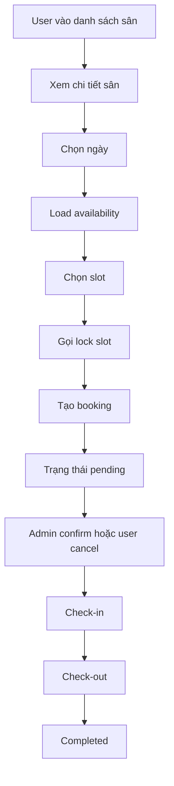
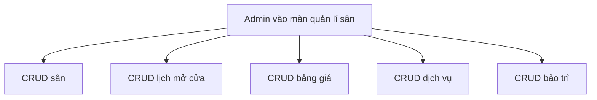
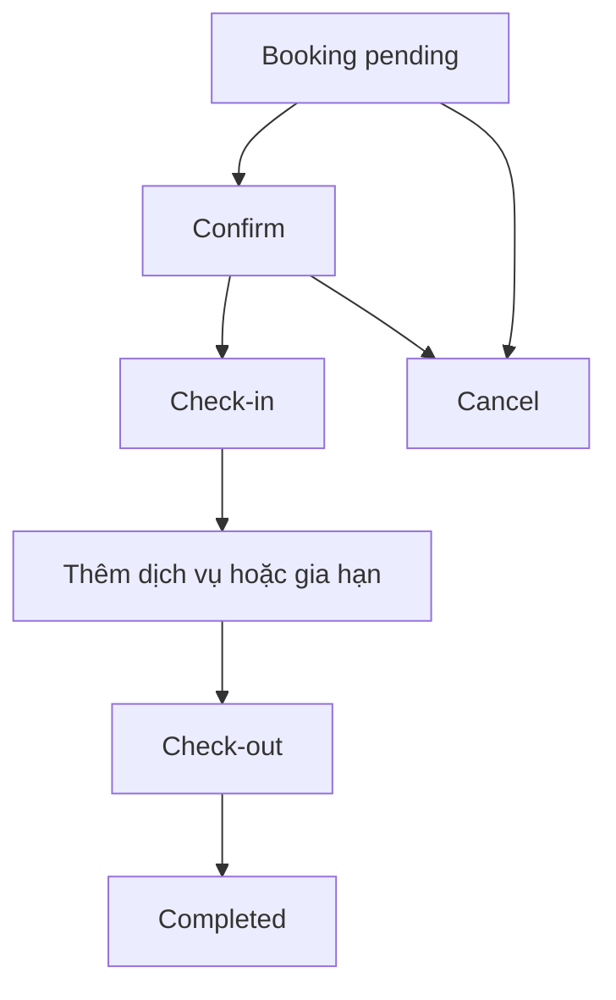
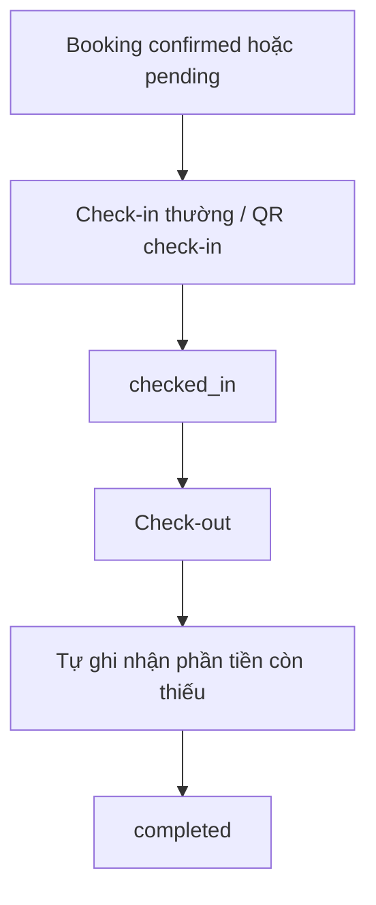
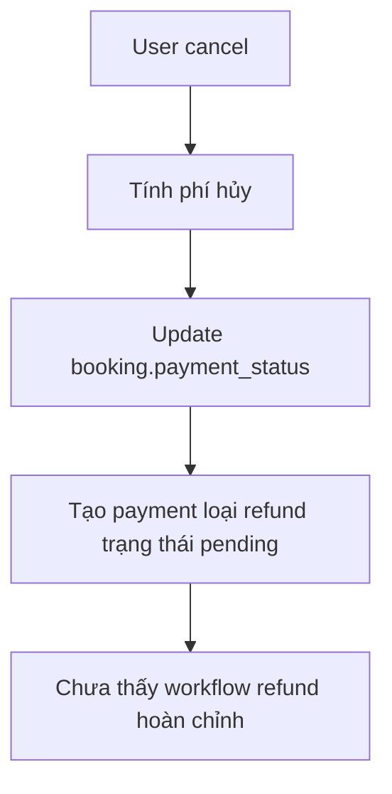

# 1. Tổng quan module đặt sân

## 1.1. Chức năng hiện tại

Module đặt sân hiện đã có khá nhiều thành phần cốt lõi:

- Danh sách sân và chi tiết sân.
- Kiểm tra slot trống theo ngày.
- Giữ chỗ tạm thời bằng `lock_token`.
- Tạo booking khách hàng.
- Danh sách booking của người dùng.
- Hủy booking phía người dùng.
- Quản trị sân, lịch mở cửa, bảng giá, dịch vụ, bảo trì.
- Quản trị booking: xác nhận, check-in, check-out, gia hạn, thêm dịch vụ, ghi nhận thanh toán.
- Realtime một phần qua Laravel Echo/Reverb.
- Email cho tạo booking, xác nhận booking, hủy booking.
- Scheduler dọn lock hết hạn và đánh dấu `no_show`.

## 1.2. Các file chính liên quan

### Backend route / bootstrap

- `backend/routes/api.php`
- `backend/routes/court_booking.php` (đang tồn tại nhưng không được nạp)
- `backend/routes/channels.php`
- `backend/routes/console.php`
- `backend/bootstrap/app.php`

### Backend controller / request / service

- `backend/app/Http/Controllers/Api/CourtController.php`
- `backend/app/Http/Controllers/Api/CourtBookingController.php`
- `backend/app/Http/Controllers/Api/Admin/CourtAdminController.php`
- `backend/app/Http/Controllers/Api/Admin/CourtScheduleAdminController.php`
- `backend/app/Http/Controllers/Api/Admin/CourtPriceAdminController.php`
- `backend/app/Http/Controllers/Api/Admin/CourtServiceAdminController.php`
- `backend/app/Http/Controllers/Api/Admin/CourtMaintenanceAdminController.php`
- `backend/app/Http/Controllers/Api/Admin/CourtBookingAdminController.php`
- `backend/app/Http/Requests/CourtBooking/LockCourtBookingRequest.php`
- `backend/app/Http/Requests/CourtBooking/StoreCourtBookingRequest.php`
- `backend/app/Services/CourtBookingService.php`
- `backend/app/Services/CourtBookingWorkflowService.php`

### Backend model / event / console

- `backend/app/Models/Court.php`
- `backend/app/Models/CourtBooking.php`
- `backend/app/Models/CourtBookingLock.php`
- `backend/app/Models/CourtBookingPayment.php`
- `backend/app/Models/CourtBookingService.php`
- `backend/app/Models/CourtBookingExtension.php`
- `backend/app/Models/CourtBookingStatusHistory.php`
- `backend/app/Models/CourtSchedule.php`
- `backend/app/Models/CourtPrice.php`
- `backend/app/Models/CourtMaintenance.php`
- `backend/app/Models/CourtService.php`
- `backend/app/Models/CourtActivityLog.php`
- `backend/app/Events/CourtBookingRealtimeEvent.php`
- `backend/app/Console/Commands/CleanExpiredCourtBookingLocks.php`
- `backend/app/Console/Commands/MarkCourtBookingNoShows.php`
- `backend/app/Mail/CourtBookingCreatedMail.php`
- `backend/app/Mail/CourtBookingConfirmedMail.php`
- `backend/app/Mail/CourtBookingCancelledMail.php`

### Database

- `backend/database/migrations/2026_05_28_000001_create_courts_table.php`
- `backend/database/migrations/2026_05_28_000002_create_court_schedules_table.php`
- `backend/database/migrations/2026_05_28_000003_create_court_prices_table.php`
- `backend/database/migrations/2026_05_28_000004_create_court_bookings_table.php`
- `backend/database/migrations/2026_05_28_000005_create_court_booking_status_histories_table.php`
- `backend/database/migrations/2026_05_28_000006_create_court_booking_locks_table.php`
- `backend/database/migrations/2026_05_28_000007_create_court_services_table.php`
- `backend/database/migrations/2026_05_28_000008_create_court_booking_services_table.php`
- `backend/database/migrations/2026_05_28_000009_create_court_maintenances_table.php`
- `backend/database/migrations/2026_05_28_000010_create_court_booking_payments_table.php`
- `backend/database/migrations/2026_05_28_000011_create_court_booking_extensions_table.php`
- `backend/database/migrations/2026_05_28_000012_create_court_activity_logs_table.php`
- `backend/database/migrations/2026_05_30_000001_make_court_booking_user_nullable.php`

### Seeder / test

- `backend/database/seeders/CourtSeeder.php`
- `backend/database/seeders/CourtServiceSeeder.php`
- `backend/database/seeders/CourtMaintenanceSeeder.php`
- `backend/database/seeders/CourtBookingSeeder.php`
- `backend/tests/Feature/CourtBookingWorkflowTest.php`

### Frontend

- `frontend/src/services/courtBookingService.js`
- `frontend/src/stores/useCourtBookingStore.js`
- `frontend/src/echo.js`
- `frontend/src/router/index.js`
- `frontend/src/Pages/Client/Courts/CourtsList.vue`
- `frontend/src/Pages/Client/Courts/CourtDetail.vue`
- `frontend/src/Pages/Client/Courts/UserBookings.vue`
- `frontend/src/Pages/Client/Payment/PaymentResult.vue`
- `frontend/src/Pages/admin/AdminCourtManagement.vue`
- `frontend/src/Pages/admin/AdminBookingManagement.vue`
- `frontend/src/Pages/admin/AdminCourtDashboard.vue`
- `frontend/src/Pages/admin/AdminCourtReports.vue`
- `frontend/src/assets/court-management.css`

## 1.3. Kiến trúc hiện tại

- Backend đang tổ chức theo kiểu Laravel monolith.
- User flow booking tách riêng controller/service tương đối rõ.
- Admin flow booking vẫn để khá nhiều nghiệp vụ ngay trong controller, đặc biệt ở `CourtBookingAdminController`.
- Realtime dùng event `CourtBookingRealtimeEvent` + private channel.
- Frontend dùng Vue + Pinia, có `courtBookingService` và store riêng.
- Có tách lớp service cho user flow tốt hơn admin flow.
- Không thấy `Policy` hoặc `Gate` riêng cho `CourtBooking`; permission chủ yếu dựa vào middleware route.

# 2. Sơ đồ luồng hoạt động thực tế

## 2.1. User đặt sân

## 2.2. Admin quản lí sân

## 2.3. Admin xử lí booking

## 2.4. Check-in / check-out

## 2.5. Hủy lịch / hoàn tiền

# 3. Kết quả kiểm tra backend

| Hạng mục | Trạng thái | Nhận xét | Mức độ ảnh hưởng |
| -------- | ---------- | -------- | ---------------- |
| Route API court booking | Cần kiểm tra thêm | Route thật đang nằm trong `backend/routes/api.php`, còn `backend/routes/court_booking.php` bị bỏ rơi vì `backend/bootstrap/app.php:8-14` không nạp file này. Dễ gây drift tài liệu và code. | Trung bình |
| RESTful / action route | Cần kiểm tra thêm | Có nhiều action route như `confirm`, `cancel`, `check-in`, `check-out`, `extend`, `payments`, `qr-check-in`. Chấp nhận được cho nghiệp vụ, nhưng chuẩn REST chưa đồng nhất. | Thấp |
| Phân quyền admin/user | Chưa đạt | User route dùng `auth:api,admin` tại `backend/routes/api.php:567-576` nhưng code lại chỉ đọc `auth()->guard('api')` ở `CourtBookingController` và `CourtBookingService`. Admin vào nhầm route sẽ lỗi/404 thay vì bị chặn rõ ràng. | Cao |
| Phân quyền seller/staff/admin | Chưa đạt | Nhóm `/admin` cho court booking tại `backend/routes/api.php:579-600` cho cả `seller`, khiến seller có thể gọi API quản lí sân, lịch, giá, dịch vụ, bảo trì, booking dù frontend không mở hết UI. | Nghiêm trọng |
| Policy / Gate cho court booking | Thiếu | `backend/app/Providers/AppServiceProvider.php:34-36` chỉ đăng ký policy cho order/return/comment. Không có `CourtBookingPolicy`. | Cao |
| Validation FormRequest | Cần kiểm tra thêm | User flow có FormRequest (`LockCourtBookingRequest`, `StoreCourtBookingRequest`), admin flow chủ yếu validate inline trong controller. | Trung bình |
| Chặn đặt trùng | Cần kiểm tra thêm | Đã có transaction + `lockForUpdate()` ở `CourtBookingService:22-93,130-304` và admin store `CourtBookingAdminController:96-203`. Tuy nhiên DB chưa có ràng buộc cuối cùng chống overlap nên vẫn còn rủi ro race condition ở tải cao. | Nghiêm trọng |
| Chặn đặt trong quá khứ | Chưa đạt | Chỉ chặn `booking_date >= today` ở request `StoreCourtBookingRequest:25-28`, `LockCourtBookingRequest:25-28`. Không có check runtime cho giờ trong ngày hiện tại ở backend user/admin. | Nghiêm trọng |
| Chặn đặt ngoài giờ mở cửa | Chưa đạt | `CourtBookingService:33-71,141-195` và `CourtBookingAdminController:86-183` không kiểm tra `court_schedules`. API có thể đặt 00:00 hoặc sau giờ đóng cửa nếu gọi trực tiếp. | Nghiêm trọng |
| Chặn đặt sân inactive/closed/maintenance | Chưa đạt | Backend create/lock chỉ kiểm tra overlap và maintenance window, không kiểm tra `courts.status`. Nếu sân `inactive/closed` hoặc `maintenance` nhưng không có record bảo trì, vẫn có thể đặt qua API. | Nghiêm trọng |
| Trạng thái booking | Cần kiểm tra thêm | Có state machine trong `CourtBookingWorkflowService:22-31`, nhưng admin controller lại tự đổi trạng thái ở `confirm/checkIn/checkOut/extend`, làm logic bị phân mảnh. Trạng thái `playing` tồn tại nhưng gần như không có flow chuyển sang. | Cao |
| Thanh toán court booking | Chưa đạt | `CourtBookingWorkflowService:153-175` coi `cash`, `bank_transfer`, `pos_card`, `pos_transfer` là `success` ngay. User có thể tự ghi nhận đã thanh toán qua endpoint `CourtBookingController.pay`. | Nghiêm trọng |
| Online payment callback cho court booking | Thiếu | Không thấy gateway flow riêng cho `court_bookings`. Chọn `vnpay/momo` ở booking chỉ tạo payment pending, không sinh URL redirect và không có callback cập nhật booking. | Nghiêm trọng |
| Hủy booking / refund | Chưa đạt | `cancelByUser` ở `CourtBookingWorkflowService:89-123` cập nhật `payment_status` thành `refunded/partially_refunded` trước khi refund thực sự diễn ra, chỉ tạo payment refund `pending`. Admin cancel ở `CourtBookingAdminController:595-607` không sinh refund record. | Nghiêm trọng |
| Update tài chính qua endpoint admin | Chưa đạt | `CourtBookingAdminController.update:558-561` cho sửa trực tiếp `payment_method`, `payment_status`, `note` mà không tạo payment record hay history tài chính. | Cao |
| Transaction ở add service / extend | Chưa đạt | `addService` (`389-423`) và `extend` (`428-552`) không bọc transaction, có thể lệch dữ liệu nếu tạo chi tiết thành công nhưng update booking lỗi hoặc ngược lại. | Cao |
| Rule cho extend | Chưa đạt | `extend` không kiểm tra booking đang ở trạng thái hợp lệ; booking pending/completed/cancelled vẫn có thể bị gia hạn nếu không đụng conflict. | Cao |
| Rule cho add service | Cần kiểm tra thêm | `addService` không giới hạn trạng thái booking; có thể thêm dịch vụ vào booking đã hủy/hoàn thành. | Trung bình |
| HTTP status code / response format | Chưa đạt | Conflict user flow thường trả `400`, admin flow trả `409`, create có nơi `200`, có nơi `201`. Response đa phần `{status,data}` nhưng không hoàn toàn thống nhất. | Trung bình |
| Logging | Cần kiểm tra thêm | Có activity log và log mail/realtime khá tốt. Nhưng nhiều nhánh lỗi business ở controller chỉ trả lỗi mà không log. | Thấp |
| Test coverage | Chưa đạt | Chỉ thấy 4 test cho court workflow lock/cancel trong `backend/tests/Feature/CourtBookingWorkflowTest.php`. Chưa có test cho admin flow, permission, refund, schedule, pricing, realtime. | Cao |

# 4. Kết quả kiểm tra frontend

| Hạng mục | Trạng thái | Nhận xét | Mức độ ảnh hưởng |
| -------- | ---------- | -------- | ---------------- |
| UI danh sách sân | Cần kiểm tra thêm | UI khá rõ, có loading/empty state. Tuy nhiên filter `date/type` ở `CourtsList.vue:17-28,93-106` không có tác dụng vì backend `CourtController.index:21-27` bỏ qua params. | Trung bình |
| Hiển thị trạng thái sân | Chưa đạt | Danh sách sân chỉ hiển thị theo `court.status`, không phản ánh đang có booking hay đang sử dụng. Thậm chí backend chỉ trả sân `active`, nên badge maintenance/closed trên list hầu như không xuất hiện. | Cao |
| Lịch/slot đồng bộ backend | Đạt một phần | `CourtDetail.vue` lấy availability và disable slot `locked/booked/maintenance/past`. Tuy nhiên đây chủ yếu là kiểm soát UI; backend vẫn cho API bypass các rule quan trọng. | Cao |
| Disable slot đã đặt | Đạt | `CourtDetail.vue:483-488` disable slot theo status trả từ backend. | Thấp |
| Loading / empty / error state | Đạt một phần | Có loading/empty khá tốt ở nhiều màn. Error state vẫn chưa đồng đều, nhiều nơi chỉ `catch {}` hoặc toast chung chung. | Trung bình |
| Validate trước khi gọi API | Đạt một phần | Frontend có chặn slot rỗng, slot không liên tục, chưa login. Nhưng không thể thay thế validation backend. | Trung bình |
| Xử lí lỗi API | Cần kiểm tra thêm | Có toast ở nhiều màn, nhưng nhiều action admin `catch (e) {}` không hiển thị lỗi cụ thể. | Trung bình |
| Pinia state management | Cần kiểm tra thêm | `useCourtBookingStore` tách riêng rõ ràng, nhưng chỉ có 1 `loading` và 1 `error` global cho mọi action, dễ ghi đè trạng thái khi gọi song song. | Trung bình |
| API service frontend | Đạt | `frontend/src/services/courtBookingService.js` tách riêng khá sạch. | Thấp |
| Refresh dữ liệu sau thao tác | Đạt một phần | User booking và admin dashboard có refresh tương đối ổn. `AdminBookingManagement` không có realtime riêng, chủ yếu refresh sau thao tác hoặc gọi tay. | Trung bình |
| Online payment UI | Chưa đạt | `CourtDetail.vue:580-585` cho chọn `VNPay/MoMo`, nhưng `proceedBooking()` chỉ gọi tạo booking `CourtDetail.vue:318-343`; không redirect thanh toán. `PaymentResult.vue` lại đang hiển thị kết quả đơn hàng bán lẻ, không phải booking sân. | Nghiêm trọng |
| User tự xác nhận thanh toán | Chưa đạt | `UserBookings.vue:130-149` cho user bấm “Đã chuyển khoản” và gọi `payBooking`, trong khi backend tự đánh dấu `bank_transfer` là thành công. | Nghiêm trọng |
| Màn lịch sử booking user | Cần kiểm tra thêm | `UserBookings.vue:90-103` không cover đủ status `extended`, `playing`, `no_show`; UI trạng thái sẽ thiếu hoặc hiển thị không đẹp. | Trung bình |
| Responsive mobile | Cần kiểm tra thêm | Có CSS responsive ở nhiều màn, nhưng chưa có test render thực tế trên mobile trong lần review này. | Trung bình |
| Reload khi chưa đăng nhập | Đạt một phần | Route `/profile/court-bookings` có `requiresAuth` trong `frontend/src/router/index.js:50-67`, redirect về login ổn. Tuy nhiên `CourtDetail` vẫn cố subscribe private realtime nếu Echo có sẵn, nên trải nghiệm guest chưa thật gọn. | Thấp |
| Realtime frontend | Đạt một phần | `CourtDetail` và `UserBookings` có subscribe. `AdminCourtDashboard` có realtime + polling fallback. Nhưng `AdminBookingManagement` chưa có realtime; chưa thấy xử lý reconnect/app-level fallback rõ cho user pages. | Trung bình |

# 5. Kết quả kiểm tra database

| Hạng mục | Trạng thái | Nhận xét | Mức độ ảnh hưởng |
| -------- | ---------- | -------- | ---------------- |
| Bảng dữ liệu chính | Đạt | Hệ court booking có đủ bảng: courts, schedules, prices, bookings, locks, services, payments, extensions, status history, maintenances, activity logs. | Thấp |
| Quan hệ khóa ngoại | Đạt một phần | FK khá đầy đủ ở migrations ngày `2026_05_28_*`. | Thấp |
| Index truy vấn | Đạt một phần | Có index cho `court_id`, `booking_date`, `status`, time range, lock expiry, maintenance lookup. | Thấp |
| Ràng buộc chống trùng lịch | Chưa đạt | `court_bookings` chỉ có index thường tại `2026_05_28_000004_create_court_bookings_table.php:83-87`, không có ràng buộc DB cuối cùng chống overlap. | Nghiêm trọng |
| Soft delete | Đạt một phần | Có soft delete cho `courts`, `court_bookings`, `court_services`, `court_maintenances`. Schedule/price/payment/history không soft delete. | Thấp |
| Booking status enum | Cần kiểm tra thêm | Enum khá đầy đủ, nhưng một số trạng thái chưa được dùng nhất quán như `playing`, `deposit_paid`. | Trung bình |
| Payment status enum | Cần kiểm tra thêm | Enum có `deposit_paid`, `partially_refunded`, nhưng service hiện tại gần như chỉ dùng `unpaid`, `partially_paid`, `paid`, `refunded`. | Trung bình |
| Price config | Chưa đạt | Có `effective_from/effective_to` và `holiday`, nhưng logic lấy giá ở controller/service đang bỏ qua hoàn toàn. | Cao |
| Schedule consistency | Chưa đạt | DB có unique `court_id + day_of_week`, nhưng backend không validate nghiệp vụ chống book ngoài giờ hoặc gia hạn vượt giờ. | Cao |
| Seeder demo | Đạt một phần | Seeder khá đầy đủ và tốt cho demo/test thủ công. | Thấp |
| Độ chính xác báo cáo | Chưa đạt | `stats()` đang dùng `hoursPerDay = 17` cố định tại `CourtBookingAdminController:867-879`, không đọc từ `court_schedules` và không trừ bảo trì. | Trung bình |

# 6. Các lỗi hoặc rủi ro nghiêm trọng

## 6.1. Có thể đặt sân trong quá khứ qua API

- File: `backend/app/Http/Requests/CourtBooking/StoreCourtBookingRequest.php:25-30`
- File: `backend/app/Services/CourtBookingService.php:141-195`
- File: `backend/app/Http/Controllers/Api/Admin/CourtBookingAdminController.php:86-98`

Nhận xét:

- Chỉ kiểm tra `booking_date >= today`.
- Không có check backend cho `booking_date = hôm nay` nhưng `start_time < now`.
- Frontend có disable slot quá khứ, nhưng API gọi trực tiếp vẫn vượt qua được.

## 6.2. Có thể đặt sân inactive/closed hoặc ngoài giờ mở cửa

- File: `backend/app/Services/CourtBookingService.php:33-71`
- File: `backend/app/Services/CourtBookingService.php:141-195`
- File: `backend/app/Http/Controllers/Api/Admin/CourtBookingAdminController.php:100-157`
- File: `backend/app/Http/Controllers/Api/Admin/CourtBookingAdminController.php:432-515`

Nhận xét:

- Không có check `courts.status = active`.
- Không có check `court_schedules` để bảo đảm giờ đặt nằm trong giờ mở cửa.
- `extend()` cũng không kiểm tra vượt giờ đóng cửa.

## 6.3. User có thể tự đánh dấu booking đã thanh toán

- File: `backend/app/Services/CourtBookingWorkflowService.php:153-175`
- File: `backend/app/Http/Controllers/Api/CourtBookingController.php:127-145`
- File: `frontend/src/Pages/Client/Courts/UserBookings.vue:143-149`

Nhận xét:

- `bank_transfer` và `cash` được set `success` ngay ở backend.
- User chỉ cần bấm “Đã chuyển khoản” là booking được cộng `paid_amount`.
- Đây là lỗ hổng tài chính nghiêm trọng.

## 6.4. Chọn VNPay/MoMo nhưng không có luồng thanh toán online thực sự

- File: `frontend/src/Pages/Client/Courts/CourtDetail.vue:580-585`
- File: `frontend/src/Pages/Client/Courts/CourtDetail.vue:318-343`
- File: `backend/app/Http/Controllers/Api/CourtBookingController.php:127-145`
- File: `frontend/src/Pages/Client/Payment/PaymentResult.vue:42-45`

Nhận xét:

- UI cho phép chọn `VNPay` và `MoMo`.
- Nhưng booking flow không sinh URL redirect/payment intent cho court booking.
- `PaymentResult.vue` đang xử lý payment của `orders`, không phải `court_bookings`.

## 6.5. Refund đang cập nhật trạng thái “đã hoàn tiền” khi refund chưa thực hiện

- File: `backend/app/Services/CourtBookingWorkflowService.php:89-123`
- File: `backend/app/Http/Controllers/Api/Admin/CourtBookingAdminController.php:595-607`

Nhận xét:

- User cancel có thể set `payment_status = refunded/partially_refunded` trước.
- Chỉ tạo payment loại `refund` trạng thái `pending`.
- Admin cancel lại không tạo refund record.
- Dữ liệu booking và payment dễ lệch nhau.

## 6.6. Seller có thể gọi API quản trị toàn bộ module sân

- File: `backend/routes/api.php:579-600`
- File: `frontend/src/router/index.js:292-301`
- File: `backend/routes/channels.php:12-14`

Nhận xét:

- Route API cho phép `seller`.
- Seller không chỉ xem booking mà còn gọi CRUD sân, lịch, giá, dịch vụ, bảo trì qua API nếu tự gọi request.
- Trong khi channel realtime admin lại không cho seller.

## 6.7. Chưa có ràng buộc DB cuối cùng chống double booking

- File: `backend/app/Services/CourtBookingService.php:22-93`
- File: `backend/database/migrations/2026_05_28_000004_create_court_bookings_table.php:83-87`

Nhận xét:

- Ứng dụng đã dùng transaction + `lockForUpdate`.
- Nhưng `court_bookings` không có inventory slot table hoặc constraint range-level.
- Dưới concurrency cao vẫn còn rủi ro đặt trùng.

## 6.8. Endpoint update admin có thể sửa payment_status trực tiếp

- File: `backend/app/Http/Controllers/Api/Admin/CourtBookingAdminController.php:558-561`

Nhận xét:

- Cho phép sửa `payment_status` và `payment_method` trực tiếp.
- Không tạo payment record.
- Không cập nhật history tài chính.
- Có nguy cơ tạo dữ liệu giả và phá luồng kiểm toán.

## 6.9. Gia hạn và thêm dịch vụ chưa khóa transaction, chưa chặn trạng thái sai

- File: `backend/app/Http/Controllers/Api/Admin/CourtBookingAdminController.php:389-423`
- File: `backend/app/Http/Controllers/Api/Admin/CourtBookingAdminController.php:428-552`

Nhận xét:

- `addService()` và `extend()` không bọc transaction.
- `extend()` không kiểm tra booking đang ở `checked_in/playing`.
- Có thể phát sinh dữ liệu sai hoặc cập nhật trạng thái không hợp lệ.

# 7. Điểm mạnh hiện tại

- Có service riêng cho user booking flow, đặc biệt là `lock slot` và `create booking`.
- Đã có `court_booking_locks` và job dọn lock hết hạn.
- Có `court_booking_status_histories` và `court_activity_logs` để truy vết.
- Có realtime event/channel cho slot, booking status, payment update.
- Có scheduler đánh dấu `no_show`.
- Frontend có store/service riêng cho module court booking.
- Admin có dashboard, calendar, báo cáo, POS booking, QR check-in.
- Có email cho create/confirm/cancel booking.
- Đã có test backend cho lock flow và double-booking cơ bản.

# 8. Điểm chưa hoàn thiện

- Chưa có rule backend chặn quá khứ theo giờ.
- Chưa có rule backend chặn ngoài giờ mở cửa.
- Chưa có rule backend chặn theo `courts.status`.
- Chưa có policy riêng cho booking sân.
- Chưa có luồng thanh toán online hoàn chỉnh cho booking sân.
- Chưa có refund workflow chuẩn hóa và idempotent cho booking sân.
- Chưa có ràng buộc DB chống overlap ở tầng cuối.
- Chưa có kiểm soát hiệu lực giá theo `effective_from/effective_to`.
- Chưa dùng `holiday` pricing.
- Trạng thái `playing`, `deposit_paid` gần như chưa có flow thật.
- Controller admin đang ôm quá nhiều business logic.
- Realtime mới mạnh ở dashboard, chưa phủ đều admin booking list và user fallback.
- Thống kê hiệu suất chưa đọc từ schedule thực tế.
- Frontend list/filter sân đang lệch với backend.

# 9. Hướng phát triển đề xuất

## Giai đoạn 1: Hoàn thiện nghiệp vụ cốt lõi

- Chặn đặt trùng bằng chiến lược chắc chắn hơn: slot inventory table hoặc constraint nghiệp vụ mạnh hơn.
- Chặn đặt trong quá khứ theo giờ, ngoài giờ mở cửa, sân inactive/closed/maintenance.
- Chuẩn hóa state machine booking vào một chỗ duy nhất.
- Bỏ endpoint admin update trực tiếp `payment_status`.
- Tách FormRequest riêng cho admin booking flows.
- Bổ sung `CourtBookingPolicy` và thu hẹp seller permission.
- Hoàn thiện refund lifecycle chuẩn: requested → processing → refunded/failed.

## Giai đoạn 2: Hoàn thiện giao diện và trải nghiệm

- Sửa backend filter sân để `date/type` hoạt động thật.
- Hiển thị trạng thái sân đúng nghĩa: trống, đã đặt, đang sử dụng, bảo trì.
- Đồng bộ toàn bộ trạng thái `pending/confirmed/checked_in/extended/completed/no_show/cancelled` trên UI.
- Tách loading/error theo từng action trong Pinia store.
- Cải thiện thông báo lỗi API thân thiện hơn cho admin.

## Giai đoạn 3: Realtime và đồng bộ đa nền tảng

- Phủ realtime cho `AdminBookingManagement`.
- Thêm reconnect handling và fallback polling cho user pages.
- Broadcast event riêng cho tạo/hủy/confirm/check-in/check-out/refund.
- Đồng bộ web và mobile cùng một contract event.

## Giai đoạn 4: Báo cáo, doanh thu, vận hành

- Tính utilization theo `court_schedules` thực tế.
- Trừ thời gian bảo trì khỏi giờ khả dụng.
- Tách doanh thu sân, doanh thu dịch vụ, doanh thu refund rõ ràng.
- Bổ sung báo cáo no-show, conversion, tỉ lệ lấp đầy theo khung giờ.
- Thêm audit tài chính cho mọi thao tác payment/refund.

# 10. Kết luận

## Đánh giá tổng thể

- Module đã vượt mức “demo”, có nền tảng backend/frontend/realtime khá tốt.
- Tuy nhiên chưa đủ an toàn để production nếu giữ nguyên logic thanh toán, permission và validation hiện tại.
- Có thể đưa vào test nghiệp vụ nội bộ hoặc UAT sớm, nhưng chưa nên mở cho người dùng thật có thanh toán thật.

## Những việc cần sửa trước production

- Chặn user tự đánh dấu đã thanh toán.
- Hoàn thiện payment gateway thật cho court booking hoặc bỏ hẳn option online khỏi UI.
- Siết permission, bỏ seller khỏi court admin APIs nếu không có yêu cầu rõ.
- Thêm validation backend cho quá khứ, giờ mở cửa, trạng thái sân.
- Chuẩn hóa refund và state transition.
- Bịt rủi ro double booking ở tầng database/nghiệp vụ cuối.

## Mức độ hoàn thiện ước lượng

- Backend nghiệp vụ cốt lõi: khoảng 65%
- Frontend trải nghiệm booking: khoảng 70%
- Thanh toán / refund court booking: khoảng 35%
- Permission / hardening / production readiness: khoảng 45%
- Tổng thể module: khoảng 60%

## Kết quả kiểm thử đã chạy

- `php artisan test --filter=CourtBookingWorkflowTest`: PASS, 4 test.
- `php artisan test --filter=PaymentProcessingServiceTest`: PASS, 4 test.

Lưu ý:

- Kết quả test hiện có chỉ xác nhận một phần nhỏ của booking lock và payment callback của module order chung.
- Các lỗi/rủi ro nêu trên vẫn tồn tại vì phần lớn chưa được test cover.
