# ĐẶC TẢ THIẾT KẾ CƠ SỞ DỮ LIỆU - HỆ THỐNG OCEAN SHOP (DATN)

Tài liệu này cung cấp thiết kế chi tiết về Cơ sở dữ liệu (Database Schema) cho hệ thống **Ocean Shop** (Đồ án tốt nghiệp). Hệ thống sử dụng hệ quản trị cơ sở dữ liệu **MySQL 8.0** phục vụ kiến trúc tách biệt (Decoupled) với Laravel API ở Backend và VueJS 3 SPA ở Frontend.

---

## I. SƠ ĐỒ QUAN HỆ THỰC THỂ (ERD - ENTITY RELATIONSHIP DIAGRAM)

Dưới đây là sơ đồ Mermaid thể hiện mối quan hệ cốt lõi giữa các bảng chính trong hệ thống (như người dùng, sản phẩm, đơn hàng, khuyến mãi, flash sale và POS).

```mermaid
erDiagram
    USERS ||--o{ ADDRESSES : "có (1-n)"
    USERS ||--o{ CARTS : "sở hữu (1-n)"
    USERS ||--o{ ORDERS : "đặt hàng (1-n)"
    USERS ||--o{ FAVORITES : "yêu thích (1-n)"
    USERS ||--o{ USER_COUPONS : "lưu mã (1-n)"
    USERS ||--o{ ATTENDANCES : "chấm công (1-n)"
    USERS ||--o{ CHAT_SESSIONS : "bắt đầu chat (1-n)"
    USERS ||--o{ PRODUCT_COMMENTS : "bình luận (1-n)"
    
    ADMINS ||--o{ ORDERS : "xử lý POS (1-n)"
    
    BRANDS ||--o{ PRODUCTS : "nhóm (1-n)"
    CATEGORIES ||--o{ PRODUCTS : "phân loại (1-n)"
    CATEGORIES ||--o{ CATEGORIES : "đệ quy cha-con (1-n)"
    
    PRODUCTS ||--o{ PRODUCT_VARIANTS : "có (1-n)"
    PRODUCTS ||--o{ PRODUCT_IMAGES : "chứa (1-n)"
    PRODUCTS ||--o{ FAVORITES : "trong danh sách (1-n)"
    PRODUCTS ||--o{ ORDER_ITEMS : "trong chi tiết đơn (1-n)"
    PRODUCTS ||--o{ FLASH_SALE_ITEMS : "tham gia (1-n)"
    PRODUCTS ||--o{ PROMOTION_PRODUCTS : "áp dụng (1-n)"
    
    PRODUCT_VARIANTS ||--o{ CART_ITEMS : "trong giỏ (1-n)"
    PRODUCT_VARIANTS ||--o{ ORDER_ITEMS : "trong chi tiết đơn (1-n)"
    PRODUCT_VARIANTS ||--o{ INVENTORY_TRANSACTIONS : "ghi lịch sử kho (1-n)"
    
    CARTS ||--o{ CART_ITEMS : "chứa (1-n)"
    
    ORDERS ||--o{ ORDER_ITEMS : "chứa (1-n)"
    ORDERS ||--o{ ORDER_STATUS_HISTORIES : "ghi trạng thái (1-n)"
    ORDERS ||--o{ PAYMENTS : "thanh toán (1-n)"
    
    COUPONS ||--o{ ORDERS : "áp dụng (1-n)"
    COUPONS ||--o{ USER_COUPONS : "lưu trữ (1-n)"
    COUPONS ||--o{ COUPON_CATEGORIES : "áp dụng theo danh mục (1-n)"
    
    PROMOTIONS ||--o{ PROMOTION_CATEGORIES : "áp dụng theo danh mục (1-n)"
    PROMOTIONS ||--o{ PROMOTION_PRODUCTS : "áp dụng theo sản phẩm (1-n)"
    PROMOTIONS ||--o{ PROMOTION_USAGES : "lịch sử sử dụng (1-n)"
    
    FLASH_SALES ||--o{ FLASH_SALE_ITEMS : "chứa (1-n)"
    
    POST_CATEGORIES ||--o{ POSTS : "phân loại (1-n)"
    CHAT_SESSIONS ||--o{ CHAT_MESSAGES : "chứa (1-n)"
```



---

## II. DANH SÁCH PHÂN HỆ VÀ 43 BẢNG DỮ LIỆU

Hệ thống bao gồm **43 bảng** được chia thành 7 phân hệ logic chính:

| STT | Phân hệ (Module) | Các bảng dữ liệu thành phần |
| :--- | :--- | :--- |
| **1** | **Hệ thống & Tiện ích** (8 bảng) | `migrations`, `sessions`, `cache`, `cache_locks`, `jobs`, `job_batches`, `failed_jobs`, `notifications` |
| **2** | **Phân quyền & Người dùng** (6 bảng) | `users`, `admins`, `password_reset_tokens`, `password_resets_otp`, `addresses`, `attendances` |
| **3** | **Sản phẩm & Tồn kho** (8 bảng) | `brands`, `categories`, `products`, `product_variants`, `product_images`, `inventory_transactions`, `favorites`, `product_comments` |
| **4** | **Giỏ hàng & Realtime Chat** (4 bảng) | `carts`, `cart_items`, `chat_sessions`, `chat_messages` |
| **5** | **Đơn hàng & Thanh toán** (5 bảng) | `orders`, `order_items`, `order_status_histories`, `payments`, `shipping_zones` |
| **6** | **Khuyến mãi & Flash Sale** (9 bảng) | `promotions`, `promotion_categories`, `promotion_products`, `promotion_usages`, `coupons`, `coupon_categories`, `user_coupons`, `flash_sales`, `flash_sale_items` |
| **7** | **Bài viết & Hỗ trợ** (3 bảng) | `post_categories`, `posts`, `contacts` |

---

## III. TỪ ĐIỂN DỮ LIỆU CHI TIẾT (DATA DICTIONARY)

Dưới đây là đặc tả cấu trúc bảng, kiểu dữ liệu, các ràng buộc và ý nghĩa chức năng của các thực thể cốt lõi trong hệ thống:

### 1. Phân hệ Phân quyền & Người dùng

#### Bảng `users` (Thông tin người dùng/khách hàng/nhân viên)
Lưu thông tin tài khoản người dùng, hỗ trợ tích hợp Social Login (Google, Facebook), chấm công và tích lũy điểm thưởng.
*   **Chỉ mục chính**: `user_id` (PK), `email` (Unique), `phone` (Unique), `google_id` (Unique), `facebook_id` (Unique).

| Tên cột | Kiểu dữ liệu | Ràng buộc | Mặc định | Mô tả ý nghĩa |
| :--- | :--- | :--- | :--- | :--- |
| `user_id` | bigint unsigned | PK, AI | | ID định danh người dùng |
| `full_name` | varchar(120) | Not Null | | Họ và tên đầy đủ |
| `email` | varchar(255) | Unique, Not Null | | Địa chỉ Email đăng nhập |
| `google_id` | varchar(255) | Unique, Nullable | Null | ID liên kết tài khoản Google |
| `facebook_id` | varchar(255) | Unique, Nullable | Null | ID liên kết tài khoản Facebook |
| `phone` | varchar(20) | Unique, Nullable | Null | Số điện thoại liên hệ |
| `password` | varchar(255) | Nullable | Null | Mật khẩu băm (Null nếu dùng Google/FB) |
| `avatar_url` | text | Nullable | Null | Đường dẫn ảnh đại diện |
| `date_of_birth` | date | Nullable | Null | Ngày sinh nhật (dành cho tích điểm/khuyến mãi) |
| `reward_points` | int unsigned | Not Null | 0 | Điểm thưởng tích lũy |
| `role` | enum('admin','staff','customer','seller') | Not Null | 'customer' | Quyền hạn tài khoản trong hệ thống |
| `status` | enum('active','inactive','banned') | Not Null | 'active' | Trạng thái tài khoản |
| `email_verified_at`| timestamp | Nullable | Null | Thời gian xác thực email |
| `last_login_at` | timestamp | Nullable | Null | Lần cuối cùng đăng nhập |
| `remember_token` | varchar(100) | Nullable | Null | Token duy trì trạng thái đăng nhập |
| `created_at` | timestamp | Null | Null | Thời gian tạo tài khoản |
| `updated_at` | timestamp | Null | Null | Thời gian cập nhật tài khoản |
| `deleted_at` | timestamp | Nullable | Null | Thời gian xóa mềm (Soft Delete) |

#### Bảng `admins` (Tài khoản quản trị cao cấp)
Lưu thông tin quản trị viên quản lý bảng điều khiển admin dashboard.
*   **Chỉ mục chính**: `admin_id` (PK), `email` (Unique).

| Tên cột | Kiểu dữ liệu | Ràng buộc | Mặc định | Mô tả ý nghĩa |
| :--- | :--- | :--- | :--- | :--- |
| `admin_id` | bigint unsigned | PK, AI | | ID định danh quản trị viên |
| `full_name` | varchar(255) | Not Null | | Họ tên đầy đủ |
| `email` | varchar(255) | Unique, Not Null | | Email quản trị |
| `phone` | varchar(255) | Nullable | Null | Số điện thoại |
| `avatar_url` | varchar(255) | Nullable | Null | Đường dẫn ảnh đại diện |
| `password` | varchar(255) | Not Null | | Mật khẩu băm |
| `role` | varchar(255) | Not Null | 'admin' | Quyền quản trị |
| `status` | enum('active','inactive') | Not Null | 'active' | Trạng thái hoạt động |
| `remember_token` | varchar(100) | Nullable | Null | Token duy trì đăng nhập |
| `created_at`/`updated_at` | timestamp | Nullable | Null | Thời gian tạo/cập nhật |

#### Bảng `addresses` (Sổ địa chỉ người dùng)
Lưu thông tin địa chỉ giao hàng của khách hàng, liên kết với hệ thống API Giao Hàng Nhanh (GHN).
*   **Khóa ngoại**: `user_id` -> `users.user_id` (Cascade).

| Tên cột | Kiểu dữ liệu | Ràng buộc | Mặc định | Mô tả ý nghĩa |
| :--- | :--- | :--- | :--- | :--- |
| `address_id` | bigint unsigned | PK, AI | | ID định danh địa chỉ |
| `user_id` | bigint unsigned | FK, Not Null | | ID khách hàng sở hữu địa chỉ |
| `recipient_name` | varchar(120) | Not Null | | Tên người nhận hàng |
| `phone` | varchar(20) | Not Null | | Số điện thoại người nhận hàng |
| `address_line` | varchar(255) | Not Null | | Địa chỉ cụ thể (Số nhà, tên đường...) |
| `ward` | varchar(120) | Nullable | Null | Tên Phường/Xã |
| `ward_code` | int unsigned | Nullable | Null | Mã Phường/Xã của đơn vị GHN |
| `district` | varchar(120) | Nullable | Null | Tên Quận/Huyện |
| `district_code` | int unsigned | Nullable | Null | Mã Quận/Huyện của đơn vị GHN |
| `province` | varchar(120) | Nullable | Null | Tên Tỉnh/Thành phố |
| `province_code` | int unsigned | Nullable | Null | Mã Tỉnh/Thành phố của đơn vị GHN |
| `postal_code` | varchar(20) | Nullable | Null | Mã bưu chính |
| `country` | varchar(120) | Not Null | 'Vietnam' | Quốc gia |
| `is_default` | tinyint(1) | Not Null | 0 | Đánh dấu địa chỉ mặc định (1: Đúng, 0: Sai) |
| `address_type` | enum('home','office','other') | Not Null | 'home' | Loại địa chỉ |

#### Bảng `attendances` (Chấm công nhân viên)
Lưu lịch sử chấm công Check-in và Check-out hàng ngày của nhân viên tại quầy hoặc cửa hàng.
*   **Khóa ngoại**: `user_id` -> `users.user_id` (Cascade).

| Tên cột | Kiểu dữ liệu | Ràng buộc | Mặc định | Mô tả ý nghĩa |
| :--- | :--- | :--- | :--- | :--- |
| `id` | bigint unsigned | PK, AI | | ID chấm công |
| `user_id` | bigint unsigned | FK, Not Null | | ID nhân viên chấm công |
| `check_in_at` | timestamp | Nullable | Null | Thời gian Check-in |
| `check_out_at` | timestamp | Nullable | Null | Thời gian Check-out |
| `ip_address` | varchar(255) | Nullable | Null | Địa chỉ IP (xác định dùng wifi cửa hàng) |
| `latitude` | decimal(10,8) | Nullable | Null | Tọa độ GPS Vĩ độ |
| `longitude` | decimal(11,8) | Nullable | Null | Tọa độ GPS Kinh độ |
| `wifi_ssid` | varchar(255) | Nullable | Null | Tên Wifi kết nối khi chấm công |
| `wifi_bssid` | varchar(255) | Nullable | Null | Địa chỉ MAC của Router phát wifi |
| `image_path` | varchar(255) | Nullable | Null | Ảnh chụp selfie lúc Check-in |
| `check_out_image_path` | varchar(255) | Nullable | Null | Ảnh chụp selfie lúc Check-out |
| `note` | text | Nullable | Null | Ghi chú chấm công |

---

### 2. Phân hệ Sản phẩm & Tồn kho

#### Bảng `categories` (Danh mục sản phẩm)
Phân loại sản phẩm theo cấu trúc cây đệ quy đa cấp (danh mục cha - con).

| Tên cột | Kiểu dữ liệu | Ràng buộc | Mặc định | Mô tả ý nghĩa |
| :--- | :--- | :--- | :--- | :--- |
| `category_id` | bigint unsigned | PK, AI | | ID danh mục |
| `parent_id` | bigint unsigned | FK, Nullable | Null | ID danh mục cha (đệ quy -> `category_id`) |
| `name` | varchar(120) | Not Null | | Tên danh mục |
| `slug` | varchar(150) | Unique, Not Null | | Đường dẫn thân thiện SEO |
| `image` | varchar(500) | Nullable | Null | Ảnh đại diện của danh mục |
| `description` | text | Nullable | Null | Mô tả chi tiết |
| `sort_order` | int | Not Null | 0 | Thứ tự sắp xếp hiển thị |
| `is_active` | tinyint(1) | Not Null | 1 | Trạng thái hiển thị (1: Hiện, 0: Ẩn) |

#### Bảng `products` (Sản phẩm gốc)
Lưu thông tin sản phẩm chính trong hệ thống.
*   **Khóa ngoại**: 
    - `category_id` -> `categories.category_id` (Restrict)
    - `brand_id` -> `brands.brand_id` (Set Null)
    - `seller_id` -> `users.user_id` (Set Null)

| Tên cột | Kiểu dữ liệu | Ràng buộc | Mặc định | Mô tả ý nghĩa |
| :--- | :--- | :--- | :--- | :--- |
| `product_id` | bigint unsigned | PK, AI | | ID sản phẩm |
| `category_id` | bigint unsigned | FK, Not Null | | ID danh mục phân loại |
| `brand_id` | bigint unsigned | FK, Nullable | Null | ID thương hiệu |
| `seller_id` | bigint unsigned | FK, Nullable | Null | ID người bán/người phụ trách |
| `name` | varchar(200) | Not Null | | Tên sản phẩm |
| `slug` | varchar(220) | Unique, Not Null | | Đường dẫn thân thiện SEO |
| `short_description`| varchar(500) | Nullable | Null | Mô tả ngắn |
| `description` | longtext | Nullable | Null | Mô tả chi tiết (HTML) |
| `thumbnail_url` | varchar(255) | Nullable | Null | Đường dẫn ảnh thu nhỏ hiển thị chính |
| `product_type` | enum('simple','variant')| Not Null| 'variant'| Loại sản phẩm (Đơn giản hoặc có biến thể) |
| `status` | enum('draft','active','inactive','out_of_stock') | Not Null | 'active' | Trạng thái sản phẩm |
| `is_featured` | tinyint(1) | Not Null | 0 | Sản phẩm nổi bật (1: Có, 0: Không) |
| `min_price` | decimal(12,2) | Not Null | 0.00 | Giá nhỏ nhất của các biến thể |
| `max_price` | decimal(12,2) | Not Null | 0.00 | Giá lớn nhất của các biến thể |
| `rating_avg` | decimal(3,2) | Not Null | 0.00 | Điểm đánh giá trung bình (1.00 -> 5.00) |
| `rating_count` | int | Not Null | 0 | Số lượt đánh giá |
| `view_count` | int | Not Null | 0 | Số lượt xem sản phẩm |
| `sold_count` | int | Not Null | 0 | Số lượng đã bán thành công |
| `published_at` | datetime | Nullable | Null | Ngày công bố sản phẩm lên web |

#### Bảng `product_variants` (Biến thể sản phẩm)
Chứa thông tin về các biến thể chi tiết của sản phẩm như Kích thước (Size), Màu sắc (Color), Chất liệu. Quản lý chính xác Tồn kho và Giá bán của từng biến thể.
*   **Chỉ mục chính**: `variant_id` (PK), `sku` (Unique), `product_id_color_size` (Unique - tránh tạo trùng tổ hợp màu và kích thước cho cùng sản phẩm).
*   **Khóa ngoại**: `product_id` -> `products.product_id` (Cascade).

| Tên cột | Kiểu dữ liệu | Ràng buộc | Mặc định | Mô tả ý nghĩa |
| :--- | :--- | :--- | :--- | :--- |
| `variant_id` | bigint unsigned | PK, AI | | ID biến thể sản phẩm |
| `product_id` | bigint unsigned | FK, Not Null | | ID sản phẩm gốc liên kết |
| `sku` | varchar(100) | Unique, Not Null | | Mã kho hàng duy nhất (Stock Keeping Unit) |
| `barcode` | varchar(100) | Nullable | Null | Mã vạch sản phẩm (quét tại quầy POS) |
| `variant_name` | varchar(150) | Nullable | Null | Tên biến thể (VD: "Sản phẩm A - Xanh - XL") |
| `color` | varchar(60) | Nullable | Null | Màu sắc |
| `size` | varchar(60) | Nullable | Null | Kích thước |
| `material` | varchar(120) | Nullable | Null | Chất liệu |
| `weight_gram` | int | Nullable | Null | Trọng lượng sản phẩm (đơn vị: gram - tính ship) |
| `cost_price` | decimal(12,2) | Not Null | 0.00 | Giá nhập hàng (Giá vốn để tính doanh thu/lợi nhuận) |
| `price` | decimal(12,2) | Not Null | | Giá bán lẻ niêm yết |
| `compare_at_price` | decimal(12,2) | Nullable | Null | Giá gốc chưa giảm (để hiển thị gạch bỏ) |
| `sale_price` | decimal(12,2) | Nullable | Null | Giá bán khuyến mãi (tạm thời) |
| `sale_starts_at` | datetime | Nullable | Null | Thời gian bắt đầu giảm giá |
| `sale_ends_at` | datetime | Nullable | Null | Thời gian kết thúc giảm giá |
| `stock` | int | Not Null | 0 | Số lượng thực tế trong kho |
| `reserved_stock` | int | Not Null | 0 | Số lượng đã được giữ (khi khách đang checkout) |
| `safety_stock` | int | Not Null | 0 | Ngưỡng tồn kho an toàn |
| `image_url` | varchar(255) | Nullable | Null | Ảnh riêng của biến thể này |
| `status` | enum('active','inactive','out_of_stock') | Not Null | 'active' | Trạng thái hoạt động của biến thể |

#### Bảng `inventory_transactions` (Lịch sử giao dịch kho)
Quản lý mọi thay đổi về số lượng tồn kho của các biến thể sản phẩm nhằm phục vụ kiểm kho, báo cáo nhập/xuất và truy vết.
*   **Khóa ngoại**: 
    - `variant_id` -> `product_variants.variant_id` (Cascade)
    - `created_by` -> `users.user_id` (Set Null)

| Tên cột | Kiểu dữ liệu | Ràng buộc | Mặc định | Mô tả ý nghĩa |
| :--- | :--- | :--- | :--- | :--- |
| `inventory_transaction_id` | bigint unsigned | PK, AI | | ID lịch sử kho |
| `variant_id` | bigint unsigned | FK, Not Null | | ID biến thể sản phẩm giao dịch |
| `transaction_type` | enum('import','export','reserve','release','adjustment','return') | Not Null | | Loại giao dịch (nhập, xuất, giữ kho khi mua, xả giữ, điều chỉnh, hoàn trả) |
| `quantity` | int | Not Null | | Số lượng tăng (+) hoặc giảm (-) |
| `reference_type` | enum('order','manual','supplier','system') | Not Null | 'manual' | Nguồn phát sinh giao dịch |
| `reference_id` | bigint unsigned | Nullable | Null | ID của thực thể tham chiếu (ID đơn hàng...) |
| `note` | varchar(255) | Nullable | Null | Lý do giao dịch |
| `created_by` | bigint unsigned | FK, Nullable | Null | Nhân viên thực hiện |

---

### 3. Phân hệ Đơn hàng & Thanh toán

#### Bảng `orders` (Thông tin đơn hàng)
Quản trị toàn bộ thông tin đơn hàng mua sắm online trên web hoặc mua trực tiếp tại quầy (POS).
*   **Chỉ mục chính**: `order_id` (PK), `order_code` (Unique - dùng làm mã giao dịch thanh toán).
*   **Khóa ngoại**: 
    - `user_id` -> `users.user_id` (Restrict)
    - `address_id` -> `addresses.address_id` (Set Null)
    - `promotion_id` -> `coupons.id` (Set Null)

| Tên cột | Kiểu dữ liệu | Ràng buộc | Mặc định | Mô tả ý nghĩa |
| :--- | :--- | :--- | :--- | :--- |
| `order_id` | bigint unsigned | PK, AI | | ID đơn hàng |
| `order_code` | varchar(30) | Unique, Not Null | | Mã đơn hàng hiển thị (VD: "ORD-2026-XXXXX") |
| `user_id` | bigint unsigned | FK, Not Null | | ID khách hàng đặt |
| `seller_id` | bigint unsigned | FK, Nullable | Null | ID nhân viên phụ trách/tạo đơn (cho POS bán tại quầy) |
| `address_id` | bigint unsigned | FK, Nullable | Null | ID địa chỉ giao hàng nhận |
| `promotion_id` | bigint unsigned | FK, Nullable | Null | ID mã giảm giá áp dụng (Khóa ngoại trỏ đến coupons) |
| `recipient_name` | varchar(120) | Not Null | | Họ tên người nhận hàng |
| `recipient_phone` | varchar(20) | Not Null | | Số điện thoại người nhận hàng |
| `shipping_address` | text | Not Null | | Địa chỉ giao hàng đầy đủ |
| `note` | text | Nullable | Null | Ghi chú đơn hàng từ khách hàng |
| `payment_method` | enum('cod','vnpay','momo','bank_transfer','pos_cash','pos_transfer','pos_card') | Nullable | 'cod' | Phương thức thanh toán |
| `payment_status` | enum('unpaid','paid','failed','refunded','partially_refunded') | Not Null | 'unpaid' | Trạng thái thanh toán |
| `fulfillment_status` | enum('pending','confirmed','packing','shipping','delivered','completed','cancelled','returned') | Not Null | 'pending' | Trạng thái xử lý và vận chuyển đơn hàng |
| `subtotal` | decimal(12,2) | Not Null | 0.00 | Tạm tính (tổng tiền các sản phẩm chưa trừ giảm) |
| `discount_amount` | decimal(12,2) | Not Null | 0.00 | Số tiền giảm giá được áp dụng |
| `shipping_fee` | decimal(12,2) | Not Null | 0.00 | Phí vận chuyển |
| `grand_total` | decimal(12,2) | Not Null | 0.00 | Tổng tiền cuối cùng khách phải trả |
| `email_sent` | tinyint(1) | Not Null | 0 | Đã gửi email xác nhận đặt hàng chưa (1: Rồi, 0: Chưa) |
| `confirmed_at` | datetime | Nullable | Null | Thời gian xác nhận đơn |
| `shipped_at` | datetime | Nullable | Null | Thời gian bắt đầu giao |
| `delivered_at` | datetime | Nullable | Null | Thời gian giao thành công |
| `completed_at` | datetime | Nullable | Null | Thời gian đơn hàng hoàn tất |
| `cancelled_at` | datetime | Nullable | Null | Thời gian hủy đơn |
| `cancel_reason` | varchar(255) | Nullable | Null | Lý do hủy đơn hàng |

#### Bảng `order_items` (Chi tiết mặt hàng trong đơn)
Lưu trữ thông tin chi tiết từng sản phẩm được mua trong đơn hàng tại thời điểm mua (để tránh bị ảnh hưởng khi sản phẩm gốc thay đổi giá sau này).
*   **Khóa ngoại**: 
    - `order_id` -> `orders.order_id` (Cascade)
    - `product_id` -> `products.product_id` (Restrict)
    - `variant_id` -> `product_variants.variant_id` (Set Null)

| Tên cột | Kiểu dữ liệu | Ràng buộc | Mặc định | Mô tả ý nghĩa |
| :--- | :--- | :--- | :--- | :--- |
| `order_item_id` | bigint unsigned | PK, AI | | ID chi tiết đơn |
| `order_id` | bigint unsigned | FK, Not Null | | ID đơn hàng chứa mặt hàng |
| `product_id` | bigint unsigned | FK, Not Null | | ID sản phẩm |
| `variant_id` | bigint unsigned | FK, Nullable | Null | ID biến thể |
| `product_name` | varchar(200) | Not Null | | Tên sản phẩm tại thời điểm mua |
| `variant_name` | varchar(150) | Nullable | Null | Tên biến thể tại thời điểm mua |
| `sku` | varchar(100) | Nullable | Null | Mã SKU biến thể tại thời điểm mua |
| `color` | varchar(60) | Nullable | Null | Màu sắc |
| `size` | varchar(60) | Nullable | Null | Kích thước |
| `quantity` | int | Not Null | | Số lượng mua |
| `unit_price` | decimal(12,2) | Not Null | | Đơn giá bán tại thời điểm mua |
| `discount_amount` | decimal(12,2) | Not Null | 0.00 | Số tiền giảm giá cho mỗi mặt hàng |
| `line_total` | decimal(12,2) | Not Null | | Tổng tiền của dòng sản phẩm này (= sl * đơn giá - giảm) |

#### Bảng `payments` (Thông tin giao dịch thanh toán)
Lưu trữ chi tiết các giao dịch thanh toán trực tuyến hoặc tiền mặt, tích hợp cổng thanh toán VNPay/MoMo.
*   **Khóa ngoại**: `order_id` -> `orders.order_id` (Cascade).

| Tên cột | Kiểu dữ liệu | Ràng buộc | Mặc định | Mô tả ý nghĩa |
| :--- | :--- | :--- | :--- | :--- |
| `payment_id` | bigint unsigned | PK, AI | | ID thanh toán |
| `order_id` | bigint unsigned | FK, Not Null | | ID đơn hàng liên kết |
| `payment_method` | enum('cod','vnpay','momo','bank_transfer') | Not Null | | Phương thức thanh toán |
| `transaction_code` | varchar(120) | Nullable | Null | Mã giao dịch trả về từ cổng VNPay/MoMo |
| `amount` | decimal(12,2) | Not Null | | Số tiền thanh toán thực tế |
| `status` | enum('pending','success','failed','refunded') | Not Null | 'pending' | Trạng thái giao dịch |
| `paid_at` | datetime | Nullable | Null | Ngày giờ thanh toán thành công |
| `gateway_response` | json | Nullable | Null | Phản hồi JSON thô từ VNPay/MoMo (để kiểm duyệt, đối soát) |

---

### 4. Phân hệ Khuyến mãi & Flash Sale

#### Bảng `coupons` (Mã giảm giá/Voucher)
Quản trị các mã giảm giá do người dùng thu thập hoặc nhập thủ công lúc thanh toán.
*   **Chỉ mục chính**: `id` (PK), `code` (Unique).

| Tên cột | Kiểu dữ liệu | Ràng buộc | Mặc định | Mô tả ý nghĩa |
| :--- | :--- | :--- | :--- | :--- |
| `id` | bigint unsigned | PK, AI | | ID mã giảm giá |
| `code` | varchar(255) | Unique, Not Null | | Mã voucher (Ví dụ: "OCEANFREE50") |
| `type` | enum('fixed','percent','free_ship') | Not Null | 'fixed' | Loại giảm giá (Tiền mặt, %, Free Ship) |
| `value` | decimal(10,2) | Not Null | | Giá trị giảm |
| `max_discount_value`| decimal(10,2)| Nullable | Null | Giá trị giảm tối đa (nếu là kiểu giảm %) |
| `min_order_value` | decimal(10,2) | Nullable | Null | Giá trị đơn hàng tối thiểu để được áp dụng mã |
| `usage_limit` | int | Nullable | Null | Tổng số lần mã có thể sử dụng trên toàn hệ thống |
| `used_count` | int | Not Null | 0 | Số lần mã đã được dùng thực tế |
| `user_usage_limit` | int | Not Null | 1 | Giới hạn số lần sử dụng của mỗi khách hàng |
| `is_public` | tinyint(1) | Not Null | 1 | Hiển thị công khai lên ví voucher cho mọi khách hàng thu thập |
| `is_first_order` | tinyint(1) | Not Null | 0 | Chỉ áp dụng cho đơn hàng đầu tiên (1: Đúng, 0: Sai) |
| `start_date` | datetime | Nullable | Null | Thời gian bắt đầu hiệu lực |
| `end_date` | datetime | Nullable | Null | Thời gian hết hạn |
| `is_active` | tinyint(1) | Not Null | 1 | Trạng thái kích hoạt (1: Hoạt động, 0: Khóa) |

#### Bảng `flash_sales` (Chiến dịch Flash Sale)
Quản lý các đợt Flash Sale diễn ra theo khung giờ vàng quy định.

| Tên cột | Kiểu dữ liệu | Ràng buộc | Mặc định | Mô tả ý nghĩa |
| :--- | :--- | :--- | :--- | :--- |
| `id` | bigint unsigned | PK, AI | | ID chiến dịch |
| `name` | varchar(255) | Not Null | 'Flash Sale' | Tên khung giờ / đợt Flash Sale |
| `start_time` | timestamp | Not Null | Current_time | Thời gian bắt đầu |
| `end_time` | timestamp | Not Null | +1 ngày | Thời gian kết thúc |
| `status` | enum('draft','active','ended','cancelled') | Not Null | 'draft' | Trạng thái của chiến dịch |

#### Bảng `flash_sale_items` (Chi tiết sản phẩm tham gia Flash Sale)
Liên kết các sản phẩm được bán trong đợt Flash Sale với số lượng và mức giá ưu đãi cực sâu.
*   **Khóa ngoại**: 
    - `flash_sale_id` -> `flash_sales.id` (Cascade)
    - `product_id` -> `products.product_id` (Cascade)

| Tên cột | Kiểu dữ liệu | Ràng buộc | Mặc định | Mô tả ý nghĩa |
| :--- | :--- | :--- | :--- | :--- |
| `id` | bigint unsigned | PK, AI | | ID chi tiết |
| `flash_sale_id` | bigint unsigned | FK, Not Null | | ID đợt Flash Sale liên kết |
| `product_id` | bigint unsigned | FK, Not Null | | ID sản phẩm tham gia |
| `campaign_price` | decimal(15,2) | Not Null | | Giá đặc biệt bán trong Flash Sale |
| `campaign_stock` | int unsigned | Not Null | | Số lượng giới hạn mở bán trong Flash Sale |
| `sold` | int unsigned | Not Null | 0 | Số lượng đã bán được trong chiến dịch |

---

### 5. Phân hệ Chat Realtime

#### Bảng `chat_sessions` (Phiên chat trực tuyến)
Khởi tạo phòng chat cho khách hàng. Hỗ trợ tạo `session_token` UUID giúp khách vãng lai chưa đăng nhập vẫn có thể nhắn tin với CSKH của cửa hàng mà không bị mất lịch sử chat khi tải lại trang.
*   **Chỉ mục**: `id` (PK), `session_token` (Unique, UUID).
*   **Khóa ngoại**: `user_id` -> `users.user_id` (Set Null).

| Tên cột | Kiểu dữ liệu | Ràng buộc | Mặc định | Mô tả ý nghĩa |
| :--- | :--- | :--- | :--- | :--- |
| `id` | bigint unsigned | PK, AI | | ID phiên chat |
| `session_token` | uuid | Unique, Not Null | | Token UUID định danh phòng chat |
| `user_id` | bigint unsigned | FK, Nullable | Null | ID khách hàng (Null nếu chưa đăng nhập) |
| `status` | enum('open','closed')| Not Null | 'open' | Trạng thái phòng chat |
| `last_message_at` | timestamp | Nullable | Null | Thời điểm tin nhắn cuối cùng được gửi |

#### Bảng `chat_messages` (Chi tiết tin nhắn trong phiên chat)
*   **Khóa ngoại**: `chat_session_id` -> `chat_sessions.id` (Cascade).

| Tên cột | Kiểu dữ liệu | Ràng buộc | Mặc định | Mô tả ý nghĩa |
| :--- | :--- | :--- | :--- | :--- |
| `id` | bigint unsigned | PK, AI | | ID tin nhắn |
| `chat_session_id` | bigint unsigned | FK, Not Null | | ID phiên chat chứa tin nhắn |
| `sender_type` | enum('user','admin') | Not Null | | Người gửi (Khách hàng hay Admin/CSKH) |
| `message` | text | Not Null | | Nội dung tin nhắn chữ thô |
| `is_read` | tinyint(1) | Not Null | 0 | Đã đọc chưa (1: Rồi, 0: Chưa) |

---

## IV. CÁC CHỈ MỤC TỐI ƯU HÓA TRUY VẤN (INDEXES)

Để hệ thống hoạt động mượt mà khi dữ liệu phình to (nhất là khi chạy sự kiện Flash Sale hoặc thanh toán dồn dập), cơ sở dữ liệu đã thiết lập sẵn các chỉ mục sau để tăng tốc độ truy vấn:

1.  **Chỉ mục Đơn hàng (`orders`)**:
    - `orders_order_code_unique`: Unique index trên trường `order_code`. Tránh tình trạng trùng mã đơn khi đối soát VNPay/MoMo.
2.  **Chỉ mục Giỏ hàng (`cart_items`)**:
    - `cart_items_cart_id_variant_id_unique`: Composite Unique index giúp ngăn chặn việc thêm cùng một biến thể sản phẩm vào một giỏ hàng thành nhiều dòng khác nhau (thay vào đó Laravel sẽ tự cộng dồn `quantity`).
3.  **Chỉ mục Biến thể (`product_variants`)**:
    - `product_variants_sku_unique`: Tối ưu hóa việc tra cứu tồn kho theo mã SKU.
    - `product_variants_product_id_color_size_unique`: Đảm bảo tính toàn vẹn dữ liệu, không cho phép tạo hai biến thể trùng màu sắc và kích thước cho cùng một sản phẩm gốc.
4.  **Chỉ mục Flash Sale (`flash_sales`)**:
    - Composite Index trên bộ ba `['status', 'start_time', 'end_time']`. Giúp hệ thống query siêu tốc danh sách các sản phẩm thuộc đợt Flash Sale đang diễn ra (`active` và nằm trong khoảng thời gian hiện tại) ở trang chủ mà không bị trễ/nghẽn.
5.  **Chỉ mục Chat & Session (`sessions` & `cache`)**:
    - `cache_expiration_index` và `sessions_last_activity_index`: Giúp giải phóng các session/cache đã hết hạn cực kỳ nhanh chóng thông qua Garbage Collector của hệ thống.

---

## VI. ĐẶC TẢ CÁC LUỒNG DỮ LIỆU NGHIỆP VỤ CHÍNH

### 1. Luồng mua hàng - Thanh toán Online & Trừ tồn kho (Checkout Flow)

Quy trình dữ liệu được kiểm soát chặt chẽ từ khi khách chọn mua đến khi trừ kho vật lý để tránh việc bán vượt mức tồn (Overselling):

```
[Khách hàng click đặt đơn]
       │
       ▼
[Laravel: Check số lượng 'stock' trong bảng 'product_variants']
       │
       ├─► (Nếu stock < qty) ──► Trả về lỗi: "Không đủ tồn kho!"
       │
       ▼ (Nếu đủ hàng)
[Tạm giữ kho: Tăng 'reserved_stock' và trừ 'stock' tương ứng]
       │
       ▼
[Tạo bản ghi mới trong bảng 'orders' với trạng thái 'unpaid']
       │
       ▼
[Tạo danh sách bản ghi trong bảng 'order_items' tương ứng]
       │
       ▼
[Tạo bản ghi trong bảng 'payments' với trạng thái 'pending']
       │
       ▼
[Khách hàng tiến hành thanh toán qua cổng VNPay/MoMo]
       │
       ├─► (Thanh toán Thất bại/Hết hạn 15p)
       │         │
       │         ▼
       │   [Giải phóng kho: Giảm 'reserved_stock' và cộng trả lại 'stock']
       │   [Cập nhật 'orders.fulfillment_status' = 'cancelled']
       │   [Ghi log vào bảng 'order_status_histories']
       │
       └─► (Thanh toán Thành công - VNPay IPN Callback)
                 │
                 ▼
           [Cập nhật 'payments.status' = 'success' & 'paid_at' = NOW()]
           [Cập nhật 'orders.payment_status' = 'paid']
           [Giải phóng kho tạm giữ: Trừ 'reserved_stock' tương ứng]
           [Ghi lịch sử kho vật lý vào bảng 'inventory_transactions']
           [Ghi log vào bảng 'order_status_histories']
```

### 2. Luồng bán hàng trực tiếp tại quầy (Mobile POS Scan Flow)

Hệ thống hỗ trợ quét mã vạch trực tiếp bằng App điện thoại để lên đơn và thanh toán trực tiếp tại quầy thu ngân thông qua cơ chế Realtime Websocket:

```
[Nhân viên dùng Mobile App quét barcode sản phẩm]
       │
       ▼
[Mobile gọi API: POST /api/pos/mobile-scan]
       │
       ▼
[Laravel: Truy vấn bảng 'product_variants' tìm biến thể bằng 'barcode']
       │
       ▼
[Laravel phát Event 'ScanProduct' qua Reverb/Pusher Realtime]
       │
       ▼
[VueJS Admin POS lắng nghe Socket ──► Tự động đẩy sản phẩm vào màn hình bán hàng]
       │
       ▼
[Thu ngân chọn phương thức 'pos_cash' (tiền mặt) hoặc 'pos_transfer' (chuyển khoản)]
       │
       ▼
[Laravel tạo đơn 'orders' với 'seller_id' = ID nhân viên]
[Tự động trừ trực tiếp 'stock' trong bảng 'product_variants']
[Ghi log 'inventory_transactions' loại 'export' với 'reference_type' = 'order']
```

### 3. Luồng chấm công định vị vị trí (Staff Attendance Flow)

Quy trình quản lý chấm công nhân viên chặt chẽ bằng cách kiểm tra cả địa chỉ IP, kết nối mạng Wifi của cửa hàng và GPS để chống gian lận chấm công:

```
[Nhân viên click Check-in trên ứng dụng]
       │
       ▼
[Hệ thống thu thập: IP mạng, Tọa độ GPS (Lat/Lng), SSID/BSSID Wifi kết nối]
       │
       ▼
[Laravel: So sánh với tọa độ GPS cửa hàng (STORE_LAT, STORE_LNG)]
       │
       ├─► (Sai lệch khoảng cách > 100m) ────► Trả về lỗi: "Không ở gần cửa hàng!"
       ├─► (Sai địa chỉ MAC/BSSID Wifi) ───► Trả về lỗi: "Không kết nối mạng Wifi cửa hàng!"
       │
       ▼ (Hợp lệ)
[Lưu thông tin Check-in: check_in_at = NOW(), ảnh selfie 'image_path']
[Tạo bản ghi mới trong bảng 'attendances']
```

---

> [!TIP]
> Tài liệu thiết kế cơ sở dữ liệu này đã được chuẩn hóa và cấu trúc theo chuẩn khoa học của các báo cáo Đồ Án Tốt Nghiệp ngành Công nghệ thông tin / Hệ thống thông tin. Bạn có thể sao chép trực tiếp nội dung file này để đưa vào chương **"Phân tích & Thiết kế hệ thống - Thiết kế Cơ sở dữ liệu"** trong tập báo cáo Đồ án tốt nghiệp của mình.
