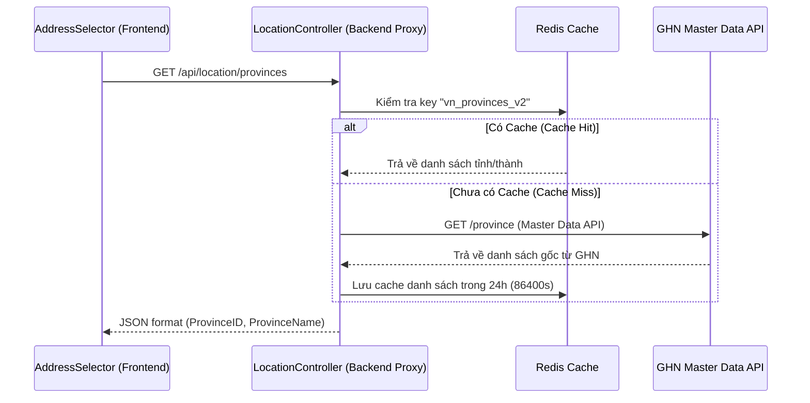
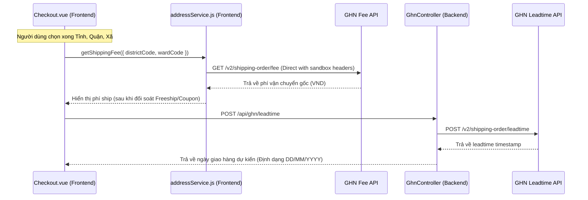
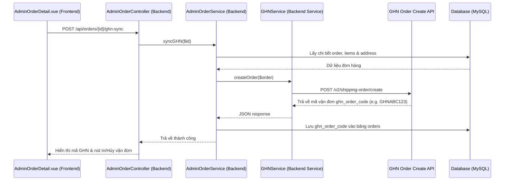
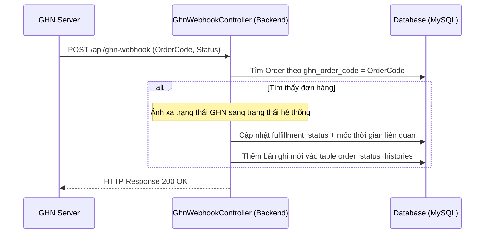

# TÀI LIỆU WORKFLOW TÍCH HỢP HỆ THỐNG GIAO HÀNG NHANH (GHN)
(System Integration Workflow Document - GHN Shipping Module)

---

## 1. Tổng quan (Overview)
Hệ thống **DATN_OCEAN** tích hợp API của đơn vị vận chuyển **Giao Hàng Nhanh (GHN)** nhằm tự động hóa quy trình:
* **Địa chỉ chuẩn hóa**: Sử dụng danh mục địa chỉ hành chính (Tỉnh/Thành, Quận/Huyện, Phường/Xã) trực tiếp theo mã vùng của GHN.
* **Tính phí tự động**: Tự động tính toán phí vận chuyển tại trang Checkout dựa trên vị trí địa lý của người nhận.
* **Dự đoán thời gian**: Tính toán ngày nhận hàng dự kiến (Leadtime).
* **Đẩy vận đơn**: Đẩy thông tin đơn hàng sang hệ thống GHN để tạo vận đơn và nhận mã tracking (`ghn_order_code`).
* **Quản trị vận đơn**: Cho phép in nhãn dán đơn hàng (A5 Print Label) và hủy đơn hàng GHN trực tiếp từ Dashboard Admin.
* **Đồng bộ tự động**: Tự động cập nhật trạng thái đơn hàng trong hệ thống (Fulfillment Status) thông qua Webhook sự kiện do GHN gửi về khi shipper cập nhật trạng thái gói hàng.

---

## 2. Bản đồ các file trong Module GHN (File Structure)

### Frontend (Vue 3 Client App)
* **[addressService.js](file:///c:/Thanhbt-dev/Project/DATN_OCEAN/frontend/src/services/addressService.js)**: Service quản lý gọi API địa điểm hành chính và API tính phí giao hàng qua Backend proxy (`POST /api/ghn/calculate-fee`), không gọi trực tiếp GHN từ Client.
* **[Checkout.vue](file:///c:/Thanhbt-dev/Project/DATN_OCEAN/frontend/src/Pages/Client/Cart/Checkout.vue)**: Trang thanh toán của khách hàng, tích hợp tính phí vận chuyển và thời gian nhận hàng dự kiến khi người dùng chọn địa chỉ.
* **[GuestTracking.vue](file:///c:/Thanhbt-dev/Project/DATN_OCEAN/frontend/src/Pages/Client/GuestTracking.vue)**: Trang tra cứu vận đơn public bằng token hoặc mã đơn + số điện thoại.
* **[ProfileOrderDetail.vue](file:///c:/Thanhbt-dev/Project/DATN_OCEAN/frontend/src/Pages/Client/Profile/ProfileOrderDetail.vue)**: Trang chi tiết đơn hàng của khách đã đăng nhập, hiển thị mã GHN, link tracking và timeline vận chuyển.
* **[AdminOrderDetail.vue](file:///c:/Thanhbt-dev/Project/DATN_OCEAN/frontend/src/Pages/admin/AdminOrderDetail.vue)**: Trang chi tiết đơn hàng phía Admin, chứa các nút hành động: "Đẩy qua GHN", "Tra cứu GHN", "In vận đơn", và "Hủy vận đơn".
* **[AddressSelector.vue](file:///c:/Thanhbt-dev/Project/DATN_OCEAN/frontend/src/components/AddressSelector.vue)**: Component dropdown chọn Tỉnh -> Quận -> Phường.
* **[OrderStatusTimeline.vue](file:///c:/Thanhbt-dev/Project/DATN_OCEAN/frontend/src/components/orders/OrderStatusTimeline.vue)**: Component timeline dùng chung cho Admin, Profile và Guest Tracking.

### Backend (Laravel 11 API)
* **[LocationController.php](file:///c:/Thanhbt-dev/Project/DATN_OCEAN/backend/app/Http/Controllers/LocationController.php)**: Proxy lấy danh sách Tỉnh/Quận/Phường từ GHN API giúp tránh lỗi CORS ở Frontend và quản lý Cache Redis (24 giờ) để tối ưu hiệu năng.
* **[GhnController.php](file:///c:/Thanhbt-dev/Project/DATN_OCEAN/backend/app/Http/Controllers/GhnController.php)**: API Controller xử lý các request tính thời gian giao hàng dự kiến, in vận đơn và hủy đơn trên GHN từ phía Admin.
* **[GHNService.php](file:///c:/Thanhbt-dev/Project/DATN_OCEAN/backend/app/Services/GHNService.php)**: Service kết nối chính với API GHN, đọc cấu hình từ `config/ghn.php`.
* **[ShippingService.php](file:///c:/Thanhbt-dev/Project/DATN_OCEAN/backend/app/Services/ShippingService.php)**: Tính phí ship dự phòng (fallback) và áp dụng chính sách Freeship/Coupon.
* **[AdminOrderController.php](file:///c:/Thanhbt-dev/Project/DATN_OCEAN/backend/app/Http/Controllers/AdminOrderController.php)**: Điều phối API đẩy đơn sang GHN (`syncGHN`).
* **[AdminOrderService.php](file:///c:/Thanhbt-dev/Project/DATN_OCEAN/backend/app/Services/AdminOrderService.php)**: Triển khai logic đẩy đơn hàng sang GHN, lưu mã `ghn_order_code`, sinh `tracking_token` nếu thiếu và gửi email tracking.
* **[OrderTrackingController.php](file:///c:/Thanhbt-dev/Project/DATN_OCEAN/backend/app/Http/Controllers/OrderTrackingController.php)**: API tracking cho user đã đăng nhập, guest bằng token, guest bằng mã đơn + SĐT.
* **[OrderTrackingService.php](file:///c:/Thanhbt-dev/Project/DATN_OCEAN/backend/app/Services/OrderTrackingService.php)**: Merge timeline từ DB và GHN realtime, mask thông tin cá nhân.
* **[SyncGhnOrderStatus.php](file:///c:/Thanhbt-dev/Project/DATN_OCEAN/backend/app/Console/Commands/SyncGhnOrderStatus.php)**: Command polling fallback `ghn:sync-status` khi webhook bị miss.
* **[GhnWebhookController.php](file:///c:/Thanhbt-dev/Project/DATN_OCEAN/backend/app/Http/Controllers/GhnWebhookController.php)**: Endpoint nhận dữ liệu thay đổi trạng thái gói hàng tự động từ GHN.

### Cơ sở dữ liệu (Database Schema)
* **Bảng `orders`**: Cột `ghn_order_code` (VARCHAR, 50, nullable) lưu mã vận đơn GHN sau khi đồng bộ thành công.
* **Bảng `addresses`**: Các cột `province_code`, `district_code`, `ward_code` lưu mã địa điểm chuẩn GHN.
* **Bảng `order_status_histories`**: Lưu lịch sử cập nhật trạng thái đơn hàng (bao gồm các cập nhật tự động từ Webhook).

---

## 3. Các quy trình nghiệp vụ chi tiết (Business Workflows)

### 3.1. Lấy danh sách địa điểm hành chính (Location Selection)
Để đảm bảo mã địa chỉ khi tạo đơn hàng khớp 100% với hệ thống GHN, hệ thống tải dữ liệu Tỉnh/Huyện/Xã trực tiếp từ GHN Master Data thông qua Backend proxy để lưu đúng mã vùng tương thích.



* **API Endpoints ở Backend**:
  * `GET /api/location/provinces` &rarr; `getProvinces()`
  * `GET /api/location/districts/{provinceCode}` &rarr; `getDistricts()`
  * `GET /api/location/wards/{districtCode}` &rarr; `getWards()`

---

### 3.2. Tính phí ship & Ngày nhận hàng dự kiến (Checkout Calculation)
Khi người dùng chọn xong 3 cấp địa chỉ ở trang checkout, hệ thống thực hiện hai tác vụ tính toán song song:



1. **Tính phí ship (Backend-proxy)**: Frontend gửi request lên `/api/ghn/calculate-fee`. Backend gọi `GHNService::calculateFee` với token server-side, sau đó trả phí vận chuyển cho client.
2. **Dự kiến thời gian nhận (Backend-proxy)**: Frontend gửi request lên `/api/ghn/leadtime`. Backend gọi `GHNService::calculateLeadtime` để lấy thông tin ngày giao dự kiến từ GHN và trả về định dạng ngày cụ thể (Ví dụ: `02/07/2026`).

---

### 3.3. Đồng bộ vận đơn sang GHN (Sync Order to GHN)
Đơn hàng sau khi thanh toán thành công sẽ ở trạng thái chờ duyệt. Admin sẽ chuyển đơn sang GHN từ Dashboard quản trị.



* **Payload cấu hình gửi sang GHN**:
  * Cửa hàng gửi: Cố định là địa chỉ shop mặc định cấu hình tại TP.HCM.
  * Khách hàng nhận: Trích xuất từ quan hệ `address` của đơn hàng (`ward_code`, `district_code`, địa chỉ chi tiết).
  * Trọng lượng: Tự động cộng dồn cân nặng các mặt hàng (mặc định 1.2kg/mặt hàng).
  * Phân định phí: `payment_type_id = 2` (Người nhận thanh toán COD).
  * Ghi chú bắt buộc: `KHONGCHOXEMHANG`.

---

### 3.4. Quản lý nhãn in & Hủy vận đơn (Print Label & Cancel Order)

* **In vận đơn (Print Label)**:
  1. Admin nhấp vào nút **In vận đơn** trên trang chi tiết đơn hàng.
  2. Frontend gọi API `POST /api/ghn/print-label` với mã `order_code`.
  3. Backend gọi `GHNService::printLabel`, gửi yêu cầu lên GHN để sinh mã token in ấn tạm thời (`/a5/public-api/printA5/gen-token`).
  4. Frontend nhận token in và mở một tab mới dẫn đến link in mẫu nhãn A5 của GHN:
     `https://dev-online-gateway.ghn.vn/a5/public-api/printA5?token=${token}`
* **Hủy vận đơn (Cancel Order)**:
  1. Admin nhấp nút **Hủy vận đơn**.
  2. Frontend gọi API `POST /api/ghn/cancel-order` gửi mã vận đơn lên server.
  3. Backend gọi `GHNService::cancelOrder` gửi request hủy đơn sang endpoint `/v2/switch-status/cancel` của GHN.

---

### 3.5. Đồng bộ trạng thái giao hàng tự động qua Webhook (Webhook Integration)
Khi shipper của GHN cập nhật trạng thái đơn hàng trên app của họ, hệ thống GHN tự động gửi một POST request chứa thông tin trạng thái về API của shop (`POST /api/ghn-webhook`).



#### Bảng Ánh Xạ Trạng Thái (Status Mapping)

| Trạng thái của GHN (`Status`) | Trạng thái hệ thống (`fulfillment_status`) | Ý nghĩa hành động |
|---|---|---|
| `ready_to_pick`, `exception` | `pending` | Đơn hàng chờ shipper đến lấy hoặc gặp sự cố tạm thời |
| `picking`, `money_collect_picking`, `picked`, `storing`, `transporting`, `sorting`, `delivering`, `money_collect_delivering`, `delivery_fail` | `shipping` | Hàng đang được lưu kho, luân chuyển hoặc đang đi giao |
| `delivered` | `delivered` | GHN xác nhận đã giao; hệ thống giữ bước `delivered` để admin/user hoàn tất sang `completed` theo workflow nội bộ |
| `cancel`, `damage`, `lost` | `cancelled` | Hàng bị hủy, bị hỏng hoặc mất trong quá trình vận chuyển |
| `waiting_to_return`, `return`, `returning`, `returned`, `return_transporting`, `return_sorting`, `return_fail` | `returned` | Hàng đang chuyển hoàn hoặc đã hoàn trả thành công về kho shop |

---

## 4. Các cấu hình môi trường (.env)
Các biến cấu hình sử dụng cho GHN bao gồm:

```env
# Môi trường kiểm thử GHN Sandbox / Production
GHN_TOKEN=75161490-6b33-11f1-a973-aee5264794df
GHN_SHOP_ID=200810
GHN_BASE_URL=https://dev-online-gateway.ghn.vn
GHN_TIMEOUT=10

# Địa chỉ kho gửi hàng
GHN_SENDER_NAME=OCEAN SHOP
GHN_SENDER_PHONE=0909000000
GHN_SENDER_ADDRESS=123 Đường ABC
GHN_SENDER_WARD_CODE=20308
GHN_SENDER_DISTRICT_ID=1444

# Frontend tuyệt đối không chứa token GHN dạng VITE_*
```

---

## 5. Điểm lưu ý về cấu hình API trong Codebase (Technical Design Review)

> [!NOTE]
> **Đồng bộ hóa cấu hình Sandbox và Production giữa các file**
> 
> Trong codebase PHP hiện tại, các cấu hình đang được phân chia như sau:
> 1. **[GHNService.php](file:///c:/Thanhbt-dev/Project/DATN_OCEAN/backend/app/Services/GHNService.php)**: Sử dụng trực tiếp biến môi trường sandbox `env('VITE_TOKEN_GHN_SANBOX')`, `env('VITE_SHOPID_GHN_SANBOX')` và cổng API sandbox (`https://dev-online-gateway.ghn.vn/...`).
> 2. **[LocationController.php](file:///c:/Thanhbt-dev/Project/DATN_OCEAN/backend/app/Http/Controllers/LocationController.php)**: Sử dụng `env('VITE_TOKEN_GHN', env('VITE_TOKEN_GHN_SANBOX', ''))` và cổng API sandbox.
> 3. **[ShippingService.php](file:///c:/Thanhbt-dev/Project/DATN_OCEAN/backend/app/Services/ShippingService.php)**: Sử dụng trực tiếp cấu hình production `env('VITE_TOKEN_GHN')`, `env('VITE_SHOPID_GHN')` và cổng API thực tế (`https://online-gateway.ghn.vn/...`).
> 
> **Khuyến nghị**: Khi deploy dự án lên môi trường chạy thực tế (Production), hãy chắc chắn đồng bộ hóa các file Service trên để tất cả đều sử dụng cổng API Production (`https://online-gateway.ghn.vn`) và các biến cấu hình không có hậu tố `_SANBOX` từ `.env`.

---

## 6. Đồng bộ trạng thái & Tra cứu vận đơn GHN

### 6.1. Phân biệt 2 hành động trong Admin

| Hành động | Ý nghĩa | API |
|---|---|---|
| **Đẩy qua GHN** | Tạo vận đơn mới trên GHN và lưu `orders.ghn_order_code` | `POST /api/admin/orders/{id}/ghn-sync` |
| **Tra cứu GHN / Đồng bộ trạng thái** | Lấy trạng thái mới nhất từ GHN về order local | `POST /api/ghn/order-detail` |

Payload tra cứu/đồng bộ:

```json
{
  "order_code": "LALWPQ",
  "sync": true
}
```

Response backend trả dữ liệu normalize để Admin UI hiển thị:

```json
{
  "status": "success",
  "data": {
    "order_code": "LALWPQ",
    "ghn_status": "delivering",
    "mapped_status": "shipping",
    "local_status": "shipping",
    "changed": true,
    "history_created": true,
    "happened_at": "2026-07-01T10:00:00+07:00",
    "location": "Kho GHN",
    "description": "Đang giao hàng",
    "raw": {}
  }
}
```

### 6.2. Service đồng bộ trạng thái

Mapping và update local order được gom vào:

- `App\Services\GhnOrderStatusSyncService`

Service này được dùng bởi:

- `GhnController::orderDetail()` cho manual sync từ Admin.
- `GhnWebhookController::handle()` cho callback realtime từ GHN.
- Command `php artisan ghn:sync-status` cho fallback polling.

Lịch sử trạng thái ghi vào `order_status_histories` với các field:

- `ghn_status`
- `source` (`ghn_manual_sync`, `ghn_webhook`, `ghn_api`)
- `location`
- `description`
- `happened_at`

### 6.3. Fallback polling command

Command:

```bash
php artisan ghn:sync-status
```

Hoặc sync một order cụ thể:

```bash
php artisan ghn:sync-status --order_id=26
```

Scheduler fallback chạy mỗi 30 phút:

```php
Schedule::command('ghn:sync-status --limit=50')
    ->everyThirtyMinutes()
    ->withoutOverlapping();
```

### 6.4. Dev webhook với ngrok

Khi chạy local, GHN không thể gọi `localhost`. Nếu muốn test webhook realtime, cần mở ngrok/Cloudflare Tunnel tới backend public port và cấu hình callback URL bên GHN:

```text
https://<ngrok-domain>/api/ghn-webhook
```

Ví dụ dev hiện tại:

```text
https://laveta-pilgrimatical-cecally.ngrok-free.dev/api/ghn-webhook
```

Manual sync/Admin lookup **không cần ngrok**; ngrok chỉ cần để test webhook realtime.
