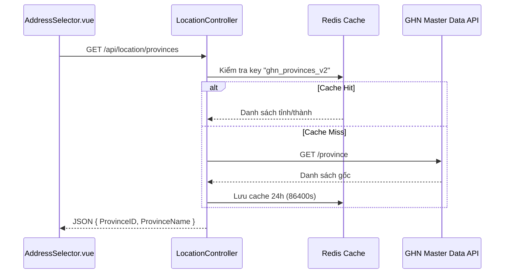
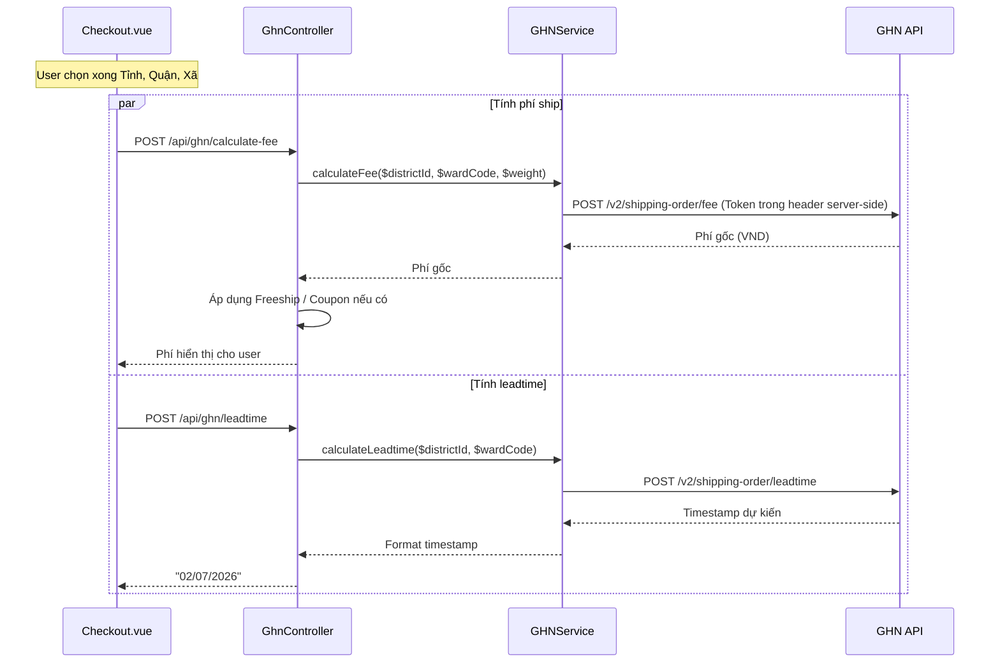
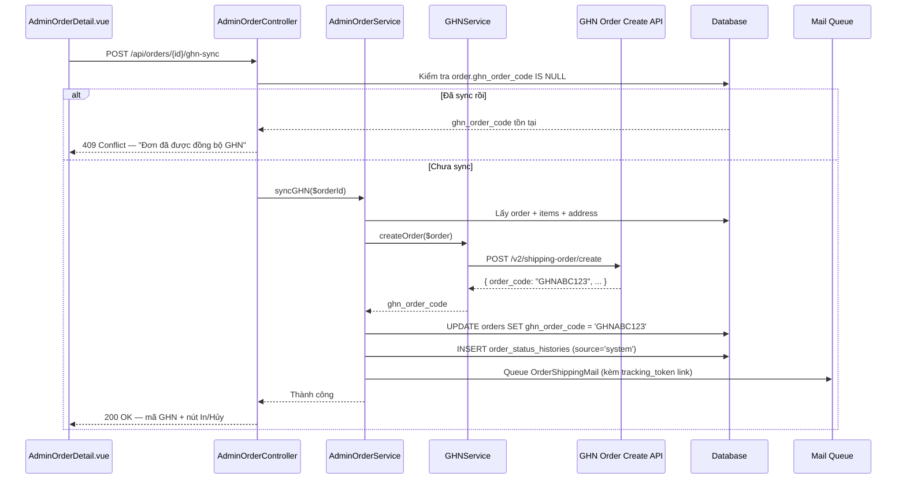
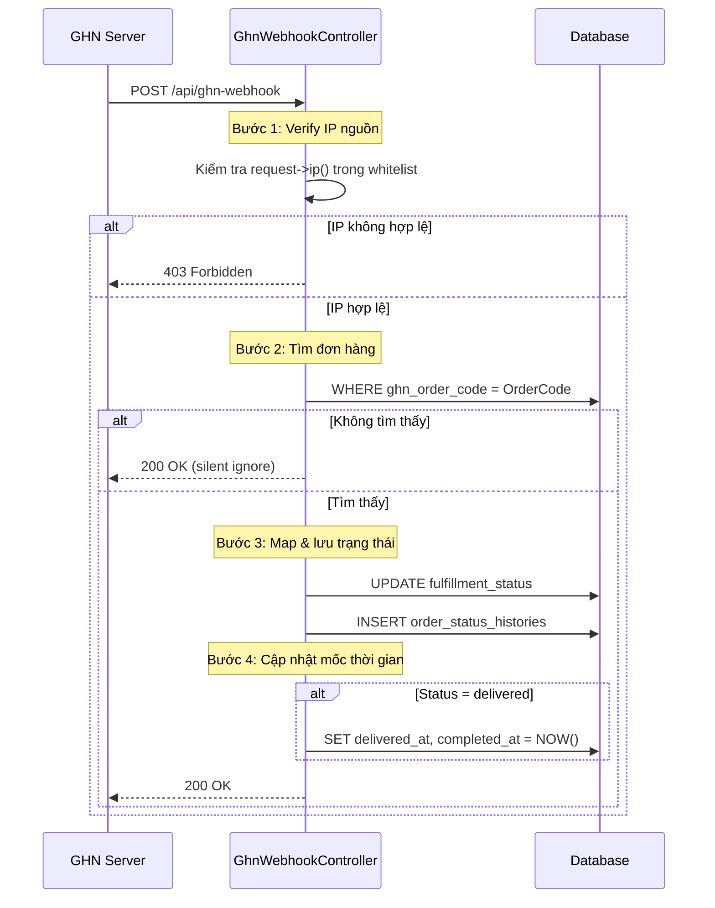
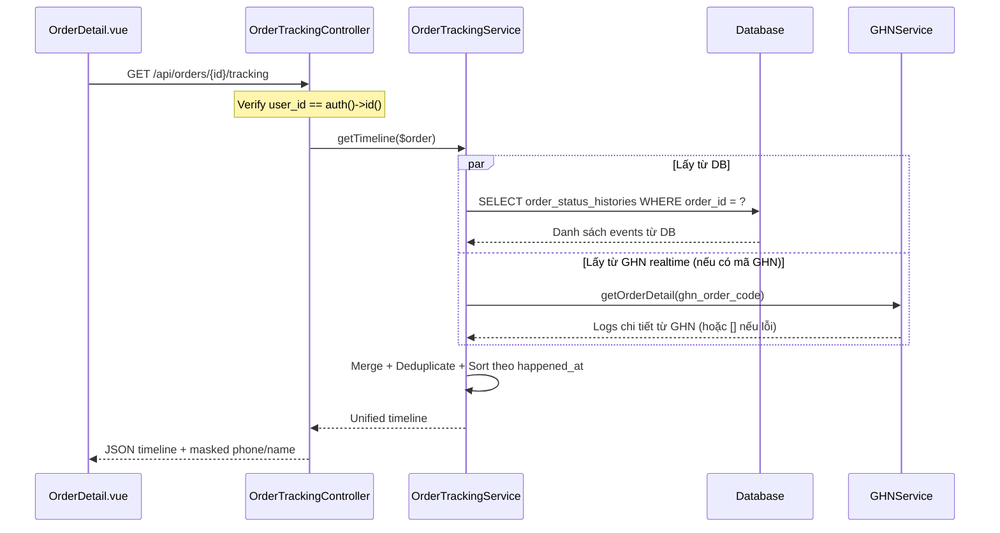
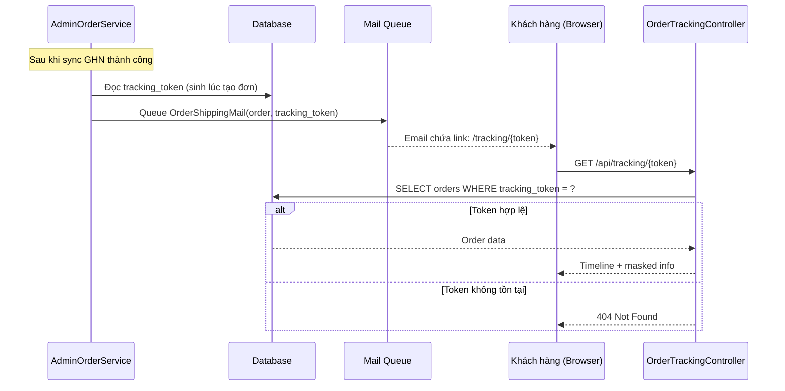
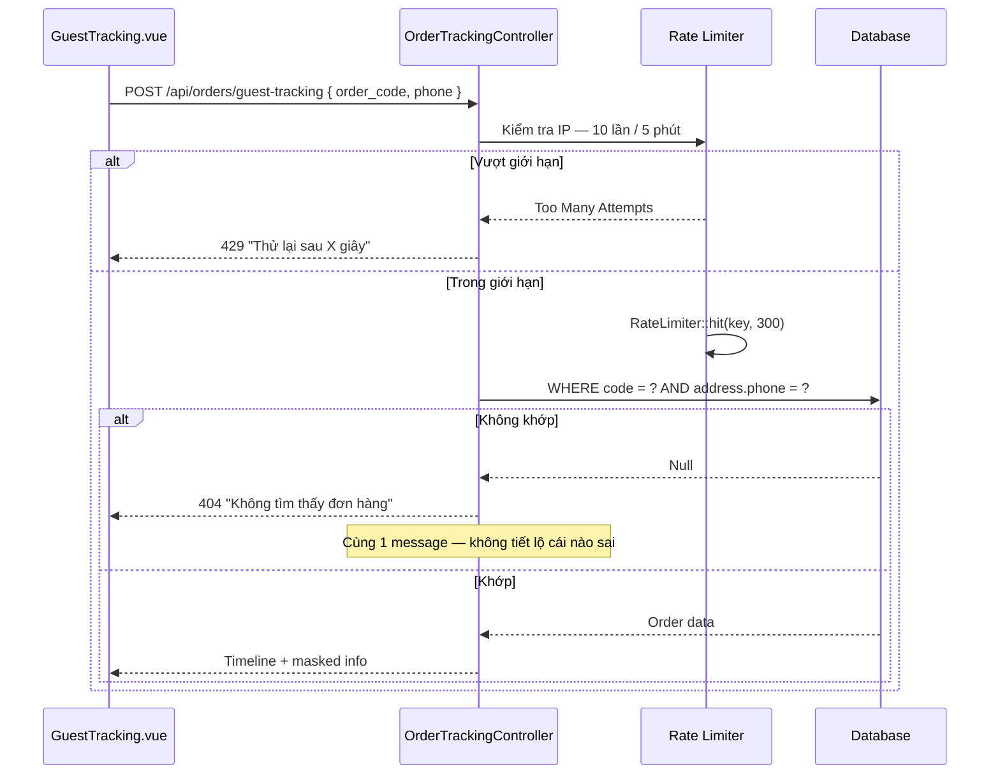

# TÀI LIỆU WORKFLOW TÍCH HỢP HỆ THỐNG GIAO HÀNG NHANH (GHN)
**Phiên bản**: 2.0 — Production Ready  
**Dự án**: DATN_OCEAN  
**Cập nhật**: 2026  

> ⚠️ **Tài liệu nội bộ — Không chia sẻ ra ngoài.**  
> Toàn bộ token, shopID, và endpoint trong tài liệu này chỉ dùng nội bộ team phát triển.

---

## Mục lục

1. [Tổng quan](#1-tổng-quan)
2. [Bản đồ file Module GHN](#2-bản-đồ-file-module-ghn)
3. [Cấu hình môi trường](#3-cấu-hình-môi-trường)
4. [Cơ sở dữ liệu](#4-cơ-sở-dữ-liệu)
5. [Quy trình nghiệp vụ chi tiết](#5-quy-trình-nghiệp-vụ-chi-tiết)
   - [5.1 Lấy danh sách địa điểm hành chính](#51-lấy-danh-sách-địa-điểm-hành-chính)
   - [5.2 Tính phí ship & Ngày nhận hàng dự kiến](#52-tính-phí-ship--ngày-nhận-hàng-dự-kiến)
   - [5.3 Đồng bộ vận đơn sang GHN](#53-đồng-bộ-vận-đơn-sang-ghn)
   - [5.4 In nhãn & Hủy vận đơn](#54-in-nhãn--hủy-vận-đơn)
   - [5.5 Webhook đồng bộ trạng thái tự động](#55-webhook-đồng-bộ-trạng-thái-tự-động)
   - [5.6 Tra cứu vận đơn — Admin](#56-tra-cứu-vận-đơn--admin)
   - [5.7 Tra cứu lịch trình — User đã đăng nhập](#57-tra-cứu-lịch-trình--user-đã-đăng-nhập)
   - [5.8 Tra cứu lịch trình — Khách không đăng nhập (Guest Tracking)](#58-tra-cứu-lịch-trình--khách-không-đăng-nhập-guest-tracking)
6. [Bảo mật & Rate Limiting](#6-bảo-mật--rate-limiting)
7. [Lỗi đã phát hiện & Hướng xử lý](#7-lỗi-đã-phát-hiện--hướng-xử-lý)
8. [Checklist trước khi Deploy Production](#8-checklist-trước-khi-deploy-production)

---

## 1. Tổng quan

Hệ thống **DATN_OCEAN** tích hợp API của đơn vị vận chuyển **Giao Hàng Nhanh (GHN)** nhằm tự động hóa toàn bộ vòng đời vận chuyển đơn hàng:

| Tính năng | Mô tả |
|---|---|
| **Địa chỉ chuẩn hóa** | Tải danh mục Tỉnh/Huyện/Xã trực tiếp từ GHN Master Data, lưu mã vùng chuẩn GHN vào DB |
| **Tính phí tự động** | Tính phí vận chuyển tại Checkout qua Backend proxy — token không bao giờ ra client |
| **Dự đoán thời gian** | Tính ngày nhận hàng dự kiến (Leadtime) tại thời điểm đặt hàng |
| **Đẩy vận đơn** | Tạo vận đơn trên hệ thống GHN và nhận mã tracking (`ghn_order_code`) |
| **Quản trị vận đơn** | In nhãn A5 và hủy vận đơn trực tiếp từ Admin Dashboard |
| **Webhook tự động** | Cập nhật trạng thái đơn hàng khi shipper cập nhật trên app GHN |
| **Tra cứu vận đơn** | User đã login / khách vãng lai đều tra được lịch trình đơn hàng |
| **Fallback Polling** | Scheduled job kiểm tra lại trạng thái định kỳ khi Webhook bị miss |

---

## 2. Bản đồ file Module GHN

### Frontend — Vue 3

| File | Vai trò |
|---|---|
| `services/addressService.js` | Gọi API địa điểm hành chính và **API tính phí ship qua Backend proxy** (KHÔNG gọi thẳng GHN) |
| `Pages/Client/Cart/Checkout.vue` | Trang thanh toán — tích hợp tính phí ship và leadtime khi user chọn địa chỉ |
| `Pages/Client/Profile/ProfileOrderDetail.vue` | Trang chi tiết đơn hàng của khách — hiển thị timeline, mã GHN, link tracking |
| `Pages/Client/GuestTracking.vue` | Trang tra cứu public — không cần đăng nhập, nhập mã đơn + SĐT hoặc mở link token `/tracking/{token}` |
| `Pages/admin/AdminOrderDetail.vue` | Trang chi tiết đơn Admin — nút: Đẩy GHN, In vận đơn, Hủy vận đơn, Tra cứu realtime |
| `components/AddressSelector.vue` | Dropdown chọn Tỉnh → Quận → Phường |
| `components/orders/OrderStatusTimeline.vue` | Component hiển thị timeline lịch trình đơn hàng (dùng chung Admin & Client) |

### Backend — Laravel 11

| File | Vai trò |
|---|---|
| `Controllers/LocationController.php` | Proxy lấy Tỉnh/Quận/Phường từ GHN — chống CORS, cache Redis 24h |
| `Controllers/GhnController.php` | Xử lý: tính phí, leadtime, in nhãn, hủy đơn, tra cứu realtime từ Admin |
| `Controllers/AdminOrderController.php` | Điều phối đẩy đơn sang GHN (`syncGHN`), kiểm tra idempotency |
| `Controllers/GhnWebhookController.php` | Nhận webhook từ GHN — verify IP, cập nhật trạng thái, lưu lịch sử |
| `Controllers/OrderTrackingController.php` | Tra cứu timeline cho User đã login và Guest (token / mã đơn + SĐT) |
| `Services/GHNService.php` | Service kết nối GHN API — toàn bộ đọc config từ `config/ghn.php` |
| `Services/AdminOrderService.php` | Logic đẩy đơn sang GHN — sinh tracking token, lưu `ghn_order_code`, gửi email |
| `Services/OrderTrackingService.php` | Merge timeline từ DB và GHN API realtime — Graceful Degradation |
| `Services/ShippingService.php` | Tính phí fallback, áp dụng Freeship/Coupon |
| `Console/Commands/SyncGhnOrderStatus.php` | Scheduled command `ghn:sync-status` polling trạng thái GHN định kỳ — fallback khi Webhook miss |
| `Mail/OrderShippingMail.php` | Email thông báo đơn hàng đã tạo vận đơn GHN — kèm link tracking token |
| `config/ghn.php` | **Nguồn cấu hình duy nhất** cho toàn bộ GHN Service |

---

## 3. Cấu hình môi trường

### 3.1 File `config/ghn.php` — Nguồn cấu hình tập trung

> **Quy tắc bắt buộc**: Mọi Service, Controller đều đọc cấu hình GHN qua `config('ghn.*')`.  
> **Tuyệt đối không** dùng `env()` trực tiếp trong Service hay Controller.  
> **Tuyệt đối không** để biến `VITE_*` nào chứa token GHN — biến VITE được bundle vào JS public.

```php
// config/ghn.php
return [
    'token'    => env('GHN_TOKEN'),
    'shop_id'  => (int) env('GHN_SHOP_ID'),
    'base_url' => env('GHN_BASE_URL', 'https://dev-online-gateway.ghn.vn'),
    'timeout'  => (int) env('GHN_TIMEOUT', 10),

    // Địa chỉ kho gửi hàng mặc định (cấu hình tại TP.HCM)
    'sender' => [
        'name'         => env('GHN_SENDER_NAME', 'OCEAN SHOP'),
        'phone'        => env('GHN_SENDER_PHONE'),
        'address'      => env('GHN_SENDER_ADDRESS'),
        'ward_code'    => env('GHN_SENDER_WARD_CODE'),
        'district_id'  => (int) env('GHN_SENDER_DISTRICT_ID'),
    ],

    // IP Whitelist của GHN Server gửi Webhook — cập nhật theo tài liệu partner GHN
    'webhook_allowed_ips' => explode(',', env('GHN_WEBHOOK_ALLOWED_IPS', '')),
];
```

### 3.2 File `.env` theo môi trường

```env
# ============================================================
# .env.local — Môi trường Sandbox (Development)
# ============================================================
GHN_TOKEN=75161490-6b33-11f1-a973-aee5264794df
GHN_SHOP_ID=200810
GHN_BASE_URL=https://dev-online-gateway.ghn.vn
GHN_TIMEOUT=10

GHN_SENDER_NAME=OCEAN SHOP TEST
GHN_SENDER_PHONE=0909000000
GHN_SENDER_ADDRESS=123 Đường ABC
GHN_SENDER_WARD_CODE=20308
GHN_SENDER_DISTRICT_ID=1444

# IP sandbox GHN (lấy từ log request thực tế lần đầu)
GHN_WEBHOOK_ALLOWED_IPS=

# ============================================================
# .env.production — Môi trường thật
# ============================================================
GHN_TOKEN=xxxx-xxxx-xxxx-production-token
GHN_SHOP_ID=xxxxxx
GHN_BASE_URL=https://online-gateway.ghn.vn
GHN_TIMEOUT=10

GHN_SENDER_NAME=OCEAN SHOP
GHN_SENDER_PHONE=09xxxxxxxx
GHN_SENDER_ADDRESS=Địa chỉ kho thật
GHN_SENDER_WARD_CODE=xxxxx
GHN_SENDER_DISTRICT_ID=xxxxx

GHN_WEBHOOK_ALLOWED_IPS=116.118.95.132,xxx.xxx.xxx.xxx
```

> **Lưu ý**: File `.env.production` **không được commit** lên Git. Sử dụng CI/CD secrets hoặc Vault để inject khi deploy.

---

## 4. Cơ sở dữ liệu

### 4.1 Bảng `orders` — bổ sung

```sql
ALTER TABLE orders
    ADD COLUMN ghn_order_code   VARCHAR(50)  NULL         COMMENT 'Mã vận đơn GHN sau khi sync thành công',
    ADD COLUMN tracking_token   VARCHAR(64)  NULL UNIQUE  COMMENT 'Token bí mật cho Guest Tracking — sinh lúc tạo đơn',
    ADD COLUMN fulfillment_status ENUM(
        'pending','confirmed','shipping','completed','cancelled','returned'
    ) NOT NULL DEFAULT 'pending',
    ADD COLUMN delivered_at     TIMESTAMP    NULL         COMMENT 'Thời điểm khách nhận hàng thành công',
    ADD COLUMN completed_at     TIMESTAMP    NULL;

CREATE INDEX idx_orders_ghn_code     ON orders (ghn_order_code);
CREATE INDEX idx_orders_track_token  ON orders (tracking_token);
```

### 4.2 Bảng `addresses` — lưu mã GHN chuẩn

```sql
-- Đảm bảo 3 cột mã vùng GHN tồn tại
ALTER TABLE addresses
    ADD COLUMN province_code  INT          NULL COMMENT 'ProvinceID từ GHN Master Data',
    ADD COLUMN district_code  INT          NULL COMMENT 'DistrictID từ GHN Master Data',
    ADD COLUMN ward_code      VARCHAR(20)  NULL COMMENT 'WardCode từ GHN Master Data';
```

### 4.3 Bảng `order_status_histories` — nâng cấp

```sql
ALTER TABLE order_status_histories
    ADD COLUMN ghn_status    VARCHAR(50)   NULL        COMMENT 'Status gốc từ GHN (picking, delivering...)',
    ADD COLUMN source        VARCHAR(20)   NOT NULL DEFAULT 'system'
                             COMMENT 'system | ghn_webhook | ghn_api | manual',
    ADD COLUMN location      VARCHAR(255)  NULL        COMMENT 'Tên bưu cục / kho trung chuyển',
    ADD COLUMN description   TEXT          NULL        COMMENT 'Mô tả chi tiết sự kiện',
    ADD COLUMN happened_at   TIMESTAMP     NOT NULL DEFAULT CURRENT_TIMESTAMP
                             COMMENT 'Thời điểm sự kiện xảy ra thực tế (từ GHN timestamp)';

-- Index để query timeline nhanh
CREATE INDEX idx_osh_order_happened ON order_status_histories (order_id, happened_at);
```

> **Tại sao cần `happened_at` riêng?**  
> `created_at` = thời điểm hệ thống ghi vào DB.  
> `happened_at` = thời điểm sự kiện xảy ra thực tế theo GHN.  
> Webhook có thể đến trễ 5–30 phút — nếu dùng `created_at` thì timeline hiển thị sai thứ tự.

### 4.4 Bảng `products` — bổ sung trọng lượng

```sql
-- Bắt buộc: mọi sản phẩm phải có trọng lượng chính xác để tính phí ship đúng
ALTER TABLE products
    ADD COLUMN weight INT NOT NULL DEFAULT 500 COMMENT 'Trọng lượng thực tế (gram)';
-- GHN yêu cầu tối thiểu 10g, tối đa theo gói dịch vụ
```

---

## 5. Quy trình nghiệp vụ chi tiết

### 5.1 Lấy danh sách địa điểm hành chính



**API Endpoints**:

| Method | Endpoint | Handler |
|---|---|---|
| GET | `/api/location/provinces` | `getProvinces()` |
| GET | `/api/location/districts/{provinceCode}` | `getDistricts()` |
| GET | `/api/location/wards/{districtCode}` | `getWards()` |

**Lưu ý quan trọng**:
- Cache key phải có versioning (ví dụ `ghn_provinces_v2`) để dễ invalidate khi GHN cập nhật dữ liệu vùng.
- Không bao giờ gọi trực tiếp từ Frontend sang GHN Master Data — lộ token, không cache được.

---

### 5.2 Tính phí ship & Ngày nhận hàng dự kiến

> **Thay đổi so với v1**: Frontend KHÔNG còn gọi thẳng GHN API để tính phí. Toàn bộ đi qua Backend proxy.



**Payload gửi lên `/api/ghn/calculate-fee`**:

```json
{
  "district_id": 1444,
  "ward_code": "20308",
  "weight": 1500
}
```

> `weight` phải được tính từ tổng trọng lượng sản phẩm trong giỏ hàng (gram), không được hardcode.

---

### 5.3 Đồng bộ vận đơn sang GHN



**Payload gửi sang GHN** (`GHNService::createOrder`):

```php
[
    'payment_type_id'   => $order->payment_method === 'cod' ? 2 : 1,
    // 1 = shop trả phí (đã thanh toán online), 2 = người nhận trả (COD)

    'note'              => 'KHONGCHOXEMHANG',
    'required_note'     => 'KHONGCHOXEMHANG',

    // Người gửi — lấy từ config('ghn.sender')
    'from_name'         => config('ghn.sender.name'),
    'from_phone'        => config('ghn.sender.phone'),
    'from_address'      => config('ghn.sender.address'),
    'from_ward_code'    => config('ghn.sender.ward_code'),
    'from_district_id'  => config('ghn.sender.district_id'),

    // Người nhận — từ quan hệ address của order
    'to_name'           => $order->address->name,
    'to_phone'          => $order->address->phone,
    'to_address'        => $order->address->detail,
    'to_ward_code'      => $order->address->ward_code,
    'to_district_id'    => $order->address->district_code,

    // Trọng lượng — tính thực tế từ sản phẩm
    'weight'            => max(
                               $order->items->sum(fn($i) => $i->product->weight * $i->quantity),
                               10  // GHN yêu cầu tối thiểu 10g
                           ),

    'service_type_id'   => 2,  // Giao hàng thường
    'items'             => $order->items->map(fn($i) => [
                               'name'     => $i->product->name,
                               'quantity' => $i->quantity,
                               'weight'   => $i->product->weight,
                           ])->toArray(),
]
```

---

### 5.4 In nhãn & Hủy vận đơn

#### In vận đơn (Print Label A5)

```
1. Admin nhấp "In vận đơn" tại AdminOrderDetail.vue
2. POST /api/ghn/print-label { order_code: "GHNABC123" }
3. GHNService::printLabel() → GHN /a5/public-api/printA5/gen-token
4. GHN trả về token in tạm thời (hết hạn sau ~10 phút)
5. Frontend mở tab mới:
   https://dev-online-gateway.ghn.vn/a5/public-api/printA5?token={token}
   (production: https://online-gateway.ghn.vn/...)
```

#### Hủy vận đơn (Cancel Order)

```
1. Admin nhấp "Hủy vận đơn"
2. Frontend hiển thị modal confirm — nhập lý do hủy (bắt buộc)
3. POST /api/ghn/cancel-order { order_code: "GHNABC123", reason: "..." }
4. GHNService::cancelOrder() → GHN /v2/switch-status/cancel
5. Sau khi GHN confirm → cập nhật fulfillment_status = 'cancelled' trong DB
6. Ghi order_status_histories { source: 'manual', description: lý do hủy }
```

> **Lưu ý**: Chỉ hủy được khi đơn ở trạng thái `ready_to_pick`. Nếu shipper đã lấy hàng, phải liên hệ GHN trực tiếp.

---

### 5.5 Webhook đồng bộ trạng thái tự động



**Implementation `GhnWebhookController::handle()`**:

```php
public function handle(Request $request): JsonResponse
{
    // [BẢO MẬT] Bước 1: Verify IP whitelist
    $allowedIps = config('ghn.webhook_allowed_ips');
    if (!empty($allowedIps) && !in_array($request->ip(), $allowedIps)) {
        Log::warning('GHN Webhook: IP không hợp lệ', ['ip' => $request->ip()]);
        return response()->json(['message' => 'Forbidden'], 403);
    }

    $data = $request->all();

    // Bước 2: Validate payload tối thiểu
    if (empty($data['OrderCode']) || empty($data['Status'])) {
        return response()->json(['message' => 'Invalid payload'], 400);
    }

    $order = Order::where('ghn_order_code', $data['OrderCode'])->first();
    if (!$order) {
        return response()->json(['message' => 'OK'], 200); // Silent ignore
    }

    // Bước 3: Map trạng thái và cập nhật DB
    $fulfillmentStatus = $this->mapGhnStatus($data['Status']);
    $happenedAt = isset($data['Time'])
        ? Carbon::createFromTimestamp($data['Time'])
        : now();

    DB::transaction(function () use ($order, $data, $fulfillmentStatus, $happenedAt) {
        $order->update(['fulfillment_status' => $fulfillmentStatus]);

        // Cập nhật mốc thời gian đặc biệt
        if ($data['Status'] === 'delivered') {
            $order->update([
                'delivered_at' => $happenedAt,
                'completed_at' => $happenedAt,
            ]);
        }

        // Lưu lịch sử đầy đủ — không chỉ status đã map
        OrderStatusHistory::create([
            'order_id'           => $order->id,
            'fulfillment_status' => $fulfillmentStatus,
            'ghn_status'         => $data['Status'],
            'source'             => 'ghn_webhook',
            'description'        => $data['Description'] ?? null,
            'location'           => $data['Warehouse'] ?? null,
            'happened_at'        => $happenedAt,
        ]);
    });

    return response()->json(['message' => 'OK'], 200);
}
```

#### Bảng ánh xạ trạng thái GHN → Hệ thống

| GHN Status | Fulfillment Status | Ý nghĩa |
|---|---|---|
| `ready_to_pick`, `exception` | `pending` | Chờ shipper đến lấy hoặc sự cố tạm thời |
| `picking`, `money_collect_picking`, `picked`, `storing`, `transporting`, `sorting`, `delivering`, `money_collect_delivering`, `delivery_fail` | `shipping` | Đang luân chuyển / giao hàng |
| `delivered` | `delivered` | GHN xác nhận đã giao; hệ thống giữ bước `delivered` trước khi hoàn tất `completed` theo workflow nội bộ |
| `cancel`, `damage`, `lost` | `cancelled` | Hủy / hỏng / mất |
| `waiting_to_return`, `return`, `returning`, `returned`, `return_transporting`, `return_sorting`, `return_fail` | `returned` | Đang hoàn / đã hoàn |

#### Fallback Polling — Khi Webhook bị miss

```php
// app/Console/Commands/SyncGhnOrderStatus.php
// Chạy mỗi 30 phút qua Scheduler

public function handle(): void
{
    // Lấy đơn đang vận chuyển, có mã GHN, chưa hoàn thành
    $orders = Order::whereNotNull('ghn_order_code')
        ->whereIn('fulfillment_status', ['pending', 'shipping'])
        ->where('created_at', '>=', now()->subDays(30)) // Chỉ check đơn trong 30 ngày
        ->get();

    foreach ($orders as $order) {
        try {
            $detail = $this->ghnService->getOrderDetail($order->ghn_order_code);
            if (empty($detail)) continue;

            $ghnStatus = $detail['status'] ?? null;
            $fulfillmentStatus = $this->mapGhnStatus($ghnStatus);

            // Chỉ cập nhật nếu có thay đổi thực sự
            if ($fulfillmentStatus !== $order->fulfillment_status) {
                $order->update(['fulfillment_status' => $fulfillmentStatus]);
                OrderStatusHistory::create([
                    'order_id'           => $order->id,
                    'fulfillment_status' => $fulfillmentStatus,
                    'ghn_status'         => $ghnStatus,
                    'source'             => 'ghn_api',
                    'description'        => 'Đồng bộ tự động qua polling',
                    'happened_at'        => now(),
                ]);
            }
        } catch (\Exception $e) {
            Log::error('GHN Polling error', [
                'order_id' => $order->id,
                'error'    => $e->getMessage(),
            ]);
            // Không throw — tiếp tục xử lý các đơn khác
        }

        sleep(1); // Tránh spam GHN API — rate limit
    }
}
```

```php
// app/Console/Kernel.php
$schedule->command('ghn:sync-status')->everyThirtyMinutes();
```

---

### 5.6 Tra cứu vận đơn — Admin

Admin có thể kiểm tra trạng thái realtime từ GHN bất cứ lúc nào — không phụ thuộc vào Webhook.

```
POST /api/ghn/order-detail        Middleware: auth:sanctum + role:admin

Request:  { "order_code": "GHNABC123", "sync": true }
Response: Chi tiết đơn hàng từ GHN + trạng thái đã map về local order (status, mapped_status, changed, history_created, raw...)
```

```php
// GHNService::getOrderDetail()
public function getOrderDetail(string $orderCode): array
{
    try {
        $response = Http::withHeaders([
            'Token'        => config('ghn.token'),
            'ShopId'       => config('ghn.shop_id'),
            'Content-Type' => 'application/json',
        ])
        ->timeout(5) // Timeout ngắn — không block Admin UI
        ->post(config('ghn.base_url') . '/shiip/public-api/v2/shipping-order/detail', [
            'order_code' => $orderCode,
        ]);

        if ($response->successful()) {
            return $response->json('data') ?? [];
        }

        Log::warning('GHN getOrderDetail: response không thành công', [
            'order_code' => $orderCode,
            'status'     => $response->status(),
        ]);
        return [];

    } catch (\Illuminate\Http\Client\ConnectionException $e) {
        Log::warning('GHN getOrderDetail: timeout', ['order_code' => $orderCode]);
        return []; // Graceful Degradation — không throw
    }
}
```

---

### 5.7 Tra cứu lịch trình — User đã đăng nhập



**Route**:

```php
// Chỉ user đã login, chỉ xem được đơn của chính mình
Route::get('/orders/{id}/tracking', [OrderTrackingController::class, 'show'])
    ->middleware('auth:sanctum');
```

**Controller**:

```php
public function show(int $orderId): JsonResponse
{
    // [BẢO MẬT] User chỉ được xem đơn của chính mình
    $order = Order::where('id', $orderId)
        ->where('user_id', auth()->id())
        ->firstOrFail(); // 404 nếu không phải của họ — không để lộ đơn tồn tại hay không

    $timeline = $this->trackingService->getTimeline($order);

    return response()->json([
        'order_code'     => $order->code,
        'ghn_order_code' => $order->ghn_order_code,
        'ghn_tracking_url' => $order->ghn_order_code
            ? 'https://donhang.ghn.vn/?order_code=' . $order->ghn_order_code
            : null,
        'timeline'       => $timeline,
        // Masked — không trả thông tin nhạy cảm đầy đủ
        'receiver_name'  => $this->maskName($order->address->name),
        'receiver_phone' => $this->maskPhone($order->address->phone),
    ]);
}
```

---

### 5.8 Tra cứu lịch trình — Khách không đăng nhập (Guest Tracking)

Có **2 phương thức song song** — bổ sung lẫn nhau:

#### Phương thức A: Link Token trong Email (UX tốt nhất)



**Sinh tracking token khi tạo đơn**:

```php
// Order Model — Boot method hoặc Observer
protected static function boot(): void
{
    parent::boot();
    static::creating(function (Order $order) {
        // Token 64 ký tự hex — không thể brute force
        $order->tracking_token = hash('sha256', $order->code . Str::random(40) . now()->timestamp);
    });
}
```

**Route public — không cần auth**:

```php
Route::get('/tracking/{token}', [OrderTrackingController::class, 'trackByToken'])
    ->middleware('throttle:30,1'); // Giới hạn 30 request/phút/IP
```

```php
public function trackByToken(string $token): JsonResponse
{
    // Token 64 ký tự — validate format trước để tránh query DB với input rác
    if (!preg_match('/^[a-f0-9]{64}$/', $token)) {
        return response()->json(['message' => 'Not found'], 404);
    }

    $order = Order::where('tracking_token', $token)->firstOrFail();
    $timeline = $this->trackingService->getTimeline($order);

    return response()->json([
        'order_code'       => $order->code,
        'ghn_order_code'   => $order->ghn_order_code,
        'ghn_tracking_url' => $order->ghn_order_code
            ? 'https://donhang.ghn.vn/?order_code=' . $order->ghn_order_code
            : null,
        'timeline'         => $timeline,
        'receiver_name'    => $this->maskName($order->address->name),
        'receiver_phone'   => $this->maskPhone($order->address->phone),
        // KHÔNG trả: địa chỉ đầy đủ, email, tổng tiền COD
    ]);
}
```

---

#### Phương thức B: Trang tra cứu public — Mã đơn + SĐT



**Route**:

```php
Route::post('/orders/guest-tracking', [OrderTrackingController::class, 'trackByPhone']);
```

**Controller**:

```php
public function trackByPhone(Request $request): JsonResponse
{
    $request->validate([
        'order_code' => 'required|string|max:50',
        'phone'      => 'required|string|regex:/^[0-9]{10,11}$/',
    ]);

    // [BẢO MẬT] Rate limiting theo IP — chống brute force
    $rateLimitKey = 'guest_tracking_' . $request->ip();
    if (RateLimiter::tooManyAttempts($rateLimitKey, 10)) {
        $seconds = RateLimiter::availableIn($rateLimitKey);
        return response()->json([
            'message' => "Quá nhiều lần thử. Vui lòng thử lại sau {$seconds} giây."
        ], 429);
    }
    RateLimiter::hit($rateLimitKey, 300); // Window 5 phút

    $order = Order::where('code', $request->order_code)
        ->whereHas('address', fn($q) => $q->where('phone', $request->phone))
        ->first();

    if (!$order) {
        // [BẢO MẬT] Luôn trả cùng 1 message — không tiết lộ mã đúng/sai hay SĐT đúng/sai
        return response()->json([
            'message' => 'Không tìm thấy đơn hàng. Vui lòng kiểm tra lại mã đơn và số điện thoại.'
        ], 404);
    }

    $timeline = $this->trackingService->getTimeline($order);

    return response()->json([
        'order_code'       => $order->code,
        'ghn_order_code'   => $order->ghn_order_code,
        'ghn_tracking_url' => $order->ghn_order_code
            ? 'https://donhang.ghn.vn/?order_code=' . $order->ghn_order_code
            : null,
        'timeline'         => $timeline,
        'receiver_name'    => $this->maskName($order->address->name),
        'receiver_phone'   => $this->maskPhone($order->address->phone),
        // KHÔNG trả: địa chỉ đầy đủ, email, chi tiết COD
    ]);
}
```

---

#### Service tổng hợp Timeline — `OrderTrackingService`

```php
// Services/OrderTrackingService.php

public function getTimeline(Order $order): array
{
    // Nguồn 1: DB (luôn có, luôn nhanh)
    $dbEvents = OrderStatusHistory::where('order_id', $order->id)
        ->orderBy('happened_at', 'asc')
        ->get()
        ->map(fn($h) => [
            'time'        => $h->happened_at->toIso8601String(),
            'label'       => $this->getLabel($h->fulfillment_status, $h->ghn_status),
            'description' => $h->description,
            'location'    => $h->location,
            'source'      => $h->source,
            'is_current'  => false,
        ])
        ->toArray();

    // Nguồn 2: GHN realtime (tùy chọn, có thể fail)
    $ghnEvents = [];
    if ($order->ghn_order_code) {
        $detail = $this->ghnService->getOrderDetail($order->ghn_order_code);
        $logs = $detail['log'] ?? [];

        foreach ($logs as $log) {
            // Dedup: bỏ qua nếu đã có trong DB (cùng ghn_status, cùng thời điểm ±60s)
            $isDuplicate = collect($dbEvents)->contains(function ($e) use ($log) {
                return $e['source'] === 'ghn_webhook'
                    && abs(strtotime($e['time']) - strtotime($log['updated_date'] ?? '')) < 60;
            });

            if (!$isDuplicate) {
                $ghnEvents[] = [
                    'time'        => $log['updated_date'] ?? now()->toIso8601String(),
                    'label'       => $log['status_name'] ?? $log['status'] ?? 'Cập nhật GHN',
                    'description' => $log['note'] ?? null,
                    'location'    => $log['warehouse_name'] ?? null,
                    'source'      => 'ghn_api',
                    'is_current'  => false,
                ];
            }
        }
    }

    // Merge + Sort + Đánh dấu current
    $merged = array_merge($dbEvents, $ghnEvents);
    usort($merged, fn($a, $b) => strtotime($a['time']) - strtotime($b['time']));

    if (!empty($merged)) {
        $merged[count($merged) - 1]['is_current'] = true;
    }

    return $merged;
}

private function maskPhone(string $phone): string
{
    return substr($phone, 0, 3) . '****' . substr($phone, -3);
    // Ví dụ: 090****123
}

private function maskName(string $name): string
{
    $parts = explode(' ', trim($name));
    $last  = array_pop($parts);
    return str_repeat('* ', count($parts)) . $last;
    // Ví dụ: "* * Hùng"
}
```

---

## 6. Bảo mật & Rate Limiting

### Tổng hợp các lớp bảo mật

| Điểm | Biện pháp | Lý do |
|---|---|---|
| Token GHN | Chỉ tồn tại trong `.env` backend, đọc qua `config('ghn.token')` | `VITE_*` bị bundle vào JS public — ai cũng đọc được |
| Webhook endpoint | Verify IP whitelist từ GHN | Bất kỳ ai POST giả webhook → đánh dấu đơn delivered sai |
| Guest tracking / SĐT | Rate limit 10 request / 5 phút / IP | Chống brute force dò thông tin khách hàng |
| Guest tracking / Token | Rate limit 30 request / 1 phút / IP | Token 64 ký tự hex không thể brute force nhưng vẫn cần giới hạn |
| Error message tracking | Luôn trả cùng 1 message khi không tìm thấy | Tránh tiết lộ mã đơn đúng hay SĐT đúng |
| Response data | Mask phone, mask name | Bảo vệ thông tin cá nhân |
| User tracking | `where('user_id', auth()->id())` bắt buộc | Tránh user A xem đơn của user B qua IDOR |
| Idempotency sync GHN | Kiểm tra `ghn_order_code IS NULL` trước khi tạo | Tránh tạo 2 vận đơn trùng cho 1 đơn hàng |
| Token format | `preg_match('/^[a-f0-9]{64}$/')` trước khi query | Tránh query DB với input rác / injection |
| `.env.production` | Không commit lên Git — dùng CI/CD secrets | Token production không được lưu trong repository |

---

## 7. Lỗi đã phát hiện & Hướng xử lý

### 🔴 Nghiêm trọng — Phải sửa trước khi production

| # | Lỗi | Hậu quả | Cách sửa |
|---|---|---|---|
| 1 | Token GHN trong biến `VITE_*` — lộ ra JS public | Kẻ xấu lấy token tạo/hủy vận đơn tùy ý, truy cập toàn bộ lịch sử shop | Chuyển toàn bộ sang Backend proxy, xóa `VITE_TOKEN_GHN*` |
| 2 | Webhook không verify IP | Bất kỳ ai giả POST webhook → đánh dấu đơn `completed` khi chưa giao | Thêm IP whitelist trong `GhnWebhookController` |
| 3 | Config không đồng nhất (`ShippingService.php` dùng production, các file khác dùng sandbox) | Khi dev: `ShippingService` gọi production với token rỗng → exception âm thầm → phí ship sai | Tạo `config/ghn.php`, tất cả Service đọc từ đó |
| 4 | Trọng lượng mặc định 1.2kg/mặt hàng hardcode | Sai phí ship, GHN có thể thu thêm phí chênh lệch | Thêm cột `weight` vào bảng `products`, tính thực tế |

### 🟡 Quan trọng — Sửa trong sprint này

| # | Lỗi | Hậu quả | Cách sửa |
|---|---|---|---|
| 5 | `payment_type_id = 2` hardcode | Đơn online payment bắt khách trả phí ship thêm lần nữa khi nhận hàng | `$order->payment_method === 'cod' ? 2 : 1` |
| 6 | Không kiểm tra idempotency khi sync GHN | Bấm sync 2 lần → tạo 2 vận đơn trùng → shipper đến lấy 2 lần | Kiểm tra `ghn_order_code IS NULL` trước khi tạo, trả 409 nếu đã sync |
| 7 | `order_status_histories` lưu thiếu thông tin | Timeline thiếu location, description, happened_at → UX xấu | Thêm các cột theo schema mục 4.3 |

### 🔵 Cải thiện — Sprint sau

| # | Thiếu sót | Cách xử lý |
|---|---|---|
| 8 | Không có fallback khi Webhook miss | Thêm `SyncGhnStatusJob` polling 30 phút |
| 9 | Không có tra cứu vận đơn cho user / guest | Thêm `OrderTrackingController` theo mục 5.7 và 5.8 |
| 10 | Không gửi email tracking khi đẩy GHN | Thêm `OrderShippingMail` trong `AdminOrderService::syncGHN()` |

---

## 8. Checklist trước khi Deploy Production

### Cấu hình

- [ ] `config/ghn.php` đã tạo — tất cả Service đọc từ đây
- [ ] Biến `VITE_TOKEN_GHN*` đã xóa hoàn toàn khỏi `.env` và codebase
- [ ] `.env.production` đã set `GHN_BASE_URL=https://online-gateway.ghn.vn`
- [ ] `.env.production` đã set token và shop_id production thật
- [ ] `.env.production` đã set `GHN_WEBHOOK_ALLOWED_IPS` đúng IP của GHN
- [ ] `.env.production` KHÔNG được commit lên Git

### Bảo mật

- [ ] `GhnWebhookController` đã có IP whitelist check
- [ ] `OrderTrackingController::trackByPhone` đã có Rate Limiting
- [ ] `OrderTrackingController::show` đã có `where('user_id', auth()->id())`
- [ ] Response tracking không trả địa chỉ đầy đủ, email, số tiền COD
- [ ] Error message tracking là generic — không tiết lộ field nào sai

### Database

- [ ] Migration thêm `tracking_token` vào bảng `orders` đã chạy
- [ ] Migration thêm `weight` vào bảng `products` đã chạy
- [ ] Migration nâng cấp `order_status_histories` đã chạy
- [ ] Index trên `ghn_order_code` và `tracking_token` đã tạo
- [ ] Toàn bộ sản phẩm đã được cập nhật trọng lượng thực tế

### Nghiệp vụ

- [ ] `payment_type_id` đã lấy động theo `payment_method` của đơn hàng
- [ ] Trọng lượng vận đơn tính từ `product.weight * quantity` — không hardcode
- [ ] Kiểm tra idempotency sync GHN đã hoạt động đúng
- [ ] `OrderShippingMail` đã gửi link tracking khi sync GHN thành công
- [ ] Scheduled Command `ghn:sync-status` đã đăng ký trong Kernel

### Kiểm thử trước go-live

- [ ] Test Webhook với tool giả (Postman) — đảm bảo IP sai bị từ chối
- [ ] Test Guest Tracking — vượt 10 lần phải bị block 5 phút
- [ ] Test IDOR — user A không thể xem đơn user B bằng cách đổi `{id}`
- [ ] Test sync GHN 2 lần liên tiếp — lần 2 phải trả 409
- [ ] Test tạo đơn GHN với `payment_method = 'online'` → `payment_type_id` phải là 1
- [ ] Test tạo đơn GHN với trọng lượng sản phẩm thực tế — kiểm tra phí ship khớp checkout

---

*Tài liệu này là nguồn sự thật duy nhất (Single Source of Truth) cho module GHN của dự án DATN_OCEAN. Mọi thay đổi về flow, config, hoặc security phải được cập nhật vào đây trước khi implement.*
