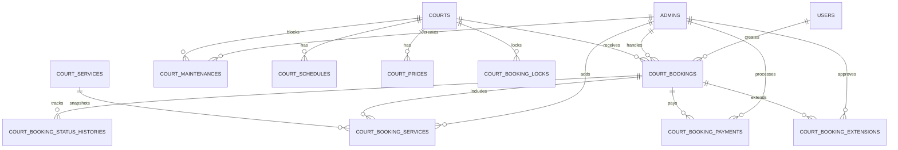

# Booking Court Audit Report

> Ngày audit: 2026-05-30  
> Phạm vi: Laravel backend, Vue.js frontend, Pinia store, MySQL migrations, realtime Reverb/Echo và luồng nghiệp vụ đặt sân cầu lông.  
> Phương pháp: chỉ đọc source code và route hiện tại. Không chạy migration, không thay đổi database, không chạy test có thao tác schema.

## 1. Tổng quan hiện trạng

Module đặt sân đã có nền tảng tương đối rộng:

- Khách hàng có thể xem danh sách sân, xem chi tiết, chọn ngày, xem slot theo giờ, giữ slot 10 phút, chọn dịch vụ, tạo booking, xem lịch sử, hủy booking, ghi nhận thanh toán và lấy token check-in.
- Quản trị có CRUD sân, lịch hoạt động, bảng giá, dịch vụ, lịch bảo trì; quản lý booking; tạo booking POS; confirm; check-in; check-out; thêm dịch vụ; gia hạn; hủy; ghi nhận thanh toán; QR check-in; dashboard timeline; calendar và báo cáo.
- Database có 12 bảng booking court chuyên biệt, khóa ngoại cơ bản, index tra cứu, history, activity log, lock tạm, payment, maintenance và extension.
- Realtime đã có Laravel Reverb/Echo, private channel, broadcast event và scheduler dọn lock/no-show.

Module chưa đủ an toàn để đưa vào vận hành thật. Hai nhóm lỗi cần xử lý trước là:

1. Chống đặt trùng chưa bảo đảm khi có concurrency thật.
2. Luồng thanh toán court booking cho phép phía khách tự xác nhận chuyển khoản thành công.

## 2. Cấu trúc file liên quan

### Backend

| Nhóm | File |
|---|---|
| Routes | `backend/routes/api.php`, `backend/routes/channels.php`, `backend/routes/console.php`, `backend/routes/court_booking.php` |
| Public/User controllers | `backend/app/Http/Controllers/Api/CourtController.php`, `backend/app/Http/Controllers/Api/CourtBookingController.php` |
| Admin controllers | `backend/app/Http/Controllers/Api/Admin/CourtAdminController.php`, `CourtBookingAdminController.php`, `CourtScheduleAdminController.php`, `CourtPriceAdminController.php`, `CourtServiceAdminController.php`, `CourtMaintenanceAdminController.php` |
| Services | `backend/app/Services/CourtBookingService.php`, `backend/app/Services/CourtBookingWorkflowService.php` |
| Requests | `backend/app/Http/Requests/CourtBooking/LockCourtBookingRequest.php`, `StoreCourtBookingRequest.php` |
| Models | `backend/app/Models/Court.php`, `CourtBooking.php`, `CourtSchedule.php`, `CourtPrice.php`, `CourtBookingLock.php`, `CourtMaintenance.php`, `CourtService.php`, `CourtBookingService.php`, `CourtBookingPayment.php`, `CourtBookingExtension.php`, `CourtBookingStatusHistory.php`, `CourtActivityLog.php` |
| Realtime | `backend/app/Events/CourtBookingRealtimeEvent.php`, `backend/config/broadcasting.php`, `backend/config/reverb.php` |
| Scheduler | `backend/app/Console/Commands/CleanExpiredCourtBookingLocks.php`, `MarkCourtBookingNoShows.php` |
| Migrations | `backend/database/migrations/2026_05_28_000001_create_courts_table.php` đến `2026_05_28_000012_create_court_activity_logs_table.php`, `2026_05_30_000001_make_court_booking_user_nullable.php` |
| Seeders | `backend/database/seeders/CourtSeeder.php`, `CourtBookingSeeder.php`, `CourtServiceSeeder.php`, `CourtMaintenanceSeeder.php` |
| Tests | `backend/tests/Feature/CourtBookingWorkflowTest.php` |

### Frontend

| Nhóm | File |
|---|---|
| Client pages | `frontend/src/Pages/Client/Courts/CourtsList.vue`, `CourtDetail.vue`, `UserBookings.vue` |
| Admin pages | `frontend/src/Pages/admin/AdminCourtManagement.vue`, `AdminBookingManagement.vue`, `AdminCourtDashboard.vue`, `AdminCourtReports.vue` |
| Store | `frontend/src/stores/useCourtBookingStore.js`, `frontend/src/stores/auth.js` |
| API service | `frontend/src/services/courtBookingService.js`, `frontend/src/axios.js` |
| Realtime client | `frontend/src/echo.js` |
| Router/menu | `frontend/src/router/index.js`, `frontend/src/components/AdminAside.vue` |
| UI style | `frontend/src/assets/court-management.css` |

## 3. Backend Audit

### 3.1 Routes và phân quyền

- Route booking chính nằm trong `backend/routes/api.php:484-522`.
- Route user dùng `auth:api,admin` tại `backend/routes/api.php:489`, nhưng controller user chỉ đọc `auth()->guard('api')->id()` tại `backend/app/Http/Controllers/Api/CourtBookingController.php:50,83,99,114,129,149`. Admin token đi qua middleware nhưng không có user id hợp lệ trong controller.
- Toàn bộ admin court routes dùng chung `role:admin,staff,seller` tại `backend/routes/api.php:501`. Điều này cho phép `seller` gọi cả CRUD sân, lịch, giá, dịch vụ và bảo trì, trong khi menu frontend chỉ hiện CRUD cấu hình cho `admin/staff` tại `frontend/src/components/AdminAside.vue:72`.
- `RoleMiddleware` ưu tiên `admin` guard rồi mới `api` guard tại `backend/app/Http/Middleware/RoleMiddleware.php:17`, nhưng nhiều admin controller ghi actor bằng `auth()->guard('admin')->id()`. Nếu request hợp lệ qua `api` guard thì `actor_id`, `staff_id`, `added_by`, `created_by` có thể bị null.
- `backend/routes/court_booking.php` là route file cũ, không được load trong `backend/bootstrap/app.php:8-14`, và contract khác với `routes/api.php`. File này gây nhiễu khi bảo trì.

### 3.2 Controller

| Controller | Đánh giá |
|---|---|
| `CourtController` | Có query trực tiếp, generate slot, tính giá và trạng thái trong controller. Chưa validate query `date`; fallback mở sân dù thiếu lịch; slot cố định 60 phút. |
| `CourtBookingController` | Tương đối mỏng nhờ dùng service. Một số validation thanh toán đặt trực tiếp trong controller. Response chưa qua API Resource. |
| `CourtBookingAdminController` | Quá tải: list/filter, POS create, workflow, dashboard, calendar, reports và query thống kê trong một file. Nhiều business rule bị lặp và bypass workflow service. |
| CRUD config controllers | CRUD tối thiểu, nhưng thiếu Form Request, policy, activity log, event realtime và kiểm tra xung đột nghiệp vụ. |

### 3.3 Service và repository

- `CourtBookingService` đã dùng transaction khi lock và tạo booking tại `backend/app/Services/CourtBookingService.php:19` và `:128`.
- `CourtBookingWorkflowService` có state machine tại `backend/app/Services/CourtBookingWorkflowService.php:19-28`, history, activity log và broadcast.
- Admin confirm/check-in/check-out/extend vẫn cập nhật model trực tiếp tại `backend/app/Http/Controllers/Api/Admin/CourtBookingAdminController.php:231-244`, `:274-287`, `:311-326`, `:447-467`. State machine không phải nguồn sự thật duy nhất.
- Không có repository hoặc repository interface cho module court booking. Query booking, dashboard và report đang nằm trong controller/service.
- Không có DTO và không có API Resource cho module. Response format chủ yếu là `{status, message?, data?}`, nhưng lỗi validation mặc định Laravel và lỗi nghiệp vụ tự catch chưa đồng nhất.

### 3.4 Validation

Đã có:

- User lock: court tồn tại, ngày không trước hôm nay, giờ bắt đầu/kết thúc hợp lệ.
- User create: court, ngày, giờ, payment method, lock token, dịch vụ.
- POS create: court, user optional, ngày, giờ, payment method.

Thiếu hoặc chưa đủ:

- `CourtController::availability()` chưa validate `date`, có thể lỗi parse ở `backend/app/Http/Controllers/Api/CourtController.php:47-52`.
- POS create chỉ validate `booking_date` là `date`, không chặn ngày quá khứ tại `backend/app/Http/Controllers/Api/Admin/CourtBookingAdminController.php:83`.
- Service lock/create chưa kiểm tra slot có nằm trong lịch mở cửa hay không.
- Service lock/create chưa kiểm tra trạng thái sân `active`.
- CRUD bảo trì chưa chặn lịch bảo trì trùng booking đang tồn tại.
- CRUD bảng giá chưa chặn rule giá chồng lấn và chưa áp dụng `effective_from/effective_to`.
- CRUD lịch hoạt động dựa vào unique DB `(court_id, day_of_week)` nhưng chưa trả lỗi nghiệp vụ thân thiện khi tạo trùng.

### 3.5 Trạng thái booking

State machine khai báo:

```text
pending -> confirmed | checked_in | cancelled | no_show
confirmed -> checked_in | cancelled | no_show
checked_in -> playing | extended | completed
playing -> extended | completed
extended -> extended | completed
```

Vấn đề:

- Admin controller bypass state machine.
- `playing` được khai báo nhưng UI vận hành check-in trực tiếp hiển thị như đang chơi; không thấy action chuyển `checked_in -> playing`.
- `DELETE /admin/court-bookings/{id}` soft-delete booking trực tiếp tại `CourtBookingAdminController.php:495-502`, không đi qua cancel, history, refund hoặc audit.
- `PUT /admin/court-bookings/{id}` cho phép cập nhật trực tiếp `payment_status` tại `CourtBookingAdminController.php:482-483`, không tạo transaction payment.

## 4. Frontend Audit

### 4.1 Ma trận giao diện

| Trang | Đã có | Thiếu / cần cải thiện | File |
|---|---|---|---|
| Danh sách sân khách hàng | Có | Giá đang hiển thị “Linh hoạt”, chưa lấy min/base price; status chỉ dựa trên trạng thái sân tĩnh | `frontend/src/Pages/Client/Courts/CourtsList.vue` |
| Chi tiết sân và chọn slot | Có | Realtime có subscribe nhưng thiếu polling fallback; lỗi tải slot bị nuốt; UI tính tổng theo slot nhưng backend tính lại giá theo một rule bao phủ cả khoảng | `frontend/src/Pages/Client/Courts/CourtDetail.vue` |
| Kiểm tra đăng nhập trước đặt sân | Có | Đã kiểm tra trước chọn slot và trước submit tại `CourtDetail.vue:178-193`, `:209-210`, `:295-296`; còn đoạn check lặp tại `:298-302` | `frontend/src/Pages/Client/Courts/CourtDetail.vue` |
| Thanh toán booking | Một phần | Không có trang checkout court riêng; lịch sử booking tự ghi nhận bank transfer thành công | `frontend/src/Pages/Client/Courts/UserBookings.vue:74-99` |
| Lịch sử booking khách | Có | QR chỉ hiển thị chuỗi token, chưa render QR image | `frontend/src/Pages/Client/Courts/UserBookings.vue:101-108` |
| CRUD sân admin | Có | Payload mô tả sân không được backend lưu; lỗi API bị nuốt | `frontend/src/Pages/admin/AdminCourtManagement.vue` |
| CRUD lịch hoạt động | Có | Chưa xử lý lỗi unique theo sân/ngày thân thiện | `frontend/src/Pages/admin/AdminCourtManagement.vue` |
| CRUD giá | Có | Chưa cảnh báo overlap, holiday/effective date chưa hoàn chỉnh | `frontend/src/Pages/admin/AdminCourtManagement.vue` |
| CRUD dịch vụ | UI có nhưng lỗi contract | UI gửi `name`, `price`, `status`; backend cần `service_name`, `service_code`, `unit`, `unit_price` | `frontend/src/Pages/admin/AdminCourtManagement.vue:21,271,917-934` |
| CRUD bảo trì | Có | Chưa cảnh báo khi bảo trì trùng booking; chưa broadcast dashboard | `frontend/src/Pages/admin/AdminCourtManagement.vue` |
| Quản lý booking admin | Có | Calendar day/week/month mới hiển thị summary, chưa render calendar chi tiết; nhiều catch rỗng | `frontend/src/Pages/admin/AdminBookingManagement.vue` |
| Live Scheduler admin | Có | Timeline vận hành tốt ở mức UI; đang polling 30 giây, chưa subscribe Echo; giờ mở cửa hard-code 05:00-23:00 | `frontend/src/Pages/admin/AdminCourtDashboard.vue:42-44,117,141-146` |
| Báo cáo | Có | Công thức backend còn đơn giản, doanh thu không đối soát payment transaction | `frontend/src/Pages/admin/AdminCourtReports.vue` |

### 4.2 Pinia store và service API

- API đã tách riêng tại `frontend/src/services/courtBookingService.js`.
- Có một Pinia store chuyên booking tại `frontend/src/stores/useCourtBookingStore.js`.
- Store đang gom user booking, admin CRUD, dashboard, report, config và payment vào cùng một store. Khi module phát triển tiếp nên tách theo domain: `courtCatalog`, `booking`, `courtOperations`, `courtReports`.
- Store dùng một biến `loading` toàn cục tại `frontend/src/stores/useCourtBookingStore.js:20,31-42`. Dashboard gọi `Promise.all()` ba action tại `AdminCourtDashboard.vue:141-145`, nên mỗi action có thể bật/tắt loading lẫn nhau.
- Store lưu lỗi vào `error`, nhưng nhiều page dùng `catch (e) {}` rỗng, ví dụ `AdminBookingManagement.vue:125,144,163,185,215,234,247,263,276` và `AdminCourtManagement.vue:140,191,243,287,338`. Người dùng không biết thao tác thất bại.

### 4.3 Router và guard

- Client routes: `/courts`, `/courts/:id`, `/profile/court-bookings` tại `frontend/src/router/index.js:63,77-78`.
- Admin routes: `/admin/courts`, `/admin/court-bookings`, `/admin/court-dashboard`, `/admin/court-reports` tại `frontend/src/router/index.js:260-281`.
- Router guard hydrate auth store và kiểm tra roles tại `frontend/src/router/index.js:300-328`.
- UI phân quyền cụ thể hơn backend. Backend cần đồng bộ matrix role với router/menu.

## 5. API Contract

### 5.1 Public và user API

| Method | Endpoint | Controller | Service | Repository | Role | Trạng thái | Ghi chú |
|---|---|---|---|---|---|---|---|
| GET | `/api/courts` | `CourtController@index` | Không | Không | Public | OK | Chỉ trả sân `active` |
| GET | `/api/courts/{id}` | `CourtController@show` | Không | Không | Public | Cần cải thiện | Có thể xem sân không active |
| GET | `/api/courts/{id}/availability?date=YYYY-MM-DD` | `CourtController@availability` | Không | Không | Public | Lỗi | Thiếu validate date; fallback lịch; slot cố định 1 giờ |
| GET | `/api/court-services` | `CourtController@publicServices` | Không | Không | Public | OK | Trả dịch vụ active |
| POST | `/api/court-bookings/lock` | `CourtBookingController@lock` | `CourtBookingService@lockSlot` | Không | Customer | Lỗi Critical | Lock DB chưa bảo đảm concurrency |
| POST | `/api/court-bookings/release-lock` | `CourtBookingController@releaseLock` | `CourtBookingService@releaseLock` | Không | Customer | OK | Trả `released=false` nếu token không tồn tại |
| POST | `/api/court-bookings` | `CourtBookingController@store` | `CourtBookingService@createBooking` | Không | Customer | Cần cải thiện | Có transaction, nhưng pricing và concurrency cần sửa |
| GET | `/api/court-bookings` | `CourtBookingController@index` | Không | Không | Customer | OK | Lịch sử của user hiện tại |
| GET | `/api/court-bookings/{id}` | `CourtBookingController@show` | Không | Không | Customer | OK | Scope theo user |
| POST | `/api/court-bookings/{id}/cancel` | `CourtBookingController@cancel` | `CourtBookingWorkflowService@cancelByUser` | Không | Customer | Lỗi | Đánh dấu refund trước khi hoàn tiền thực tế thành công |
| POST | `/api/court-bookings/{id}/payments` | `CourtBookingController@pay` | `CourtBookingWorkflowService@recordPayment` | Không | Customer | Lỗi Critical | Customer có thể tự ghi bank transfer/cash thành công |
| GET | `/api/court-bookings/{id}/qr` | `CourtBookingController@qr` | `CourtBookingWorkflowService@qrToken` | Không | Customer | Cần cải thiện | Token tĩnh, chưa QR image, chưa rotation |

### 5.2 Admin API

| Method | Endpoint | Controller | Service | Repository | Role hiện tại | Trạng thái | Ghi chú |
|---|---|---|---|---|---|---|---|
| GET/POST/GET/PUT/DELETE | `/api/admin/courts[/{id}]` | `CourtAdminController` | Không | Không | admin, staff, seller | Lỗi phân quyền | Seller không nên CRUD cấu hình |
| GET/POST/GET/PUT/DELETE | `/api/admin/court-schedules[/{id}]` | `CourtScheduleAdminController` | Không | Không | admin, staff, seller | Cần cải thiện | Thiếu log/event, thiếu xử lý unique thân thiện |
| GET/POST/GET/PUT/DELETE | `/api/admin/court-prices[/{id}]` | `CourtPriceAdminController` | Không | Không | admin, staff, seller | Cần cải thiện | Thiếu kiểm tra rule overlap/effective range |
| GET/POST/GET/PUT/DELETE | `/api/admin/court-services[/{id}]` | `CourtServiceAdminController` | Không | Không | admin, staff, seller | Lỗi | UI payload không khớp backend |
| GET/POST/GET/PUT/DELETE | `/api/admin/court-maintenances[/{id}]` | `CourtMaintenanceAdminController` | Không | Không | admin, staff, seller | Lỗi High | Không chặn bảo trì trùng booking |
| GET | `/api/admin/court-bookings` | `CourtBookingAdminController@index` | Không | Không | admin, staff, seller | OK | Filter/paginate |
| POST | `/api/admin/court-bookings` | `CourtBookingAdminController@store` | Một phần | Không | admin, staff, seller | Lỗi High | POS booking code dùng count+1, pricing lặp |
| GET | `/api/admin/court-bookings/{id}` | `CourtBookingAdminController@show` | Không | Không | admin, staff, seller | OK | Chi tiết đầy đủ |
| PUT/PATCH | `/api/admin/court-bookings/{id}` | `CourtBookingAdminController@update` | Không | Không | admin, staff, seller | Lỗi High | Cho sửa trực tiếp `payment_status` |
| DELETE | `/api/admin/court-bookings/{id}` | `CourtBookingAdminController@destroy` | Không | Không | admin, staff, seller | Lỗi High | Soft delete bypass cancel/refund/history |
| POST | `/api/admin/court-bookings/{id}/confirm` | `CourtBookingAdminController@confirm` | Chỉ log/broadcast | Không | admin, staff, seller | Cần cải thiện | Bypass state machine |
| POST | `/api/admin/court-bookings/{id}/check-in` | `CourtBookingAdminController@checkIn` | Chỉ validate window | Không | admin, staff, seller | Cần cải thiện | Bypass state machine |
| POST | `/api/admin/court-bookings/{id}/check-out` | `CourtBookingAdminController@checkOut` | Không | Không | admin, staff, seller | Lỗi Critical | Tự set paid, không tạo payment transaction |
| POST | `/api/admin/court-bookings/{id}/services` | `CourtBookingAdminController@addService` | Không | Không | admin, staff, seller | Cần cải thiện | Chưa giới hạn trạng thái booking |
| POST | `/api/admin/court-bookings/{id}/extend` | `CourtBookingAdminController@extend` | Không | Không | admin, staff, seller | Lỗi High | Giá gia hạn hard-code |
| POST | `/api/admin/court-bookings/{id}/cancel` | `CourtBookingAdminController@cancel` | `CourtBookingWorkflowService@transition` | Không | admin, staff, seller | Cần cải thiện | Chưa có refund workflow admin rõ ràng |
| POST | `/api/admin/court-bookings/{id}/payments` | `CourtBookingAdminController@recordPayment` | `CourtBookingWorkflowService@recordPayment` | Không | admin, staff, seller | Cần cải thiện | Cần idempotency và reconciliation |
| POST | `/api/admin/court-bookings/{id}/qr-check-in` | `CourtBookingAdminController@qrCheckIn` | `assertValidQrToken`, `assertCheckInWindow`, `transition` | Không | admin, staff, seller | OK nền tảng | UI hiện paste token, chưa scanner |
| GET | `/api/admin/courts-calendar` | `CourtBookingAdminController@calendar` | Không | Không | admin, staff, seller | OK nền tảng | Hỗ trợ day/week/month |
| GET | `/api/admin/courts-dashboard` | `CourtBookingAdminController@dashboard` | Không | Không | admin, staff, seller | Cần cải thiện | Maintenance status theo cả ngày, không theo thời điểm |
| GET | `/api/admin/courts-stats` | `CourtBookingAdminController@stats` | Không | Không | admin, staff, seller | Cần cải thiện | Revenue và utilization chưa đối soát chính xác |

### 5.3 Request body chính

```json
POST /api/court-bookings/lock
{
  "court_id": 1,
  "booking_date": "2026-05-31",
  "start_time": "19:00",
  "end_time": "20:00"
}
```

```json
POST /api/court-bookings
{
  "court_id": 1,
  "booking_date": "2026-05-31",
  "start_time": "19:00",
  "end_time": "20:00",
  "payment_method": "bank_transfer",
  "lock_token": "uuid",
  "services": [{ "service_id": 1, "quantity": 2 }]
}
```

```json
POST /api/admin/court-bookings
{
  "court_id": 1,
  "user_id": null,
  "booking_date": "2026-05-31",
  "start_time": "19:00",
  "end_time": "20:00",
  "payment_method": "cash",
  "note": "Khách vãng lai"
}
```

Response thành công hiện dùng dạng:

```json
{
  "status": "success",
  "message": "Booking created successfully.",
  "data": {}
}
```

Khuyến nghị chuẩn hóa thêm `code`, `errors`, `meta`, request id và HTTP status nhất quán.

## 6. Database Audit

### 6.1 Bảng hiện có

| Bảng | Mục đích | Quan hệ chính | Đánh giá |
|---|---|---|---|
| `courts` | Danh mục sân | 1-n schedule, price, booking, maintenance | Đủ nền tảng; chưa có branch/facility nếu mở rộng nhiều cụm sân |
| `court_schedules` | Giờ mở cửa theo thứ | FK `court_id`; unique `(court_id, day_of_week)` | Chưa hỗ trợ nhiều ca trong cùng ngày, ngày ngoại lệ, ngày lễ |
| `court_prices` | Rule giá theo loại ngày và khoảng giờ | FK `court_id` | Có effective range nhưng code chưa dùng; chưa chặn overlap |
| `court_bookings` | Booking chính | FK `user_id`, `staff_id`, `court_id` | Có index overlap; chưa có cơ chế DB-level chống race |
| `court_booking_status_histories` | Lịch sử trạng thái | FK `booking_id` | Tốt; `actor_id` polymorphic logic nhưng không có FK |
| `court_booking_locks` | Giữ chỗ 10 phút | FK `court_id`, `user_id`; unique token | Index tốt; chưa có mutex/unique reservation theo slot |
| `court_services` | Danh mục dịch vụ | Được tham chiếu bởi booking service | Tốt nền tảng |
| `court_booking_services` | Snapshot dịch vụ theo booking | FK booking, service, added_by | Tốt nền tảng |
| `court_maintenances` | Khóa sân vì bảo trì | FK court, created_by | Thiếu approval/history và kiểm tra conflict booking |
| `court_booking_payments` | Giao dịch thu/hoàn tiền | FK booking, processed_by | Thiếu idempotency key; transaction code chỉ index, không unique |
| `court_booking_extensions` | Lịch sử gia hạn | FK booking, approved_by | Tốt nền tảng |
| `court_activity_logs` | Audit log | subject polymorphic | Tốt nền tảng, nhưng chưa được gọi ở mọi CRUD |

### 6.2 ERD



### 6.3 Bổ sung đề xuất

| Bổ sung | Lý do |
|---|---|
| `court_slot_inventory` hoặc `court_reservations` chuẩn hóa theo slot | Dùng unique key `(court_id, booking_date, slot_start)` để chống race condition ở DB |
| `court_schedule_exceptions` | Đóng/mở sân theo ngày cụ thể, lễ, sự kiện |
| `court_maintenance_histories` | Audit vòng đời bảo trì |
| `court_booking_payment_attempts` hoặc idempotency key unique | Chống callback/gửi request thanh toán lặp |
| `court_booking_notifications` | Theo dõi thông báo booking, cancel, reminder |
| `facilities` | Chỉ cần khi quản lý nhiều cơ sở |

## 7. Business Flow Audit

### 7.1 Flow khách hàng hiện tại

1. User mở danh sách sân từ `/api/courts`.
2. User mở chi tiết sân và gọi `/api/courts/{id}/availability`.
3. Khi chọn slot, frontend kiểm tra login rồi gọi `/api/court-bookings/lock`.
4. Backend kiểm tra booking overlap, lock overlap, maintenance, sau đó tạo lock 10 phút.
5. User submit booking với `lock_token`.
6. Backend kiểm tra lại overlap, lock token, maintenance, tính giá, tạo booking, service snapshot, history, activity log và broadcast.
7. User xem lịch sử booking, có thể hủy, tự ghi nhận bank transfer hoặc lấy token QR.

Khoảng trống:

- Không kiểm tra lịch mở cửa trong lock/create.
- Chống race chưa tuyệt đối.
- Thanh toán online chưa nối vào court booking.
- Chưa gửi notification/email/SMS riêng cho booking.

### 7.2 Flow admin hiện tại

1. Dashboard tải court dashboard, calendar và courts theo polling 30 giây.
2. Nhân viên có thể tạo POS booking, confirm, check-in, check-out.
3. Admin booking page hỗ trợ thêm dịch vụ, gia hạn, hủy, ghi nhận payment, QR check-in.
4. Báo cáo lấy dữ liệu trực tiếp từ `court_bookings` và `court_booking_services`.

Khoảng trống:

- Check-out tự đánh dấu paid nhưng không có transaction.
- Confirm/check-in/check-out/extend bypass state machine.
- Maintenance create không xử lý booking đã có.
- Dashboard không subscribe realtime, chỉ polling.

### 7.3 Tình huống hai khách cùng chọn một sân

Tình huống: khách A và B cùng chọn sân 1, 19:00-20:00 gần như đồng thời.

- Code hiện tại dùng transaction và `lockForUpdate()` khi kiểm tra booking/lock tại `CourtBookingService.php:31-53`.
- Nếu chưa có row overlap nào, query `lockForUpdate()` không khóa được một row đại diện cho slot trống.
- Hai transaction có thể cùng đọc “không có conflict”, sau đó cùng insert lock range.
- `court_booking_locks` chỉ unique theo `lock_token`, không unique theo slot tại migration `2026_05_28_000006_create_court_booking_locks_table.php:24-29`.

Kết luận: đã có biện pháp giảm rủi ro nhưng chưa chống double booking an toàn dưới concurrency thật.

## 8. Danh sách lỗi phát hiện

### Critical

#### C-01: Race condition khi giữ slot trống

- File: `backend/app/Services/CourtBookingService.php:31-73`
- Database: `backend/database/migrations/2026_05_28_000006_create_court_booking_locks_table.php:24-29`
- Mô tả: `lockForUpdate()` không đủ khi slot chưa có row để khóa. Hai request đồng thời có thể cùng insert lock overlap.
- Nguyên nhân: thiết kế khóa theo time range nhưng không có row mutex hoặc unique reservation slot ở DB.
- Đề xuất: tạo inventory/reservation theo slot chuẩn hóa và unique key; hoặc khóa row `court_id + booking_date` trước khi kiểm tra/insert. Bổ sung integration test concurrency thật.

#### C-02: Khách hàng tự xác nhận chuyển khoản thành công

- File: `backend/app/Http/Controllers/Api/CourtBookingController.php:129-143`
- File: `backend/app/Services/CourtBookingWorkflowService.php:134-156`
- File: `frontend/src/Pages/Client/Courts/UserBookings.vue:74-99`
- Mô tả: customer gọi API payment với `bank_transfer`; service tự đặt `status=success`, cập nhật `paid_amount` và `payment_status=paid`.
- Nguyên nhân: offline payment và gateway callback chưa tách trust boundary.
- Đề xuất: customer chỉ được tạo payment intent `pending`; chỉ IPN hợp lệ hoặc admin reconciliation mới chuyển `success`. Amount phải tính ở server.

#### C-03: Check-out tự đánh dấu paid không tạo payment transaction

- File: `backend/app/Http/Controllers/Api/Admin/CourtBookingAdminController.php:300-326`
- Mô tả: check-out set `payment_status=paid` và `paid_amount=total_amount` nhưng không insert `court_booking_payments`.
- Nguyên nhân: workflow hoàn tất sân và workflow thu tiền bị gộp trực tiếp trong controller.
- Đề xuất: bắt buộc tạo/reconcile payment trước khi completed; nếu cho công nợ thì dùng trạng thái riêng.

### High

#### H-01: Phân quyền seller quá rộng và actor guard không đồng bộ

- File: `backend/routes/api.php:501`
- File: `backend/app/Http/Middleware/RoleMiddleware.php:17`
- File: `backend/app/Http/Controllers/Api/Admin/CourtBookingAdminController.php:164,186,235,278,317,359,444,521,553,576`
- Mô tả: seller được gọi toàn bộ court admin API. Request qua `api` guard vẫn có thể ghi actor bằng `admin` guard thành null.
- Đề xuất: tách route group theo capability; tạo actor resolver thống nhất; áp dụng Policy.

#### H-02: Generic update và delete booking bypass nghiệp vụ

- File: `backend/app/Http/Controllers/Api/Admin/CourtBookingAdminController.php:482-502`
- Mô tả: update cho sửa trực tiếp payment status; delete soft-delete booking không history, refund, release hoặc audit.
- Đề xuất: bỏ generic update/delete khỏi vận hành; dùng command endpoint có state transition rõ ràng.

#### H-03: CRUD bảo trì không kiểm tra booking đã tồn tại

- File: `backend/app/Http/Controllers/Api/Admin/CourtMaintenanceAdminController.php:20-34`
- Mô tả: có thể tạo maintenance overlap booking đã confirmed/checked-in.
- Đề xuất: transaction kiểm tra conflict; buộc admin resolve booking affected; broadcast court status.

#### H-04: Giá booking không đúng khi khoảng đặt cắt qua nhiều rule

- File: `backend/app/Services/CourtBookingService.php:201-215`
- File: `backend/app/Http/Controllers/Api/Admin/CourtBookingAdminController.php:141-153`
- File: `backend/app/Http/Controllers/Api/Admin/CourtBookingAdminController.php:436`
- Mô tả: chỉ chọn một rule bao phủ toàn bộ khoảng; nếu không có thì fallback. Gia hạn hard-code `100000/60`.
- Đề xuất: pricing engine chia interval theo rule; áp dụng weekend/holiday/effective date; dùng cùng service cho client, POS và extension.

#### H-05: Form CRUD dịch vụ frontend sai API contract

- File: `frontend/src/Pages/admin/AdminCourtManagement.vue:21,271,917-934`
- File: `backend/app/Http/Controllers/Api/Admin/CourtServiceAdminController.php:23-30`
- Mô tả: UI gửi `name`, `price`, `status`; backend bắt buộc `service_name`, `service_code`, `unit`, `unit_price`.
- Đề xuất: chuẩn hóa form và schema contract; thêm API contract test.

#### H-06: Online payment của e-commerce chưa tích hợp cho court booking

- File: `backend/routes/api.php:333-340`
- File: `backend/app/Http/Controllers/Api/CourtBookingController.php:129-143`
- Mô tả: VNPay/MoMo callback hiện xử lý order e-commerce; court payment chỉ tạo row pending, chưa có booking-specific intent/callback mapping.
- Đề xuất: tích hợp provider adapter cho court booking, transaction reference unique và IPN idempotent.

### Medium

#### M-01: Fallback mở sân khi không có schedule

- File: `backend/app/Http/Controllers/Api/CourtController.php:53-60`
- Mô tả: thiếu hoặc tắt lịch lại được coi là mở 06:00-22:00.
- Đề xuất: không có schedule active thì trả closed/no slots.

#### M-02: Expired lock cleanup không broadcast release

- File: `backend/app/Console/Commands/CleanExpiredCourtBookingLocks.php:16`
- Mô tả: job xóa lock hàng loạt nhưng client không nhận `CourtSlotReleased`.
- Đề xuất: lấy lock hết hạn theo chunk và broadcast hoặc thêm polling fallback.

#### M-03: Dashboard admin chưa realtime thật

- File: `frontend/src/Pages/admin/AdminCourtDashboard.vue:117,141-146`
- Mô tả: timeline polling mỗi 30 giây; không subscribe Echo.
- Đề xuất: subscribe `court-booking.{date}`, giữ polling fallback theo chu kỳ dài hơn.

#### M-04: Reverb auth URL hard-code port 8383

- File: `frontend/src/echo.js:20,24`
- Mô tả: websocket port có env nhưng auth endpoint vẫn ghép cứng hostname và port 8383.
- Đề xuất: dùng `VITE_API_URL` cho broadcasting auth endpoint.

#### M-05: Availability date chưa validate và slot duration hard-code

- File: `backend/app/Http/Controllers/Api/CourtController.php:47-52,97-99,171`
- Mô tả: date sai có thể lỗi parse; slot luôn 60 phút.
- Đề xuất: Form Request/query validation và cấu hình slot duration.

#### M-06: Report không đối soát payment transaction

- File: `backend/app/Http/Controllers/Api/Admin/CourtBookingAdminController.php:742-814`
- Mô tả: doanh thu lấy `SUM(total_amount)` của booking completed, không lấy payment success/refund.
- Đề xuất: revenue ledger theo `court_booking_payments`.

#### M-07: Maintenance realtime status theo cả ngày

- File: `backend/app/Http/Controllers/Api/Admin/CourtBookingAdminController.php:654-668`
- Mô tả: chỉ cần có maintenance overlap trong ngày là dashboard đánh dấu maintenance, kể cả ngoài khung giờ hiện tại.
- Đề xuất: khi dashboard ngày hiện tại, tính overlap với thời điểm hiện tại; khi xem ngày khác, hiển thị block maintenance trên timeline.

#### M-08: API response và lỗi chưa chuẩn hóa

- File: `backend/app/Http/Controllers/Api/CourtBookingController.php`
- File: `frontend/src/stores/useCourtBookingStore.js:24-42`
- Mô tả: validation error, business error và exception chưa chung schema; frontend nhiều catch rỗng.
- Đề xuất: exception handler chung, error code ổn định, toast/form error thống nhất.

### Low

#### L-01: Route file booking cũ không được load

- File: `backend/routes/court_booking.php`
- File: `backend/bootstrap/app.php:8-14`
- Đề xuất: xóa hoặc đưa vào tài liệu deprecation sau khi xác nhận không dùng.

#### L-02: QR check-in mới hiển thị/paste token

- File: `frontend/src/Pages/Client/Courts/UserBookings.vue:101-108`
- File: `frontend/src/Pages/admin/AdminBookingManagement.vue:219-234`
- Đề xuất: render QR image và tích hợp camera scanner.

#### L-03: UI mô tả sân gửi lên nhưng backend bỏ qua

- File: `frontend/src/Pages/admin/AdminCourtManagement.vue:19,774`
- File: `backend/app/Http/Controllers/Api/Admin/CourtAdminController.php:22-27,51-56`
- Mô tả: backend chỉ validate một số field nên description không được lưu khi create/update.
- Đề xuất: đồng bộ DTO/form schema.

#### L-04: Test hiện tại chưa kiểm tra concurrency thật

- File: `backend/tests/Feature/CourtBookingWorkflowTest.php`
- Mô tả: có test overlap tuần tự, lock token, cancel history, expired lock; chưa có parallel requests, payment trust boundary, maintenance conflict, role policy.
- Đề xuất: bổ sung integration test với hai connection/process độc lập.

## 9. Danh sách tính năng còn thiếu

### Khách hàng

- Checkout court booking riêng.
- Thanh toán VNPay/MoMo thực tế và banking pending/reconciliation.
- QR code image thay vì token text.
- Notification sau đặt sân, confirm, cancel, nhắc lịch.
- Chính sách hủy hiển thị rõ trước khi xác nhận.
- Theo dõi refund.
- Slot duration cấu hình 30/60/90 phút.
- Polling fallback khi WebSocket lỗi.

### Quản trị viên

- Role/capability matrix chính xác cho admin, staff, seller, lễ tân.
- State machine thống nhất cho mọi thao tác.
- Payment reconciliation và công nợ.
- Maintenance conflict resolution.
- Calendar day/week/month trực quan đầy đủ trong trang quản lý booking.
- Hiển thị maintenance block trên timeline.
- QR camera scanner.
- Audit log viewer.
- Lịch ngoại lệ/ngày lễ.
- Báo cáo theo transaction payment/refund.
- Export báo cáo.

### Kỹ thuật

- DB-level mutex hoặc unique slot inventory.
- Repository/query service cho dashboard/report.
- API Resource, Form Request, Policy.
- Idempotency cho payment callback và POS action.
- Logging exception có correlation/request id.
- Test concurrency, authorization, payment, realtime fallback.

## 10. Đề xuất roadmap hoàn thiện

### Phase 1: Hoàn thiện database và API core

**Ưu tiên: P0**

- Thiết kế `court_slot_inventory` hoặc mutex theo court-day.
- Chặn double booking ở DB level.
- Chuẩn hóa pricing engine dùng chung.
- Chặn slot ngoài lịch mở cửa và sân không active.
- Thêm Form Request, Policy, API Resource và error schema.
- Tách route role theo capability.

### Phase 2: Hoàn thiện booking flow người dùng

**Ưu tiên: P0**

- Tách payment intent khỏi payment success.
- Hoàn thiện checkout court booking.
- Hiển thị chính sách hủy/refund.
- Render QR code.
- Gửi notification booking lifecycle.

### Phase 3: Hoàn thiện admin quản lý sân

**Ưu tiên: P1**

- Sửa contract CRUD dịch vụ và sân.
- Đưa confirm/check-in/check-out/extend/cancel về workflow service.
- Bỏ update/delete booking tùy ý.
- Hoàn thiện bảo trì có conflict resolution.
- Calendar day/week/month trực quan.

### Phase 4: Hoàn thiện realtime

**Ưu tiên: P1**

- Subscribe dashboard admin theo ngày.
- Broadcast khi expired lock cleanup.
- Broadcast court config/maintenance change.
- Polling fallback khi Echo disconnect.
- Chuẩn hóa Reverb auth endpoint theo env.

### Phase 5: Hoàn thiện thống kê, doanh thu, bảo trì

**Ưu tiên: P2**

- Ledger doanh thu theo payment success/refund.
- Utilization theo schedule thực.
- Báo cáo doanh thu sân, dịch vụ, no-show, hủy.
- Export và audit log viewer.

### Phase 6: Testing và tối ưu

**Ưu tiên: P0 trước production**

- Concurrency test bằng parallel requests/process.
- Authorization test theo role.
- Payment idempotency/IPN test.
- Realtime reconnect/fallback test.
- Responsive QA mobile/tablet/desktop.
- Load test timeline và availability.

## 11. Checklist nghiệm thu

### User flow

- [x] User xem được danh sách sân.
- [x] User xem được chi tiết sân.
- [x] User chọn được ngày/giờ.
- [x] Frontend kiểm tra đăng nhập trước khi giữ slot và đặt sân.
- [ ] Hệ thống chặn trùng lịch an toàn dưới concurrency thật.
- [x] User tạo booking với lock token.
- [x] User xem lịch sử booking.
- [x] User hủy booking pending/confirmed.
- [ ] Refund chỉ cập nhật hoàn tất sau khi hoàn tiền thành công.
- [ ] VNPay/MoMo court booking hoạt động end-to-end.
- [ ] Banking không thể được khách tự xác nhận thành công.
- [ ] QR được hiển thị dưới dạng mã quét.
- [ ] User nhận notification booking lifecycle.

### Admin operations

- [x] Admin xem danh sách booking.
- [x] Admin tạo booking POS.
- [x] Admin confirm booking.
- [x] Admin check-in thủ công.
- [x] Admin check-out.
- [x] Admin thêm dịch vụ.
- [x] Admin gia hạn.
- [x] Admin hủy booking.
- [x] Admin xem Live Scheduler.
- [ ] Check-out tạo payment transaction đối soát.
- [ ] Mọi thao tác đi qua state machine duy nhất.
- [ ] Seller không truy cập CRUD cấu hình sân.
- [ ] Bảo trì không thể tạo đè lên booking chưa xử lý.
- [ ] QR check-in dùng camera scanner.

### Court configuration

- [x] Có CRUD sân.
- [x] Có CRUD lịch hoạt động.
- [x] Có CRUD bảng giá.
- [ ] CRUD dịch vụ frontend/backend đồng bộ contract.
- [x] Có CRUD bảo trì.
- [ ] Có lịch ngoại lệ/ngày lễ.
- [ ] Pricing áp dụng đúng nhiều khung giờ và effective date.
- [ ] Slot ngoài giờ mở cửa không thể lock/create.

### Realtime

- [x] Có Laravel Reverb/Echo.
- [x] Có private channels.
- [x] Có event lock/release/create/cancel/status/payment/service.
- [x] Trang chi tiết sân subscribe realtime.
- [ ] Dashboard admin subscribe realtime.
- [ ] Job cleanup lock phát sự kiện release.
- [ ] Có polling fallback khi websocket lỗi.
- [ ] Auth endpoint Reverb dùng config env nhất quán.

### Architecture và QA

- [x] User create booking có transaction.
- [x] Có service cho booking core và workflow.
- [ ] Controller admin không chứa business logic nặng.
- [ ] Có repository/query service rõ ràng.
- [ ] Có Interface cho repository.
- [ ] Có DTO/Form Request/API Resource đầy đủ.
- [ ] API trả response/error thống nhất.
- [ ] Frontend không nuốt lỗi API.
- [ ] Loading state tách theo action.
- [x] Có test nền cho lock token, overlap tuần tự, cancel history, expired lock.
- [ ] Có test concurrency thật.
- [ ] Có test payment security.
- [ ] Có test authorization theo role.

## Kết luận

Module đã đạt mức prototype nghiệp vụ rộng và có UI vận hành tương đối đầy đủ. Trước khi tiếp tục mở rộng màn hình, cần ưu tiên sửa P0: chống race condition ở database, tách payment intent khỏi payment success, bắt buộc payment transaction khi check-out, đồng bộ role/capability và gom mọi transition về một workflow service duy nhất.
